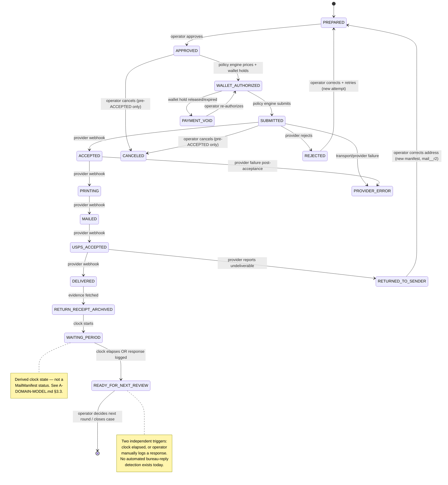

# A-STATE-MACHINE.md — Unified Fulfillment State Machine

Agent A · Architecture only · New vocabulary labeled **PROPOSED** · Migrations/founder calls labeled **FOUNDER-GATE**. This document is the single authority for fulfillment-stage naming; `A-DOMAIN-MODEL.md`'s `DisputePackage.stage` and `A-POLICY-ENGINE.md`'s decisions both reference the `FulfillmentStage` vocabulary defined here rather than redefining it.

## 1. Existing state machine #1 — `MailManifest` (16 states, verbatim)

Source: `lib/mail/MailStatus.ts:9-25` (enum), `:28-32` (pipeline order), `:34-36` (terminal), `:45-62` (forward-transition table).

| # | State | Meaning (verbatim intent from source comments) | On pipeline? |
|---|---|---|---|
| 1 | `GENERATED` | "letter body exists (from the dispute flow)" | yes |
| 2 | `IN_REVIEW` | "presented to the user for approval" | yes |
| 3 | `APPROVED` | "user approved sending (Kai recommends, user approves)" | yes |
| 4 | `PAID` | "payment captured for this mail job" | yes |
| 5 | `QUEUED` | "accepted by MailService, awaiting dispatch to a provider" | yes |
| 6 | `PDF_GENERATED` | "print-ready PDF produced" | yes |
| 7 | `PROVIDER_ACCEPTED` | "provider accepted the job (has a provider job id)" | yes |
| 8 | `PRINTED` | "physically printed by the provider" | yes |
| 9 | `CARRIER_ACCEPTED` | "handed to the postal carrier (USPS or other)" | yes |
| 10 | `IN_TRANSIT` | "moving through the mail stream" | yes |
| 11 | `DELIVERED` | "delivered to the recipient" | yes |
| 12 | `RESPONSE_RECEIVED` | "a response to this mailing was logged" | yes |
| 13 | `CLOSED` | "lifecycle complete" | yes |
| 14 | `CANCELED` | "canceled before it entered the physical mail stream" | side-exit |
| 15 | `FAILED` | "a step failed (payment, PDF, provider, …)" | side-exit |
| 16 | `RETURNED` | "USPS returned it to sender" | side-exit |

Forward transitions are guarded (`canTransition`, `MailStatus.ts:72-74`); `FAILED` is reachable from any non-terminal state, `CANCELED` only up to `PROVIDER_ACCEPTED` (`CANCELABLE`, `MailStatus.ts:43` — "the provider owns the paper" after that).

**Verified against product code:** the operator flow in production reaches only `IN_REVIEW → APPROVED → PAID → QUEUED` (`app/api/mail/prepare/route.ts`, `app/api/mail/[mailId]/approve/route.ts`, `app/api/mail/[mailId]/confirm/route.ts`). `MailService.dispatch()` (`lib/mail/MailService.ts:157-189`, the only path to `PDF_GENERATED`→`PROVIDER_ACCEPTED` and beyond) has **zero callers** anywhere in `app/`, `lib/`, or `worker/` (confirmed by repository-wide `grep` for `.dispatch(`). States 6-13 are implemented and guarded but **never reached in production today**.

## 2. Existing state machine #2 — `Letter.status` (6 states, verbatim)

Source: `prisma/schema.prisma:46-53`.

| State | Set by | Reachable today? |
|---|---|---|
| `DRAFT` | declared, PATCH-accepted (`app/api/letters/[id]/route.ts:24`) | **no** — no server route writes it; the one client call to the generic status setter uses the literal `"MAILED"` only (`app/letters/page.tsx:381`) |
| `GENERATED` | `prisma.letter.create` default (`prisma/schema.prisma:258`) | yes — every letter's starting state |
| `PRINTED` | declared, PATCH-accepted | **no** — same as `DRAFT`, dormant |
| `MAILED` | client PATCH (`app/letters/page.tsx:381` → `app/api/letters/[id]/route.ts:72-86`), stamps `mailedAt` | yes — the **self-mail** path, entirely independent of `MailManifest` |
| `RESPONSE_RECEIVED` | `POST /api/letters/[id]/response` (`app/api/letters/[id]/response/route.ts:69-77`) | yes |
| `RESOLVED` | client PATCH; side-effects `Tradeline.resolved = true` (`app/api/letters/[id]/route.ts:89-93`) | yes |

## 3. A third, undocumented projection — discovered, not in the brief's digest

`lib/mailCenter.ts:111-116` computes its own `MailStatus` value for **display only**, straight from `Letter` fields, **never reading `MailManifest` at all**:

```ts
function toMailStatus(l: MailLetter): MailStatus {
  if (l.status === "RESOLVED" || l.responseOutcome === "deleted") return "CLOSED";
  if (l.hasResponse || l.status === "RESPONSE_RECEIVED") return "RESPONSE_RECEIVED";
  if (l.status === "MAILED") return "IN_TRANSIT";
  return "GENERATED";
}
```

This is a **third, ad hoc mapping** into the `MailStatus` vocabulary — reusing the type and labels but computed from an entirely different source than machine #1. It only ever produces 4 of the 16 values (`GENERATED`, `IN_TRANSIT`, `RESPONSE_RECEIVED`, `CLOSED`) and is never persisted. `app/mail/page.tsx:44-49,106-107` already shows the retirement path in the same file: it separately joins the real `MailManifest` by the `mail_<letterId>` convention and renders it as an overlay badge ("CreditVector Mail · {status}") **next to**, not instead of, the `toMailStatus()`-derived row. **Any unification must retire `toMailStatus()` in favor of always reading the real manifest** once every letter has one (today a letter only has a manifest if `/api/mail/prepare` was ever called for it — the self-mail path never creates one).

## 4. Canonical operator timeline → `FulfillmentStage` (PROPOSED)

Founder decision §1.10 names 12 operator-visible stages. **PROPOSED**, formalized as a string vocabulary (`FulfillmentStage`), the rollup target for `DisputePackage.stage` (rollup rule at `A-DOMAIN-MODEL.md` §2.2, field declared §2.6) and the thing `A-PROVIDER-ABSTRACTION.md`'s provider-status taxonomy maps into.

| # | `FulfillmentStage` | Owner (§7) | Derived from |
|---|---|---|---|
| 1 | `PREPARED` | operator action (implicit) | `/api/mail/prepare` response, ≈ manifest `IN_REVIEW` |
| 2 | `APPROVED` | operator action | manifest `APPROVED` |
| 3 | `WALLET_AUTHORIZED` | policy engine + wallet (Agent C) | **new**, inserted between `APPROVED` and `PAID` — see §5.1 |
| 4 | `SUBMITTED` | policy engine → provider | manifest `QUEUED`/`PDF_GENERATED` |
| 5 | `ACCEPTED` | provider webhook | manifest `PROVIDER_ACCEPTED` |
| 6 | `PRINTING` | provider webhook | manifest `PRINTED` |
| 7 | `MAILED` | provider webhook | manifest `CARRIER_ACCEPTED` |
| 8 | `USPS_ACCEPTED` | provider webhook | **new**, split out of `CARRIER_ACCEPTED` — see §5.2 |
| 9 | `DELIVERED` | provider webhook | manifest `DELIVERED` |
| 10 | `RETURN_RECEIPT_ARCHIVED` | provider webhook (evidence fetch) | **new** — see §5.3 |
| 11 | `WAITING_PERIOD` | clock (computed, `A-DOMAIN-MODEL.md` §3.3) | derived, not a manifest state at all |
| 12 | `READY_FOR_NEXT_REVIEW` | clock OR operator action (response logged) | derived — see §5.4 |

Side states (failure family, cross-cutting — not on the happy path, §6):

| `FulfillmentStage` | Maps from |
|---|---|
| `REJECTED` | manifest `FAILED` (pre-acceptance) |
| `ADDRESS_FAILURE` | manifest `FAILED` (validation-specific reason code — new, §6) |
| `PROVIDER_ERROR` | manifest `FAILED` (post-acceptance) |
| `PAYMENT_VOID` | **new** — wallet authorization released/failed, no manifest equivalent today |
| `RETURNED_TO_SENDER` | manifest `RETURNED` |
| `CANCELED` | manifest `CANCELED` |

## 5. Gaps between what exists and the canonical timeline (PROPOSED additions)

All additions below are **new string values flowing through an existing TEXT column** (`MailManifest.status`, `lib/mail/MailStore.ts:87`, raw SQL `TEXT NOT NULL`, not a Postgres enum) — **no schema migration is required to add them**; `MailManifest` is already frozen on the self-heal allowlist (`scripts/schema-safety.test.ts:110`) and adding an allowed string through a `TEXT` column is a code-only, additive change to the `MailStatus` TypeScript union and its transition table, not a DDL change. Each is still labeled PROPOSED because it changes application behavior, not because it needs FOUNDER-GATE on schema grounds.

### 5.1 `WALLET_AUTHORIZED` — inserted between `APPROVED` and `PAID`

Today `markPaid()` (`lib/mail/MailService.ts:134-138`) requires `APPROVED` and moves straight to `PAID`, recording `"authorized:no-charge (MAIL_LIVE=off…)"` (`app/api/mail/[mailId]/confirm/route.ts:54`) — a hold with no real charge, already conceptually an *authorization*, not a *settlement*. **PROPOSED:** insert `WALLET_AUTHORIZED` as its own state; `PAID` becomes the true settlement/capture step (Agent C's authorize→consume→settle/void detail lives inside this span; not designed further here — only the slot is reserved). Until the Wallet exists, `WALLET_AUTHORIZED` and `PAID` can be reached back-to-back synchronously (byte-identical user-visible behavior to today).

### 5.2 `USPS_ACCEPTED` split out of `CARRIER_ACCEPTED`

The canonical list names "Mailed" **and** "USPS Accepted" as two distinct stages; today's single `CARRIER_ACCEPTED` (`lib/mail/MailStatus.ts:18`, "handed to the postal carrier") conflates the mailer's drop-off with USPS's own first tracking scan (a real, distinguishable USPS tracking-API event — "Acceptance"/"Origin facility"). **PROPOSED:** add `USPS_ACCEPTED` immediately after `CARRIER_ACCEPTED` in the forward-transition table; a provider that cannot distinguish the two (LetterStream's current dry-run mapping does not, `providers/LetterStreamProvider.ts:34`, `mailed: "CARRIER_ACCEPTED"`) simply skips straight through both in one webhook, same as `MailService.syncTracking()`'s existing "walk one legal step at a time up to the reported status" loop already does for any gap (`lib/mail/MailService.ts:206-218`) — **zero information loss** either way.

### 5.3 `RETURN_RECEIPT_ARCHIVED` — new, no manifest equivalent today

Founder decision §1.3 requires "Electronic Return Receipt" as a permanent artifact. `MailProvider.retrieveProof()` already returns a typed `ProofArtifact[]` including `kind: "return_receipt"` (`lib/mail/MailProvider.ts:87-91`), but nothing in `MailStatus` marks the moment that artifact was fetched and archived — today it would be conflated with plain `DELIVERED`. **PROPOSED:** `RETURN_RECEIPT_ARCHIVED` follows `DELIVERED`, entered once `retrieveProof()` has been called and its artifact stored (storage-location question is FOUNDER-GATE, `A-PROVIDER-ABSTRACTION.md`). A provider/mail-class combination with no return receipt (uncertified mail, if ever allowed — it should not be, per Founder §1.3) would skip this stage entirely; certified mail (the only allowed class per §1.3) always passes through it.

### 5.4 `WAITING_PERIOD` / `READY_FOR_NEXT_REVIEW` — computed, not manifest states

Neither is a `MailManifest` status at all. Both are **derived facts** at the `DisputePackage`/`Case` level (`A-DOMAIN-MODEL.md` §3.3), computed from `RETURN_RECEIPT_ARCHIVED`'s (or, self-mail path, `MAILED`-on-`Letter`'s) timestamp plus the existing recipient-typed statutory clock (`lib/mailCenter.ts:129-146`, `lib/forecast.ts`'s `REINVESTIGATION_DAYS`). `READY_FOR_NEXT_REVIEW` has **two independent exit triggers** — see §7's ownership table, row 12.

## 6. Failure states, retry, and dead-letter semantics

| Canonical failure | Manifest state | Trigger | Retry? | Dead-letter? |
|---|---|---|---|---|
| `rejected` | `FAILED` (pre-`PROVIDER_ACCEPTED`) | provider `createMailJob` throws `MailProviderError` (`code: "rejected"`, `lib/mail/MailProvider.ts:123`) before any provider id exists | operator re-approves a corrected package → new manifest attempt (same `mailId`, since it's keyed `mail_<letterId>` and the letter itself is unchanged) | after N rejections, PROPOSED: policy engine (`A-POLICY-ENGINE.md`) surfaces a refusal reason rather than silently retrying forever |
| `returned-to-sender` | `RETURNED` (terminal, `MailStatus.ts:36`) | provider tracking reports `RETURNED` (`MailService.syncTracking()`, `lib/mail/MailService.ts:201-205`) | **not automatic** — a returned physical piece cannot be re-sent as "the same" mailing; PROPOSED: operator reviews the corrected address and the policy engine authorizes a **new** manifest, new `mailId` suffix (e.g. `mail_<letterId>_r2`), preserving the original as historical evidence | N/A — terminal by design, a new attempt is a new manifest |
| `address-failure` | `FAILED`, reason code `address_invalid` (new — see below) | `validateAddress()` returns `issues.length > 0` (`lib/mail/MailProvider.ts:23-28`) **before** a manifest is even created, OR a live CASS check (FOUNDER-GATE, `A-PROVIDER-ABSTRACTION.md`) rejects a previously-structurally-valid address | operator corrects the address, re-attempts `/api/mail/prepare` | none needed — caught pre-dispatch |
| `provider-error` | `FAILED` (post-`PROVIDER_ACCEPTED`), `MailService.dispatch()`'s catch block (`lib/mail/MailService.ts:177-183`) | transport/`network` `MailProviderError`, or an unexpected provider exception | PROPOSED: policy engine's retry schedule (`A-POLICY-ENGINE.md`), bounded, exponential, keyed on the `mailId` claim (§8) so a retry after a crash never double-submits | after the schedule is exhausted: PROPOSED dead-letter — package stays `FAILED`, surfaced to the operator as a recommended action (never auto-retried silently forever — the Room Constitution's §9 "no fabricated progress" forbids implying the piece is still moving when it is stuck) |
| `payment-void` | no manifest equivalent today — new `FulfillmentStage` (§4 side states) | wallet authorization released/expired/failed (Agent C) before fulfillment consumed it | operator re-authorizes | N/A |

`MailStatus`'s existing `FAILED` value does not carry a reason code today (`AuditEntry.detail` is free text, `lib/mail/MailAudit.ts:25`). **PROPOSED:** add a bounded, machine-readable `reasonCode` field to the audit entry emitted alongside a `FAILED`/`RETURNED` transition (`address_invalid | provider_rejected | network | returned_undeliverable | payment_void`) — additive to `AuditEntry`, same append-only guarantee, no change to `assertAppendOnly`'s tamper checks (`lib/mail/MailAudit.ts:54-65`, which only diff prior entries — a new optional field on new entries is compatible).

## 7. Ownership per state — operator action / policy engine / provider webhook / clock

| `FulfillmentStage` | Owner | Entry invariant | Exit invariant |
|---|---|---|---|
| `PREPARED` | operator action (implicit — visiting the send flow) | letter exists, sender address complete (`senderMailAddress`, `lib/mailExecution.ts:54-64`) | recipient address resolved (`bureauMailAddress`/`furnisherMailAddress`) |
| `APPROVED` | operator action, exclusively | `MailService.approve()` requires a signed-in owner (`app/api/mail/[mailId]/approve/route.ts:9-14`) — "Kai never approves" | — |
| `WALLET_AUTHORIZED` | policy engine (amount) + wallet (hold) | policy engine has computed the certified-mail-inclusive price (`A-POLICY-ENGINE.md`) | wallet confirms a hold exists (Agent C) |
| `SUBMITTED` | policy engine → provider | duplicate-prevention verdict clean (`A-POLICY-ENGINE.md`) | provider accepted the `createMailJob` call |
| `ACCEPTED` | provider webhook (or dry-run synchronous return today, `providers/LetterStreamProvider.ts:110-119`) | `providerJobId` present | — |
| `PRINTING` | provider webhook | — | — |
| `MAILED` | provider webhook | — | — |
| `USPS_ACCEPTED` | provider webhook | — | — |
| `DELIVERED` | provider webhook | — | — |
| `RETURN_RECEIPT_ARCHIVED` | provider webhook (evidence fetch) + policy engine (storage decision, FOUNDER-GATE) | `retrieveProof()` returned a `return_receipt` artifact | — |
| `WAITING_PERIOD` | **clock** (computed, no owner action) | `RETURN_RECEIPT_ARCHIVED` (or self-mail `MAILED`) timestamp set | either the statutory window elapses OR a response is logged |
| `READY_FOR_NEXT_REVIEW` | **clock OR operator action** — two independent triggers: (a) clock: `REINVESTIGATION_DAYS` elapsed with no response (`lib/mailCenter.ts:131-146`); (b) operator action: `POST /api/letters/[id]/response` manually logs a reply (`app/api/letters/[id]/response/route.ts`) — **there is no automated bureau-reply detection; this is always a manual log today**, never a provider webhook | one of the two triggers fired | operator decides next round (`/api/letters/[id]/round2`) or closes the case |

**Correction to a natural misreading of the brief:** `A-STATE-MACHINE.md`'s assignment text describes failure owners as "operator action vs policy engine vs provider webhook vs clock" as if every state has exactly one plausible owner-type — `READY_FOR_NEXT_REVIEW` above is the one state that genuinely has two independent, disjoint triggers rather than one. This is called out explicitly rather than picking one and hiding the other.

## 8. Idempotent transition rules (ADR-0028 3-state claim, mapped)

Precedent, verbatim mechanism: `claimStripeEvent()` (`lib/billing.ts:174-197`) returns `"claimed" | "completed" | "in_flight"` from an atomic `INSERT ... ON CONFLICT DO NOTHING`, exactly the shape ADR-0028 §1.2 specifies ("`claim(key)` is an atomic `INSERT PENDING … ON CONFLICT DO NOTHING RETURNING`"). **PROPOSED:** every fulfillment transition that can be retried (a webhook redelivery, a retry after a crash mid-dispatch) claims before acting, using the same 3-state shape:

- **Claim key = a stable business subject, never a per-emission id** — per ADR-0028 and the `XpAward` precedent (`@@unique([subjectId, operatorId, awardKind])`, never the event id). For a mail transition: `` `${mailId}:${toStage}` `` (e.g. `mail_abc123:DELIVERED`) — the manifest id is already the idempotency key by construction (`MailManifest.ts:15`, "CreditVector's own id (idempotency key)"), and appending the target stage makes each *transition* independently claimable rather than the whole manifest.
- **`claimed`** → this invocation executes the transition (calls `applyTransition`, `lib/mail/MailJob.ts:42-91`, and persists).
- **`completed`** → a prior delivery already applied this exact transition; acknowledge (200 to the webhook) without re-running `applyTransition` — critical because `applyTransition` itself already refuses a same-status transition (`MailJob.ts:43-45`, `"already {to}"`) and would otherwise surface a false error on a benign redelivery.
- **`in_flight`** → a claim is PENDING and not yet aged out; return INDETERMINATE (do not re-execute, do not fabricate success) — same law as ADR-0028 §1.3.
- **Storage:** reuse the existing `MailManifest.auditTrail`'s append-only guarantee as the settlement record (`assertAppendOnly`, `lib/mail/MailAudit.ts:54-65`) — a successful `applyTransition` + `saveProgress` **is** the settle-on-success step; no second ledger table is needed for this specific case because `MailStore.saveProgress`'s optimistic audit-length guard (`lib/mail/MailStore.ts:174-193`, "last-writer-lose (0 rows) instead of silently dropping an audit entry") already gives at-most-once-per-audit-entry semantics. The **claim table itself** (mapping `` `${mailId}:${toStage}` `` → pending/committed/failed) is new and FOUNDER-GATE (a small additive self-heal table, or an extension of the existing `StripeWebhookEvent`-style pattern to a new table — not the same table, since that one's key shape is Stripe-event-specific, `lib/billing.ts:139`).

**Duplicate-prevention verdicts** (Founder decision §1.5) are a *policy* decision consuming this claim state, not the claim mechanism itself — specified in `A-POLICY-ENGINE.md`.

## 9. Old-state → new-state mapping (zero information loss)

| `MailManifest.status` | `Letter.status` | `FulfillmentStage` | Loss? |
|---|---|---|---|
| `GENERATED` | `GENERATED`/`DRAFT` | *(pre-`PREPARED`, transient — never observed at rest, `MailService.initiate()` moves through it in one call, `lib/mail/MailService.ts:104-123`)* | none |
| `IN_REVIEW` | — | `PREPARED` | none |
| `APPROVED` | — | `APPROVED` | none |
| `PAID` | — | `WALLET_AUTHORIZED` → `PAID`/settlement (§5.1 split) | none — additive split |
| `QUEUED` | — | `SUBMITTED` | none |
| `PDF_GENERATED` | — | `SUBMITTED` (sub-step) | none — collapsed for operator display only; full detail stays in the audit trail |
| `PROVIDER_ACCEPTED` | — | `ACCEPTED` | none |
| `PRINTED` | — | `PRINTING` | none |
| `CARRIER_ACCEPTED` | — | `MAILED` (+ `USPS_ACCEPTED` if the provider distinguishes, §5.2) | none — additive split |
| `IN_TRANSIT` | — | sub-state within `USPS_ACCEPTED`→`DELIVERED` span | none — collapsed for operator display; audit trail keeps every provider event |
| `DELIVERED` | — | `DELIVERED` | none |
| — | — | `RETURN_RECEIPT_ARCHIVED` (§5.3) | **new fact, not a loss** |
| `RESPONSE_RECEIVED` | `RESPONSE_RECEIVED` | triggers `READY_FOR_NEXT_REVIEW` (§7) | none |
| `CLOSED` | `RESOLVED` | terminal, beyond the 12-stage list — belongs to `Case.state = CLOSED` (`A-DOMAIN-MODEL.md` §1.5), not a `FulfillmentStage` | none — the canonical §1.10 list describes one round's fulfillment mechanics, not the whole Case's eventual resolution |
| `CANCELED` | — | `CANCELED` (side state) | none |
| `FAILED` | — | `REJECTED`/`ADDRESS_FAILURE`/`PROVIDER_ERROR` (§6, reason-code-disambiguated) | none — additive refinement |
| `RETURNED` | — | `RETURNED_TO_SENDER` (side state) | none |
| — | `MAILED` (self-mail path) | `MAILED`, but **without** `USPS_ACCEPTED`/`DELIVERED`/`RETURN_RECEIPT_ARCHIVED` ever firing (no provider involved) — `WAITING_PERIOD` still computed from this timestamp | none — mirrors `lib/mailCenter.ts:108-116`'s existing honesty rule ("never DELIVERED — we can't confirm delivery without provider tracking") |
| — | `DRAFT`/`PRINTED` | not reachable in production (§2) | none — dormant states have nothing to lose |

## 10. Mermaid state diagram


