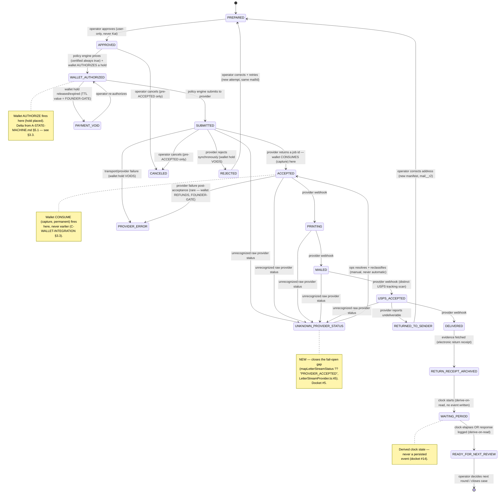

# CreditVector Fulfillment Engine v1.0 — Unified Architecture

Agent E (Architecture Merge) · Status: **PROPOSED** · Architecture only, no product code touched · Branch `docs/fulfillment-engine-v1` (worktree base `origin/main@f449c35`) · Founder-readable executive document — detail lives in the four appendices (`A-DOMAIN-MODEL.md`, `A-STATE-MACHINE.md`, `A-POLICY-ENGINE.md`, `A-PROVIDER-ABSTRACTION.md`, `B-MAIL-CENTER-EVOLUTION.md`, `C-WALLET-INTEGRATION.md`, `D-KAI-EXPERIENCE.md`), cited by section, never restated in full.

This document merges four independently-written architecture artifacts (Agents A–D) against `PROGRAM-BRIEF.md`'s binding contract, resolves the cross-agent conflict docket (17 items), and re-verifies the load-bearing disputed facts directly against repository source (not re-derived from the artifacts alone). Where an artifact's claim was re-checked against source and confirmed, no note is made; where a correction was needed, it is called out inline.

---

## 1. Mission + Decisions Recap

**Mission:** evolve the existing mail-sending spine (`lib/mail/*`, `/mail`, the 3-step send wizard) into the **CreditVector Fulfillment Platform** — a provider-abstracted, policy-governed, wallet-funded, Kai-narrated fulfillment engine for the **Dispute Package**, without a parallel system and without touching product code in this phase.

**Binding Founder decisions (Program Brief §1, terse recap — full text there):**

| # | Decision |
|---|---|
| 1 | Operators never interact with LetterStream. It is Provider Adapter #1 under the CreditVector Fulfillment Platform. |
| 2 | Primary object = **Dispute Package**; primary workflow = **Case Journey**: `Case → Kai Analysis → Dispute Package → Approval → Wallet Authorization → CreditVector Fulfillment → Timeline → Waiting Period → Next Recommendation`. |
| 3 | Dispute Packages always use Certified Mail, Tracking, Electronic Return Receipt, Delivery Evidence, Immutable Timeline — no exception. |
| 4 | Operators always have two options: Download Package or Send with CreditVector Fulfillment. |
| 5 | The Fulfillment Policy Engine — deterministic, owns delivery/certified/provider/wallet/retry/idempotency/duplicate-prevention/routing decisions. **Kai never decides these.** |
| 6 | Wallet — architecture only; authorization/funding/marketplace/growth/payouts/ledger integration points named, not built. |
| 7 | Kai owns explanation/education/recommendation/narration/guided workflow; never truth, money, execution, policy, or vendor identity. |
| 8 | Operational Room Constitution — a **proposed** amendment (never ratified here) — every primary room presents current work/state/recommended action/Kai guidance/evidence/timeline; metrics are context only. |
| 9 | Package Review chain (12 steps, §3 below). |
| 10 | Canonical operator-visible fulfillment timeline (12 stages, §3 below). |

---

## 2. Domain Model

Full detail: `A-DOMAIN-MODEL.md`. Verified against `prisma/schema.prisma`, `lib/campaign/CampaignStore.ts`, `scripts/schema-safety.test.ts`.

### 2.1 New entities (migration-backed, additive-only — FOUNDER-GATE: new migration)

```
Case (1) ──(N)── DisputePackage (1) ──(N)── DisputePackageLetter ──(1)── Letter
  │                    │                                            └─(1)─ MailManifest [via mailId, unchanged 1:1]
  User.id          Campaign (existing, self-heal — see §2.2)
```

- **`Case`** — durable identity for one dispute target's whole history, scoped `(User, Tradeline)` or `(User, null)` for identity-only disputes. States: `OPEN | WAITING | NEEDS_ATTENTION | CLOSED | ARCHIVED` — a cached rollup, never a second source of truth. Tombstone erasure (`redactedAt`), mirrors `EventEnvelope.redactedAt` (`prisma/schema.prisma:629`).
- **`DisputePackage`** — the primary object (Founder §1.2). N letters (N recipients) per package via the join table; `stage` is a **rollup at the least-progressed constituent manifest** (never "Delivered" while one of three bureau letters is still in transit). States: `DRAFT|RECOMMENDED|IN_REVIEW|APPROVED|CANCELED` (composition lifecycle) — distinct from `FulfillmentStage` (§3, fulfillment progress).
- **`DisputePackageLetter`** — join table; `onDelete: Restrict` on `letter` (mirrors `XpAward`'s Restrict reasoning — a packaged letter is evidence, not scratch data).

### 2.2 Campaign FK — resolved per docket #2

`Campaign` is self-heal raw SQL (`lib/campaign/CampaignStore.ts:73-90`, confirmed on the frozen 32-table `LEGACY_SELF_HEAL_ALLOWLIST`, `scripts/schema-safety.test.ts:106-114` — verified count is **32**, not 31 as one sibling artifact stated in passing). Prisma cannot FK a migration-backed model to a table with no Prisma model. **v1 ships `DisputePackage.campaignId` as a plain, unenforced `String`**, integrity enforced at the Policy Engine / application layer (mirrors `CommunityReport.targetId`'s deliberate no-FK precedent, `prisma/schema.prisma:314-316`). Migrating `Campaign` to a Prisma model is a **separate, later FOUNDER-GATE** — not forced into v1.

### 2.3 Letter-delete behavior change — resolved per docket #4

`DisputePackageLetter.letterId` is `onDelete: Restrict`. This is a **deliberate, documented behavior change**: once a `Letter` joins a `DisputePackage`, `DELETE /api/letters/[id]` (`app/api/letters/[id]/route.ts:45-53`, today deletes any letter unconditionally) must refuse for packaged letters — a protection, not a regression. The unpackaged-letter path is unchanged.

### 2.4 Round / waiting period

`Letter.round`/`parentLetterId` stay exactly as-is (no new `Round` model — would duplicate, not add, a fact). Waiting period stays a **computed clock**, never a persisted "we are waiting" row (`lib/mailCenter.ts:131-146`, `lib/forecast.ts`'s `REINVESTIGATION_DAYS = 30`, defined at both `lib/forecast.ts:10` and `lib/kaiHome.ts:13` — duplicated constant, same value, noted for a future single-source cleanup, not a v1 blocker).

---

## 3. Canonical 12-Stage Timeline + Unified State Machine

Full detail: `A-STATE-MACHINE.md`. Founder §1.10 names 12 operator-visible stages, formalized as `FulfillmentStage`, a string vocabulary layered over the **existing, unchanged** 16-state `MailManifest.status` (`lib/mail/MailStatus.ts:9-25`, verified verbatim) and 6-state `Letter.status` (`prisma/schema.prisma:46-53`).

### 3.1 Brief errata — resolved per docket #6

Program Brief §2.1 states a "9-stage timeline (last 6 stages placeholder)." **Independently re-verified directly against source** (`lib/mailCenter.ts:197-230`, `buildTimeline()`): the literal stage array declares 6 non-placeholder stages (`generated, mailed, window, response, recommendation, resolved`) and the trailing loop pushes 6 placeholder stages (`payment, provider_print, carrier, delivery, tracking, certified`) — **12 total, 6 placeholder**, matching Agent B's independent finding (`B-MAIL-CENTER-EVOLUTION.md §1.4`). **This document adopts 12 as authoritative.** Brief §2.1 should be corrected in any future revision to "12-stage timeline (6 live + 6 placeholder)."

### 3.2 Canonical `FulfillmentStage` → Kai event → provider-status mapping (resolved per docket #16)

Agent A's `A-STATE-MACHINE.md` §4/§9 owns the FulfillmentStage vocabulary; Agent D's `D-KAI-EXPERIENCE.md` §1.1 asked A to close the granular `fulfillment.status` payload mapping. Assembled below verbatim from A's own Derived-from/old-to-new columns — no new mapping invented. **One correction to D's illustrative table**: D used `"CARRIER_ACCEPTED"` as the payload value for stage 9 (USPS Accepted); A's §5.2 defines `USPS_ACCEPTED` as a **distinct new value**, split out specifically because conflating the mailer's drop-off with USPS's own tracking scan is the ambiguity A's split exists to remove. The table below uses A's value, not D's placeholder.

| # | `FulfillmentStage` | Kai event | `fulfillment.status.status` payload | Manifest `MailStatus` source | Owner |
|---|---|---|---|---|---|
| 1 | `PREPARED` | `package.prepared` | — (named event) | `IN_REVIEW` | operator action (implicit) |
| 2 | `APPROVED` | `package.approved` | — (named event) | `APPROVED` | operator action, exclusively |
| 3 | `WALLET_AUTHORIZED` | **`package.authorized`** (renamed — docket #13) | — (named event) | `PAID` (span-internal — see §3.3 delta) | policy engine + wallet (authorize) |
| 4 | `SUBMITTED` | `package.submitted` | — (named event) | `QUEUED`/`PDF_GENERATED` | policy engine → provider |
| 5 | `ACCEPTED` | `fulfillment.status` | `"PROVIDER_ACCEPTED"` | `PROVIDER_ACCEPTED` | provider webhook (wallet **consume** — §3.3) |
| 6 | `PRINTING` | `fulfillment.status` | `"PRINTED"` | `PRINTED` | provider webhook |
| 7 | `MAILED` | `package.mailed` | — (named event) | `CARRIER_ACCEPTED` | provider webhook |
| 8 | `USPS_ACCEPTED` | `fulfillment.status` | `"USPS_ACCEPTED"` **(new value, corrects D §1.1 row 9)** | new additive string (A §5.2) | provider webhook |
| 9 | `DELIVERED` | `package.delivered` | — (named event) | `DELIVERED` | provider webhook |
| 10 | `RETURN_RECEIPT_ARCHIVED` | `package.receipt_archived` | — (named event) | new fact, no manifest equivalent (A §5.3) | provider webhook (evidence fetch) |
| 11 | `WAITING_PERIOD` | **derive-on-read only, no persisted event** (docket #14) | — | none (computed) | clock |
| 12 | `READY_FOR_NEXT_REVIEW` | **derive-on-read only, no persisted event** (docket #14) | — | none (computed) | clock OR operator action |

Side states (failure family): `REJECTED`, `ADDRESS_FAILURE`, `PROVIDER_ERROR`, `PAYMENT_VOID`, `RETURNED_TO_SENDER`, `CANCELED` (all A §4/§6, unchanged) plus **`UNKNOWN_PROVIDER_STATUS`** (new — resolved per docket #5, §4.2 below).

### 3.3 Settlement moment — resolved per docket #9 (delta from A's artifact, stated explicitly)

`A-STATE-MACHINE.md` §5.1 and `C-WALLET-INTEGRATION.md` §3.3 independently placed the wallet's settlement/capture moment at different points. **Ruling: adopt C's argued position.**

- **Authorize** fires at the `Approved → Wallet Authorized` transition (hold placed; amount from the Policy Engine's `walletAuthorization` decision).
- **Consume** (capture, permanent) fires at provider **Accepted** (`PROVIDER_ACCEPTED` — the first externally-verifiable commitment, a real `providerJobId`), **not** at the manifest-internal `PAID` sub-step.
- **Void** fires on rejection/failure/cancel before consume; **refund** (FOUNDER-GATE) only after consume.

**Explicit delta from `A-STATE-MACHINE.md` §5.1:** that document's phrasing — *"`PAID` becomes the true settlement/capture step... Agent C's authorize→consume→settle/void detail lives inside this span"* — is corrected. The manifest-internal `PAID` sub-step (sitting immediately before `QUEUED`, i.e. before the provider ever sees the job) is part of the **authorize** span (hold confirmed/finalized, still voidable), not the settlement moment. Consuming at `PAID` would debit the operator for a job the provider might still reject synchronously, forcing an immediate compensating void in the common rejection case. Agent A itself left this span *"not designed further here"* (§5.1), so no artifact is overwritten — this is the resolution of an explicitly deferred question, recorded here per the Program Director's ruling. The operator-visible narration is unaffected either way: `package.authorized` narrates the `WALLET_AUTHORIZED` **stage**, never the internal `PAID` sub-step.

### 3.4 Merged state diagram



### 3.5 Idempotency — the unified claim ledger (resolved per docket #12, full reasoning ADR-0045)

**One generic `Claim` table**, not two domain tables. See §5.3 and `ADR-PROPOSALS.md` ADR-0045 for full basis.

---

## 4. Fulfillment Policy Engine

Full detail: `A-POLICY-ENGINE.md`. A deterministic, server-only module (Founder §1.5) — the fourth instance of a pattern already proven three times in this codebase (`CampaignPolicy.ts`, `pickRecommendation`'s `basis` law, `planForPrice()`'s fail-closed law).

**Laws:** (1) fail-closed on unknowns — no branch returns a decision that *looks* permissive by falling through a default; (2) no policy decision ever originates from Kai or client input; (3) every decision carries a `basis`; (4) certified mail is a constant, never a computation (`delivery.certified: true`, unconditionally); (5) the engine never calls a provider or the network; (6) Kai narrates the engine's output, never becomes an input to it.

### 4.1 `PolicyDecision` — corrected per docket #10, #11

```typescript
interface PolicyDecision {
  policyVersion: number;   // ADDED — docket #10. Freezes the rate/rule version this
                           // decision was made under; WalletLedger.policyVersion (§5)
                           // stamps this value so past entries are never re-weighted.
  delivery: { certified: true; trackingRequired: true; returnReceiptRequired: true; basis: "founder_decision_1_3" };
  providerRouting: { eligible: MailProviderId[]; chosen: MailProviderId | null; basis: string };
  walletAuthorization: { required: true; amountCents: number; basis: string };
  retrySchedule: { allowed: boolean; nextAttemptAt: string | null; attemptsRemaining: number; basis: string };
  duplicatePrevention: { verdict: "clean" | "duplicate_detected" | "in_flight"; claimKey: string; basis: string };
  refusal: { refused: boolean; reason: string | null };
}
```

`PolicyInput.wallet` gains a read-only field the Wallet must expose (docket #11): `hasSufficientAuthorization: boolean | null` (null = not yet consulted), backed by `walletHasSufficientBalance(userId, amountCents): Promise<boolean>` — a cheap fold-and-compare, advisory only. The authoritative gate stays the Wallet's own atomic insert-guard at actual authorize time (`C-WALLET-INTEGRATION.md §3.8`); this read is a fast-path hint, never a substitute.

### 4.2 Fail-open provider status — resolved per docket #5

`mapLetterStreamStatus()` (`lib/mail/providers/LetterStreamProvider.ts:45`, **verified verbatim**: `LS_STATUS[raw.trim().toLowerCase()] ?? "PROVIDER_ACCEPTED"`) silently reports forward progress for any unrecognized raw status — a real, live violation of the Policy Engine's own fail-closed law, predating the engine's existence. **Ruling: an unmapped raw status maps to `UNKNOWN_PROVIDER_STATUS`** (§3.2, §3.4), a quarantine stage requiring operator/ops attention — never silent acceptance. Same additive-TEXT-column mechanism as every other new `FulfillmentStage` (A §5) — no migration required, code-only.

---

## 5. Wallet Integration Summary

Full detail: `C-WALLET-INTEGRATION.md`. **Architecture only** — the Wallet is the productized, stored-value form of the existing **Cash** instrument in ADR-0038's five-instrument partition (PGE-3/PGE-4, verified verbatim against `.ai/ADR/ADR-0038-professional-growth-economy.md:26-27`), never a sixth instrument, never converted with XP/Business-Health/Affiliate/Promo.

### 5.1 `WalletLedger` — append-only, fold-derived

Mirrors `XpAward` (`prisma/schema.prisma:749-786`) field-for-field: `entryKind` (`fund|authorize|consume|void|refund|adjust`), signed `amountCents`, subject-keyed idempotency (`@@unique([userId, subjectId, entryKind])` — never a per-emission event id), `Restrict` FKs, `policyVersion` freezing the rate in effect, balance **derived by fold** (`foldWalletBalance`, floors at zero), never a stored column. Coexists with, never replaces, `User.letterCredits` (gates letter *generation*; Wallet gates *fulfillment* — Founder §1.2's two different steps).

### 5.2 Read interface to the Policy Engine — resolved per docket #11

`WalletBalanceView` (conceptually `{ hasSufficientAuthorization: boolean | null }`), backed by `walletHasSufficientBalance(userId, amountCents)`. Read-only; the Policy Engine never writes to the Wallet.

### 5.3 Unified claim ledger — resolved per docket #12 (E-DECIDES)

`A-STATE-MACHINE.md` §8 and `C-WALLET-INTEGRATION.md` §3.6 each independently proposed a new claim table for the identical ADR-0028 claim-before-effect shape (mail-transition keyed `${mailId}:${toStage}`; wallet keyed `wallet:<subjectId>:<transition>`). **Decision: one shared, generically-keyed `Claim` table**, not two domain tables.

```prisma
// PROPOSED — additive only, 0 DROP. FOUNDER-GATE: new migration.
enum ClaimDomain { MAIL_TRANSITION WALLET }
model Claim {
  key         String      @id             // domain's own existing convention, verbatim —
                                           // "mail_<letterId>:<toStage>" (A §8) or
                                           // "wallet:<subjectId>:<transition>" (C §3.6)
  domain      ClaimDomain                 // set EXPLICITLY by the caller at insert — never
                                           // inferred by parsing the key's prefix
  state       String                      // "pending" | "committed" | "failed"
  resultRef   String?                     // opaque pointer to the settled receipt row
  createdAt   DateTime    @default(now())
  settledAt   DateTime?
  @@index([domain, state, createdAt])     // reclaim sweep, scoped to the domain's own TTL
}
```

**Basis:** (a) ADR-0028 §1.2 already specifies this exact claim/settle/lookup shape as a **generic kernel port** (`IdempotencyStore`, dormant behind `KERNEL_DURABLE`) — building two bespoke tables would duplicate a primitive the architecture already declared should be one; a single `Claim` table today is the correct concrete stand-in, collapsing into that port later with zero reshape. (b) The domains' pre-existing key conventions never collide (`mail_`-prefixed vs. `wallet:`-prefixed) and are kept verbatim — no forced renaming. (c) Different reclaim TTLs (mail: near `STALE_CLAIM_MINUTES`-scale; wallet: a business-level hold window, §3.4) are handled by branching on the `domain` column, the same discipline as one typed function over one input, not two parallel tables. (d) One small reviewable migration + one guard suite (`claim-migration-guard.test.ts` + `claim-runtime.test.ts`) is smaller than two, consistent with Article VIII (small reversible changes). (e) Independent shippability is preserved at the **consumer** level (mail-transition dedup and Wallet activation remain separately flag-gated) even though the table itself ships once; a `domain` tag keeps a future CCO review scoped to wallet-only rows without needing a second table.

### 5.4 Naming collision — resolved per docket #13

`D-KAI-EXPERIENCE.md`'s proposed `package.funded` KaiEvent is **renamed `package.authorized`**, aligning with the §1.10 "Wallet Authorized" stage name and disambiguating from this ledger's `entryKind:"fund"` (the account-level top-up, no `DisputePackage` subject at all — an unrelated concept that happens to share the English word "funded"). `package.authorized` narrates the fact that `WALLET_AUTHORIZED@1` (Agent C's Event Bus contract) fired — never an amount.

### 5.5 PII-denylist constraint on wallet event field names

`lib/eventBus/validate.ts:22-27`'s `PII_DENYLIST` blocks any payload key containing `"amount"`, `"balance"`, or `"reason"` by substring match — verified verbatim. Every Wallet contract (`WALLET_FUNDED@1`, `WALLET_AUTHORIZED@1`, `WALLET_CONSUMED@1`, `WALLET_VOIDED@1`) is already designed around this (`centsDelta`/`totalCents`/`basis`, never `amountCents`/`balanceCents`/`reasonCode`) — a naming convention future implementers must follow by design, not rediscover by a failed guard (Risk Register #7).

---

## 6. Kai Experience Summary

Full detail: `D-KAI-EXPERIENCE.md`. Four binding laws: Kai never owns truth/money/execution/policy (L1); never exposes vendor identity (L2); never writes its own audit trail — every event is SYSTEM-emitted (L3, verified against 7 existing `recordKaiEvent` call sites, all in routes/services, never `lib/kai.ts`/`components/kai/*`); every claim carries a `basis` (L4).

- **Narration model:** `package.*`/`fulfillment.status` KaiEvent family (§3.2 table) + three new Event Bus contracts (`PACKAGE_APPROVED@1`, `PACKAGE_FULFILLMENT_SUBMITTED@1`, `PACKAGE_DELIVERED@1`, `RETURN_RECEIPT_ARCHIVED@1`) plus reactivating three existing zero-caller contracts (`DISPUTE_CREATED@1`, `LETTER_GENERATED@1`, `LETTER_SENT@1`).
- **Waiting-period events — resolved per docket #14 (E-DECIDES):** `waiting.started`/`waiting.ready_for_review` are **derive-on-read only, no persisted Bus event**. Both `A-STATE-MACHINE.md` §5.4 and `A-DOMAIN-MODEL.md` §3.3 state this as their own position with no stronger invariant requiring persistence (verified — neither document asks for a stored clock-state row). D's own §1.3 flagged this as an open question and speculated Agent A "may still want an audit-trail row when the round2 gate physically opens" — but A never actually proposed this, so it is not adopted. Zero-fabrication law: no event is written merely to mark a clock tick; both moments render directly from the `FulfillmentStage` computation (`RETURN_RECEIPT_ARCHIVED`'s or self-mail `MAILED`'s timestamp + the existing §611/§623/§1692g clock).
- **Guided Package Review:** Kai Summary (`lib/kaiPackage.ts`, `components/kai/KaiSummary.tsx` — PROPOSED, reuses `kaiHome.ts`/`KaiWhy` idioms) → Recommended Disputes (`pickPackageCandidate()`, one primary + alternatives via the existing `RecommendationIntelPanel`) → Educational Explanation (existing `KaiWhy`, reused verbatim). Kai Summary AI-composed prose (if built) is **not persisted server-side** absent the ADR-0006 gate (docket #3 — inherits verbatim, localStorage-only precedent, no new gate).
- **Approval moment:** Kai steps back entirely — "the Approve control must never render inside a Kai-labeled panel" (§7 below covers the concrete UI split, docket #7).
- **Notifications:** v1 ships in-app only (`KaiPresence` + Case Memory). Email/push are FOUNDER-GATE, blocked on ADR-0027 D-07 (mark-on-failure + synthetic replay) and D-08 (payload-blind PEP — `authorize()` never sees the recipient), both verified verbatim against `.ai/ADR/ADR-0027-notification-decision-vs-effect.md:67,74`. No postal channel in `notify.plan` — physical certified mail stays its own pipeline.
- **Vendor-opacity gap:** L2 has **no compiled guard today** — `applyCompliance`'s `PROHIBITED` table has no vendor-name rule. Resolved at §7 (Vendor Opacity law).

---

## 7. Provider Abstraction + Vendor Opacity Law

Full detail: `A-PROVIDER-ABSTRACTION.md`. Formalizes the **existing** `MailProvider` interface (`lib/mail/MailProvider.ts:102-114`, verified verbatim) — not a redesign. LetterStream = Adapter #1; four remaining `MailProviderId`s are registered, typed stubs.

### 7.1 Vendor Opacity law — new, resolved per docket #15

Two concrete, latent leak paths found (both verified against source):

| Leak | Path | Status |
|---|---|---|
| `MailReceipt.provider` | `lib/mail/MailReceipt.ts:11`, `provider: string` set to the raw id (e.g. `"letterstream"`) | Present in the `GET /api/mail/[mailId]` JSON response today; not rendered by any current UI, but visible in devtools |
| Audit-trail vendor name | `MailService.dispatch()`'s `detail: \`Accepted by ${this.provider.name}\`` (`MailService.ts:186`) | Lands in the operator-visible `auditTrail`; latent only because `dispatch()` has zero callers today |

**Law (new):** (1) operator-facing API responses pass through a provider-neutral DTO that strips or replaces `MailReceipt.provider` (e.g., a fixed `"CreditVector Fulfillment"` string) — enforced at the response boundary, not left to "no page happens to render it." (2) Audit `detail` strings for provider transitions use platform-neutral phrasing ("Accepted for fulfillment"), never the adapter's own `.name`. (3) A **static guard** (regex `/letterstream|postgrid|click2mail|postalmethods|\blob\b/i`, per D's proposal) asserts no vendor name reaches any operator-facing module — the same enforcement class as the CROA phrase scrubber, applied to vendor identity.

### 7.2 Honest `validateAddress` contract

`deliverable: true` is today fabricated from a ZIP regex pass (`LetterStreamProvider.ts:76`, verified) — no CASS/USPS check exists. **PROPOSED:** `deliverable` returns `undefined` ("not determined") until a real check is wired — never inferred from structural validity. Activating live CASS/USPS verification is **FOUNDER-GATE** (new vendor dependency or LetterStream API call, gated behind `MAIL_LIVE` activation itself).

### 7.3 Sandbox/live discipline — untouched

`MAIL_LIVE` (dry-run default, live throws `not_wired` before any network call) and `MAIL_PROVIDER` (unset → `letterstream`) stay exactly as today. Nothing in this program requires either to change.

---

## 8. Evolved Mail Center Summary

Full detail: `B-MAIL-CENTER-EVOLUTION.md`. The room has almost all raw material already computed (`recommendationFor()`, `kaiIntel`, the 6-state health enum, the timeline) — the gap is **presentation ordering and promotion**, not missing intelligence.

- **Work queue:** replace DB-order with a health-priority ladder (`ESCALATION_AVAILABLE → NEEDS_ATTENTION → RESPONSE_RECEIVED → READY_FOR_ROUND_2 → WAITING_NORMALLY → COMPLETED`); "Do this first" band (new `pickQueueRecommendation()`, Executive-Queue idiom + `pickRecommendation()`'s anti-overwhelm law).
- **Evidence drawer:** first UI consumer of `TrackingInfo`/`ProofArtifact` (currently zero consumers anywhere in the app).
- **Metrics:** demoted from first-on-page to a context strip below the recommendation band (Room Constitution §1.8 compliance).
- **Package Review chain:** 3-step wizard → 12-step chain (§1.9); route rename `[letterId]` → `[packageId]`.
- **Approval-card split — resolved per docket #7:** today's `Approval()` (`app/mail/send/[letterId]/page.tsx:165-205`, **verified verbatim**: the KAI badge, `<h2>`, and the `Approve & continue` button all sit inside the same `<div className="card p-5">`) structurally violates Kai's "never inside a Kai panel" law. **Ruling: adopt D's law — split into (a) a Kai-labeled explanation section (recipient/round/address/price context) and (b) a separate, non-Kai operator-chrome section holding only the Approve button and the Download/Send fork.** This is a real UI change, not a relabel.
- **Two-option law:** Download Package and Send with CreditVector Fulfillment become co-equal primary actions at the terminal fork, not a de-emphasized secondary link.
- **Scope boundary — resolved per docket #17:** `app/letters/page.tsx`'s tradeline/strategy/bureau selection UI is **not** absorbed into the Package Review chain in v1. `/letters` stays the letter workshop (generation entry point); the Package Review chain is the fulfillment path. Future consolidation (Package Review absorbing `/letters`' selection UI, or vice versa) is a **separate FOUNDER-GATE** product decision, not resolved by this program.
- **CXOS adoption:** operational grammar now, inside today's `AppShell` idiom; full CXOS Living Environment chamber adoption is a separate, Founder-gated future decision (§0 baseline; detailed in `OPERATIONAL-ROOM-CONSTITUTION-PROPOSAL.md` §5).

---

## 9. Compliance Posture

| Requirement | Mechanism | Status |
|---|---|---|
| CROA bar (process language, no outcome guarantees) | `applyCompliance()`'s `PROHIBITED` table (`lib/compliance.ts:3-36`), `DISCLAIMER`/`EduBanner` — every new operator-facing and Kai copy line in B/D's artifacts is pre-checked against this table | Existing mechanism, extended to new surfaces |
| Approval mandatory before any send | `MailService.approve()` — "a user, never Kai, never the system, approves" (`MailService.ts:125-132`), verified verbatim; Package-level approve endpoint mirrors this 1:1 | Existing law, carried forward unchanged |
| Certified-mail pricing transparent before wallet authorization | **Currently broken** — `MailPricing.computePrice()` collapses the certified surcharge into one lump `"Postage & printing"` line (verified verbatim, `lib/mail/MailPricing.ts` — the `providerCostCents` line absorbs the provider's own itemized `+495¢` certified charge with no separate line). Fix: stop collapsing the breakdown, or have `WalletAuthorizationView` read `CostEstimate.breakdown` directly. Tri-confirmed independently by Agents A, B, and C. | Sequence item — IMPLEMENTATION-SEQUENCE.md Phase 1 |
| Dispute Packages always Certified + Tracking + Return Receipt + Evidence + Immutable Timeline | Policy Engine `delivery.certified: true` constant (§4) — once wired, `certified: false` (`prepare/route.ts:46`) can never again diverge from Founder §1.3 | Sequence item — currently violated in shipped code |
| Tombstone retention (erasure) | `EventEnvelope.redactedAt` precedent (`prisma/schema.prisma:629`) — payload cleared, envelope/shell kept, ordering/idempotency intact. `Case.redactedAt`/`DisputePackage.redactedAt` follow the identical shape. **FOUNDER-GATE, unresolved:** a live `MailManifest` mid-transit at erasure time — the audit trail's evidentiary value vs. the consumer's erasure right (A-DOMAIN-MODEL.md §6) | Named, not resolved — FOUNDER-GATE |
| New user-facing copy / pricing surfaces / wallet model | CCO compliance-review gate before implementation | Required — IMPLEMENTATION-SEQUENCE.md names the gates per phase |

---

## 10. Resolved Docket — All 17 Items

| # | Conflict | Resolution | Recorded in |
|---|---|---|---|
| 1 | `certified: false` hardcode (`prepare/route.ts:46`) contradicts Founder §1.3 | Not an architecture conflict — the Policy Engine's `delivery.certified` constant (§4) makes this impossible once wired; the current code is a live violation, flagged for the Founder, must-fix at wiring time | §9; IMPLEMENTATION-SEQUENCE.md Phase 1 #1; Risk Register #1 |
| 2 | `Campaign` self-heal vs. `DisputePackage`'s migration-backed FK | v1: plain unenforced `String` ref + Policy-Engine-level integrity; Campaign→Prisma migration is a separate, later FOUNDER-GATE | §2.2; ADR-0041 |
| 3 | Kai Summary persistence — new gate or existing? | Inherits ADR-0006 verbatim (localStorage-only default); no new gate invented | §6; ADR-0046 |
| 4 | `Restrict` FK on packaged letters changes `DELETE /api/letters/[id]` | Deliberate, documented protection: packaged letters aren't deletable; unpackaged path unchanged | §2.3 |
| 5 | Unknown LetterStream status silently → `PROVIDER_ACCEPTED` | Fail-closed: unmapped status → new `UNKNOWN_PROVIDER_STATUS` quarantine stage, never silent forward-progress | §4.2, §3.4; IMPLEMENTATION-SEQUENCE.md Phase 1 #2; Risk Register #2 |
| 6 | Brief §2.1 "9-stage" vs. source "12-stage" | Adopt 12 (6 live + 6 placeholder), independently re-verified against source; Brief errata noted | §3.1 |
| 7 | KAI badge + Approve button in one card, violating D's law | Adopt D's law: split into Kai-labeled explanation + separate non-Kai operator-chrome Approve section | §8; IMPLEMENTATION-SEQUENCE.md Phase 2; Risk Register #6 |
| 8 | `MailPricing.computePrice()` collapses certified surcharge into a lump sum | Mandate line-item disclosure before wallet authorization; `WalletAuthorizationView` renders lines; fix is a sequence item | §9; IMPLEMENTATION-SEQUENCE.md Phase 1 #3; Risk Register #3 |
| 9 | Settlement moment: C argues consume-at-Accepted; A placed it earlier | Adopt authorize-at-`WALLET_AUTHORIZED`, consume-at-`ACCEPTED`, void-on-reject/fail/cancel; A's mapping corrected, delta stated explicitly | §3.3 |
| 10 | `PolicyDecision` missing `policyVersion` | Added, non-optional, alongside every `basis` | §4.1; ADR-0042 |
| 11 | Wallet must expose a read-only balance-check interface to the Policy Engine | Adopt `WalletBalanceView`/`walletHasSufficientBalance()`; Policy Engine reads only, never writes | §4.1, §5.2 |
| 12 | Two independent claim-table proposals (A's mail-transition, C's wallet) | **E-DECIDES:** unify into one generic `domain`-tagged `Claim` table, the concrete stand-in for ADR-0028's dormant `IdempotencyStore` port | §3.5, §5.3; ADR-0045 |
| 13 | Naming collision: `fund` (top-up) vs. `package.funded` (actually authorization) | D's event renamed `package.authorized`; `fund` stays the top-up entry kind | §5.4 |
| 14 | `waiting.started`/`ready_for_review` persisted vs. derived | **E-DECIDES:** derive-on-read confirmed — A's own artifacts document no stronger invariant; no persisted event for either | §6 |
| 15 | Vendor-name leakage has no compiled guard | New Vendor Opacity law: response-boundary DTO stripping + audit-string neutral phrasing + static regex guard | §7.1; IMPLEMENTATION-SEQUENCE.md Phase 1 #4; Risk Register #4 |
| 16 | A owes D the granular `fulfillment.status` mapping | **E-DECIDES:** final canonical mapping table assembled from A's own vocabulary, correcting D's illustrative `USPS_ACCEPTED` placeholder | §3.2 |
| 17 | `app/letters/page.tsx` vs. Package Review scope seam | v1: `/letters` = letter workshop; Package Review = fulfillment path; boundary stated; future consolidation is its own FOUNDER-GATE | §8 |

---

## 11. Risk Register (Top 10, Severity-Ranked)

| # | Risk | Severity | Detail |
|---|---|---|---|
| 1 | **Certified-mail hardcode contradicts binding Founder §1.3 in shipped code today** | Critical | `app/api/mail/prepare/route.ts:46` — every dispute mailed via this path lacks the certified+return-receipt guarantee the Founder mandated with no exception. Live compliance exposure, not a future risk. |
| 2 | **Fail-open unknown-provider-status fallback** | High | `mapLetterStreamStatus() ?? "PROVIDER_ACCEPTED"` (`LetterStreamProvider.ts:45`) silently reports forward progress for any status the platform has never seen — violates the fail-closed law before the Policy Engine even exists to enforce it. |
| 3 | **`MailPricing.computePrice()` lump-sum collapse blocks pricing-transparency compliance** | High | The certified surcharge Founder §1.3 mandates is invisible as a line item to the operator being asked to authorize payment for it — a real UDAAP/transparency exposure, tri-confirmed by three independent agents. |
| 4 | **Vendor identity leak paths, zero compiled guard** | Medium-High | `MailReceipt.provider` (unrendered but fetched) + `dispatch()`'s `Accepted by ${provider.name}` audit template — both latent today, both violate Founder §1.1 the moment either surface activates, with nothing today to catch it. |
| 5 | **Campaign FK integrity gap** | Medium | `DisputePackage.campaignId` is an unenforced string; a corrupted/missing `Campaign` row silently orphans a package until application-level guards are actually built. |
| 6 | **Approval-card KAI-badge/Approve-button conflation** | Medium | Today's single `Approval()` component structurally couples Kai's voice to the money-authorizing control — the exact optic the Founder's "Kai never approves" law is meant to prevent, not just mechanically but visually. |
| 7 | **PII-denylist substring collision constrains Wallet event field names** | Medium | `validate.ts`'s `PII_DENYLIST` blocks any key containing `"amount"`/`"balance"`/`"reason"` — a future engineer adding a naive `amountCents` field to a Wallet event will hard-fail the guard at runtime, not at review, unless this convention is documented (§5.5 does so here). |
| 8 | **Claim-table unification must actually reach implementation** | Medium | The merge resolves docket #12 on paper; if an implementer reads only `A-STATE-MACHINE.md` or only `C-WALLET-INTEGRATION.md` in isolation, two claim tables still ship. Process risk, not a design gap. |
| 9 | **Settlement-moment correction must actually reach implementation** | Medium | Same process risk for docket #9 — reading only `A-STATE-MACHINE.md` §5.1's original phrasing would wire the Wallet to consume too early, recreating the debit-then-immediately-void UX C's argument was built to avoid. |
| 10 | **`kaiSummaryRef` column is an attractive nuisance for ADR-0006** | Low-Medium | The column exists (defaults null) before the founder gate is cleared; nothing stops a future engineer from writing to it without realizing the gate applies, since the schema itself doesn't enforce the discipline — only convention does. |

---

## Appendix Cross-Reference

| Topic | Primary source |
|---|---|
| Domain model detail | `A-DOMAIN-MODEL.md` |
| State machine detail | `A-STATE-MACHINE.md` |
| Policy Engine detail | `A-POLICY-ENGINE.md` |
| Provider abstraction detail | `A-PROVIDER-ABSTRACTION.md` |
| Mail Center / Case Journey UX detail | `B-MAIL-CENTER-EVOLUTION.md` |
| Wallet detail | `C-WALLET-INTEGRATION.md` |
| Kai experience detail | `D-KAI-EXPERIENCE.md` |
| Room constitution formalization | `OPERATIONAL-ROOM-CONSTITUTION-PROPOSAL.md` |
| ADR proposals | `ADR-PROPOSALS.md` |
| Phased rollout | `IMPLEMENTATION-SEQUENCE.md` |
