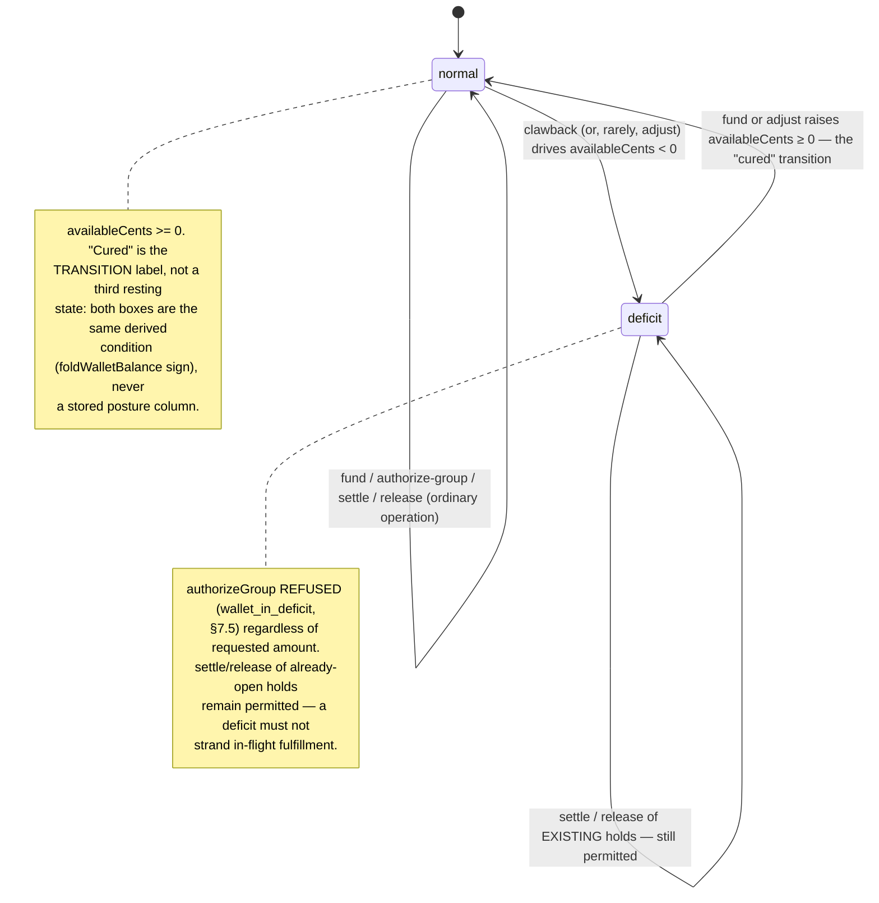

# WALLET-COMMITMENT-MODEL.md — CreditVector Wallet: Commitment Refinement (W1)

**Status:** PROPOSED. Architecture only — no product code, schema, dependency, env, flag, or
vendor change. Written by Agent W1 against `docs/fulfillment/COMMITMENT-REFINEMENT-BRIEF.md`
(binding spine; every deviation from S1–S8 is argued in-doc, not silent). Continuation of the
accepted package (`e223e51`), refining `C-WALLET-INTEGRATION.md` and `ADR-0044` — **not** a
redesign of the Wallet's purpose, only of its concrete money mechanics.

**SUPERSEDES:** `docs/fulfillment/C-WALLET-INTEGRATION.md` (§§1–9, selectively — full map in §13)
and `ADR-0044: CreditVector Wallet + WalletLedger` (its `Decision`/`Security implications`
clauses — full map in §13). `ADR-0045: Unified Claim Ledger Pattern` is **adopted**, not
superseded (§3.3 extends its key convention; the table itself is unchanged).

> **§7 CROA posture note (S7, verbatim from the brief — carried in every refinement doc's
> header):** Settlement-at-acceptance strengthens the §1679b(b) posture versus
> capture-at-top-up but does NOT moot the counsel question — funds are still received in
> advance at top-up. The counsel question (ADVERSARIAL-REVIEW §3.4) remains the hard
> precondition before any wallet implementation phase. Every refinement doc carries this note
> verbatim in its header. F1 (Gate D Phase −1) also stands.

**Vocabulary retirement (S8):** `authorize` / `settle` / `release` / `clawback` / `adjust` are
the only entry kinds. "Consume," "void," and "refund" are retired names — see §2 and the §13
supersession map for exactly what replaced each. "Hold," "commitment boundary," and "recovery"
are used per the brief's vocabulary; "consume" appears nowhere below except inside a quoted
citation of the prior package.

> **Refinement Cycle 2 (this revision), per `REFINEMENT-2-DIRECTIVE.md` (coordinator rulings)
> and `COMMITMENT-REGATE.md` (the must-fix source):** closes the re-gate's F4 restoration —
> re-authorization silently no-op'ing against a resolved attempt, and the paired false
> `insufficient_funds` — under Ruling 1 (§3.2, §3.3, §5.2, §7.3); cites the canonical wallet
> claim-key registry rather than re-deriving it, under Ruling 2 (§3.3, §15); fixes the
> `actorId` Restrict-FK failure mode for system-driven entries and propagates `onBehalfOfId`
> onto every downstream entry, per must-fix B6 (§3.2, §5.1–§5.6, §8.2–§8.3, §9.1–§9.3); closes
> the funding-integrity gaps at B7/N7 (§8.2); fixes the clawback over-count and adds the
> missing won-dispute reversal at N4, disclosing the agency-wide deficit blast radius (§8.3,
> §8.4); corrects the FINAL REVIEW consent-ordering conflation under Ruling 4 (§11, §15); and
> restates the F3–F7 disposition table honestly as RESOLVED-WITH-RESIDUALS (§14). Every change
> below is labeled with the must-fix or ruling it closes; everything not listed here is
> unchanged from the prior revision.

---

## 1. Scope, method, reading order

This document is the full wallet mechanics per Brief S1–S4 + S7: schema (§3), transaction
pseudocode for every operation under the anchor lock (§5), the authorization-group lifecycle
(§6), a line-by-line concurrency proof that F3 and F4 are now structurally impossible (§7),
funding integrity and the deficit posture (§8), the payer/spend-authority model (§9), Event Bus
contract updates (§10), the Founder's transaction model as a sequence diagram (§11), the Wallet
Constitution Amendment text (§12), the supersession map (§13), and the finding disposition for
F3/F4/F5/F6/F7 (§14). §15 collects the interface handles this document exposes to W2
(`FULFILLMENT-COMMITMENT-BOUNDARY.md` / `RECOVERY-ENGINE.md`) and W3 (`KAI-FULFILLMENT-UX.md`).
§16 restates what stays FOUNDER-GATE, unchanged from C-WALLET.

**Out of scope, by design, not oversight:** the unified fulfillment state machine (W2), the
17-scenario recovery matrix (W2), the FINAL REVIEW UI and Kai copy (W3), the `MailPricing.ts`
line-collapsing fix (Policy Engine / Agent A, unchanged from C-WALLET §4.6), cash-back-to-card
refund and Payouts (both remain FOUNDER-GATE, §16), and the CROA §404 legal question itself
(ADVERSARIAL-REVIEW §3, unchanged — this document's job is to make the *engineering* claims
defensible, not to answer the legal one).

Every citation below was read from the live worktree at write time (not re-derived from
C-WALLET's citations of them), specifically: `lib/entitlements.ts` (spendLetterCredits +
the payer law at :190), `lib/billing.ts` (the Stripe claim ledger + `creditLetters`),
`lib/reputation/fold.ts`, `lib/reputation/reconcile.ts`, `lib/reputation/events.ts`,
`lib/eventBus/validate.ts` (the PII denylist), `lib/eventBus/contracts.ts` and `envelope.ts`,
`app/api/stripe/checkout/route.ts` and `webhook/route.ts`, `lib/session.ts`,
`lib/mail/MailService.ts`, `lib/mail/MailStatus.ts`, `lib/mail/MailProvider.ts`,
`prisma/schema.prisma` (`XpAward`, `AdminAuditLog`, `User.letterCredits`), and
`docs/fulfillment/A-DOMAIN-MODEL.md` / `A-STATE-MACHINE.md` /
`CREDITVECTOR-FULFILLMENT-ENGINE-V1.md` (read-only, for the identity/claim conventions this
document must not diverge from).

---

## 2. Vocabulary — six entry kinds (S2)

| entryKind | amountCents sign | Fold effect | Fires at | Attempt-scoped? |
|---|---|---|---|---|
| `fund` | + | credit | Stripe top-up webhook, or admin grant | No (fixed `1`) |
| `authorize` | − | debit (a hold) | Approve → Wallet Authorized, one row per letter, inside one all-or-nothing group txn (§6) | Yes |
| `settle` | **0** | none — converts the hold from voidable to permanent | Provider `Accepted` (has a `providerJobId`) | Yes (same attempt as its authorize) |
| `release` | + | credit (restores the hold) | Pre-settle rejection / cancel / TTL sweep | Yes (same attempt as its authorize) |
| `clawback` | − | debit, **no floor** — may drive the fold negative | Stripe `refund.created` / `charge.dispute.created` (account-level — keyed on the refund/dispute's own id, §8.3, corrected from `charge.refunded`/event-id keying), or an operator/CCO post-settlement make-good (subject-level) | Yes for subject-level; fixed `1` for account-level |
| `adjust` | ± | correction, paired with `AdminAuditLog` | Admin-vocabulary — human-triggered, OR a `charge.dispute.closed`(won) automated compensating entry (§8.3) that still logs through the same `AdminAuditLog` trail (a "system" sentinel actor is safe there specifically, never on `WalletLedger` itself — §3.2's B6 argument) | No (fixed `1`) |

Renames from C-WALLET/ADR-0044: `consume` → `settle` (same zero-value-marker reasoning,
§5.4 preserves it verbatim); `void` → `release` (same pre-settle-failure reasoning, §5.5); the
old FOUNDER-GATE `refund` entry kind is retired — its two meanings split cleanly onto existing
kinds: the **in-wallet** reversal is now a `clawback` (subject-level flavor, §5.6); the
**cash-back-to-card** meaning stays a separate, still-FOUNDER-GATE decision outside the ledger
entirely (§16), never a `WalletLedger` entry kind. This is a deliberate resolution of an
ambiguity S2 left open (S2 lists six kinds and no seventh "refund"), argued here rather than
silently assumed: both the Stripe-side top-up reversal and the operational post-settlement
make-good share the identical structural property — money that was already available/settled
must be removed or credited *outside* the normal authorize→settle→done lifecycle, and both can
independently drive the fold negative — so one entry kind covers both, distinguished by
`subjectId` scope (account-level vs. per-letter) and `basis`, not by a second entry kind.

---

## 3. Schema (additive, migration-first, no self-heal, Restrict FKs)

Per `CLAUDE.md` gotcha #1 (owner-ratified 2026-07-20): every new table ships as a reviewed Prisma
migration, never `CREATE TABLE IF NOT EXISTS`, and is never added to
`scripts/schema-safety.test.ts`'s frozen `LEGACY_SELF_HEAL_ALLOWLIST`. This migration is
additionally gated by F1 (ADVERSARIAL-REVIEW §1) — it cannot execute before Gate D's Phase −1
lands; that precondition is unchanged by this document and is not re-argued here.

### 3.1 `Wallet` — the serialization anchor (S1)

One row per **payer principal**. It holds no balance — it exists to be locked.

```prisma
// ── CreditVector Wallet anchor (PROPOSED, additive) ──────────────────────────
// Holds NO balance. Its only job is to be the ONE row every money-moving
// transaction locks before touching WalletLedger (§4). This retracts
// C-WALLET §3.8's INSERT…SELECT "guard" outright — it took no lock, and the
// "negative balances structurally impossible" claim built on it was false
// (F3). A lock anchor is the only thing that can serialize a SUM invariant
// across an append-only table with no row of its own to lock.
model Wallet {
  id            String   @id @default(cuid())

  // "consumer" | "agency" — stamped ONCE at wallet-creation time from the
  // principal's classification at that moment (User.isAgency). Deliberately
  // NOT re-derived on every read: if an agency's subscription later lapses,
  // its existing Wallet keeps functioning as an agency wallet for funds
  // already loaded/held — a separate, unrelated gate (lib/entitlements.ts's
  // isPremium/agencyClientLimit) independently decides whether the agency
  // may still GENERATE new letters at all. This field does not re-answer
  // that question, and must not be re-derived to try. A closed, app-enforced
  // set (not a Prisma enum, to keep the migration purely additive against a
  // table with zero rows today); asserted by the migration guard.
  principalType String

  // The payer. v1: always a User.id — the same identity primitive every
  // other new fulfillment model uses today (A-DOMAIN-MODEL.md's
  // Case.userId / DisputePackage.userId — no OperatorIdentity/Organization
  // reference exists in the live schema). Restrict: an append-only
  // financial anchor must never cascade-delete (identical reasoning to
  // XpAward.operatorId, prisma/schema.prisma:768-772 — erasure is an
  // explicit step, never a silent FK cascade).
  principal     User     @relation("WalletPrincipal", fields: [principalId], references: [id], onDelete: Restrict)
  principalId   String

  // Optional (S1's own word) cheap staleness signal for LOCK-FREE advisory
  // readers — e.g. the Policy Engine's walletHasSufficientBalance() hint
  // (C-WALLET §3.2, retained). Bumped by 1 inside the SAME locked
  // transaction as every ledger insert (§4). NOT consulted by the
  // authoritative path — SELECT…FOR UPDATE already serializes that — purely
  // a "did anything change since I last looked" read for callers who
  // deliberately avoid taking the lock.
  lockVersion   Int      @default(0)

  createdAt     DateTime @default(now())

  ledgerEntries WalletLedger[]

  @@unique([principalId])   // exactly one wallet anchor per payer principal, ever
  @@index([principalType])
}
```

### 3.2 `WalletLedger` — revised, per-letter, attempt-keyed (S2)

```prisma
// ── CreditVector Wallet — append-only ledger (PROPOSED, additive) ────────────
// Mirrors XpAward (prisma/schema.prisma:749-786) field-for-field where the
// precedent applies; every deviation is called out below and is load-bearing
// for F3/F4/F5/F6/F7 (§14).
model WalletLedger {
  id                    String   @id @default(cuid())

  wallet                Wallet   @relation(fields: [walletId], references: [id], onDelete: Restrict)
  walletId              String

  // "fund" | "authorize" | "settle" | "release" | "clawback" | "adjust" — §2.
  // "consume" / "void" / "refund" never appear (S8). Closed, app-enforced set.
  entryKind             String

  // Signed cents. Negative = debit (authorize hold, clawback). Positive =
  // credit (fund, release, adjust-up). Zero ONLY for "settle" — a pure
  // state-transition marker (§5.4), precedented by MILESTONE_REACHED@1
  // carrying no numeric value at all (lib/eventBus/contracts.ts:279-282,
  // builder at lib/reputation/events.ts:127-137). Guarded non-zero for
  // every other kind.
  amountCents           Int

  // The stable business subject. authorize/settle/release/clawback
  // (subject-level) → the attempt-FREE base id, "mail_<letterId>" — constant
  // across every attempt of one letter, because it is what ties them together
  // under this table's own `attempt` column (below). fund → "topup:<PaymentIntent
  // id>" (§8.2, corrected from an earlier `<eventId>` keying — B7/N7). adjust →
  // an admin correction id. clawback (account-level) → "chargeback:<refund or
  // dispute id>" (§8.3, corrected from `<eventId>` — N4). NEVER the bare
  // per-emission webhook id alone (same law as XpAward.subjectId,
  // prisma/schema.prisma:753-754 — this is a REPEAT of the exact discipline that
  // table already enforces, not a new one).
  //
  // ⚠️ Corrected misnomer (per REFINEMENT-2-DIRECTIVE Ruling 1): a prior revision
  // of this comment called subjectId itself "the manifest id" — accurate only
  // for TODAY's shipped one-manifest-per-letter code (`mailId = mail_${letter.id}`,
  // app/api/mail/prepare/route.ts:16,52), and no longer accurate once Ruling 1's
  // attempt lifecycle lands: the per-ATTEMPT physical manifest becomes a
  // DIFFERENT, additional string, `mail_<letterId>_a<n>`, minted fresh on every
  // retry and owned by `DisputePackageLetter.attempt` (W2's schema,
  // FULFILLMENT-COMMITMENT-BOUNDARY.md/RECOVERY-ENGINE.md) — one letter can then
  // have N manifests (one per attempt) all sharing this ONE wallet subjectId.
  // subjectId is the wallet's cross-attempt correlation key; it is never itself
  // a manifest id once more than one attempt can exist.
  subjectId             String

  // Generation counter for THIS subject's authorize/settle/release chain
  // (S2 — the direct structural fix for F4 and F9-iii). Fixed at 1 for
  // fund/adjust/account-level-clawback (the dimension is meaningless there;
  // held constant so the unique key below still applies uniformly). A
  // re-authorization after a release is attempt+1 — a NEW tuple, never a
  // collision with the reversed generation's row. The WALLET does not
  // compute this value: it is supplied by the caller (Recovery Engine /
  // Policy Engine, W2's domain) and only ENFORCED here via the sequence
  // guard (§5.2, guard table row 3–4). This mirrors policyVersion's
  // freeze-not-compute posture: the wallet is a pure consumer of a decision
  // made elsewhere, never the author of it.
  attempt               Int      @default(1)

  // Ties every per-letter authorize row created inside ONE §6 all-or-nothing
  // group transaction to that package-level authorization event. Carried
  // forward — never re-minted — by a same-round single-letter
  // re-authorization after a partial failure (§6.3). Null for
  // fund/adjust/account-level-clawback (no package is involved).
  authorizationGroupId  String?

  // The Policy Engine's rate-decision version in effect when an authorize
  // was written — frozen forever, mirroring XpAward.policyVersion never
  // re-minting past awards. COPIED verbatim (never re-read) onto that
  // hold's eventual settle/release row, since neither re-prices anything.
  // Nullable: meaningless for fund/adjust/account-level-clawback (no
  // pricing decision occurred there); the non-null requirement for
  // authorize/settle/release is an application-level invariant (asserted by
  // the runtime guard, §6 of the activation posture carried from C-WALLET
  // §8.3), not a DB CHECK constraint, to keep the migration purely additive.
  policyVersion         Int?

  // Machine-readable cause code. "basis," never a "reason"-shaped key — the
  // PII denylist bans any KEY containing "reason" (lib/eventBus/validate.ts
  // :25) and this column name is deliberately chosen to match the payload
  // field name it will mirror into events (§10), not just to dodge the
  // guard. Values per operation are enumerated at each pseudocode block (§5).
  basis                 String

  // Provenance / linkage — refs only, never raw payment or vendor data.
  reversesId            String?  // settle/release/clawback(subject-level) → the authorize row's id
  stripeRef             String?  // PaymentIntent/Charge/Refund/Dispute id (fund/clawback)
  sourceEventId         String?  // provenance only (webhook/dispatch id) — NEVER part of the unique key

  // Principal-aware audit (S4 — the structural fix for F7). actorId is the
  // REAL operator identity who performed this action — never a literal
  // "user" placeholder. Supersedes MailService.approve's unconditional
  // `actor: "user"` stamp (lib/mail/MailService.ts:129, `to: "APPROVED",
  // actor: "user", event: "user.approved"`). onBehalfOfId is the managed
  // client this action was performed FOR, when the actor is an agency
  // principal acting inside a client workspace (lib/session.ts
  // WORKSPACE_COOKIE, :8); null when the actor spends for themselves.
  //
  // ⚠️ NULLABLE, corrected from a non-null Restrict FK (must-fix B6, argued
  // here). `fund` (Stripe top-up webhook) and `clawback` (Stripe
  // chargeback/refund/dispute webhooks) fire from a webhook handler with no
  // signed-in User anywhere in the call path; `settle` fires from the mail
  // provider's async acceptance callback; `release` and `clawback` may fire
  // from the reconciliation sweep or a won-dispute reversal (§8.3, §8.4) —
  // none of these has a real User to point at. A non-null `Restrict` FK
  // fails at the FIRST such insert, because there is no "system" row in
  // `User` — exactly what a prior revision's literal `actorId: "system"`
  // (§8.3) would have hit. `actorKind` is the closed, app-enforced String
  // this table already uses for `entryKind` itself (§2) — not a Prisma
  // `enum`, for the identical purely-additive-migration reason `principalType`
  // (§3.1) gives — with values `"operator" | "agency" | "system"`: `actorId`
  // is present (and FK-checked) whenever `actorKind` is `"operator"` or
  // `"agency"`, and is null if and only if `actorKind` is `"system"` — an
  // application-level pairing invariant (asserted by `wallet-runtime.test.ts`,
  // mirroring §3.2's existing policyVersion non-null-per-kind discipline), not
  // a DB CHECK constraint, to keep the migration purely additive.
  //
  // **The alternative considered and rejected: AdminAuditLog's own precedent**
  // (`actorId String`, no FK at all — prisma/schema.prisma:112-124) is
  // deliberately NOT adopted here. It is the safer default for a table whose
  // actor is *always* an admin and whose only cost of a bad id is a broken
  // report; it would be the wrong trade for `WalletLedger`, whose §9.3
  // argument for a REAL FK ("not a documentation convention") is the
  // structural fix for F7 — dropping the FK to accommodate the system-driven
  // minority would silently drop that guarantee for every operator/agency
  // row too. Nullable-Restrict keeps the FK's integrity check for every row
  // that has a real actor and only relaxes it for the rows that provably do
  // not. (`AdminAuditLog`'s own actorId, being a plain unconstrained String,
  // already tolerates a "system" sentinel value with no FK to violate — see
  // §8.3's won-dispute handler, which uses exactly that precedent for the
  // audit-log row it writes, correctly, because THAT table never had this
  // table's FK to begin with.)
  actor                 User?    @relation("WalletLedgerActor", fields: [actorId], references: [id], onDelete: Restrict)
  actorId               String?
  actorKind             String   // "operator" | "agency" | "system" — closed, app-enforced (B6)
  onBehalfOf            User?    @relation("WalletLedgerOnBehalfOf", fields: [onBehalfOfId], references: [id], onDelete: Restrict)
  onBehalfOfId          String?  // (B6) propagated onto settle/release/clawback from the authorize
                                  // row they resolve or reverse — never only on authorize (§5.3-§5.5)

  createdAt             DateTime @default(now())

  // Idempotency — mirrors XpAward's @@unique([subjectId, operatorId,
  // awardKind]) shape, EXTENDED with `attempt` (S2's structural fix for
  // F4/F9-iii): one entry per (wallet, subject, kind, generation), ever. A
  // retried call for the SAME (subject, kind, attempt) is a no-op returning
  // the ORIGINAL row (§5's double-authorize/double-settle guard cases); a
  // call for a NEW attempt is a genuinely new row, not a collision.
  @@unique([walletId, subjectId, entryKind, attempt])
  @@index([walletId, createdAt, id])   // the fold's canonical replay order
  @@index([subjectId])
  @@index([authorizationGroupId])
  @@index([stripeRef])                 // clawback lookup: which fund did this charge/dispute reverse? (§8.3)
}
```

### 3.3 `Claim` — adopted verbatim from ADR-0045, key convention extended

`ADR-0045: Unified Claim Ledger Pattern` already resolved the C-WALLET §3.6 / A-STATE-MACHINE §8
collision (one shared, domain-tagged table, not two). This document does not re-argue that
decision — it adopts the table exactly as merged (`CREDITVECTOR-FULFILLMENT-ENGINE-V1.md` §5.3)
and reproduces it here only because every operation in §5 is claim-before-effect against it.

```prisma
// ── ADOPTED VERBATIM from ADR-0045 (CREDITVECTOR-FULFILLMENT-ENGINE-V1.md §5.3) ──
// Reproduced, not redesigned. This document's only addition is the KEY
// CONVENTION for the WALLET domain (below) — the table shape is unchanged.
enum ClaimDomain { MAIL_TRANSITION WALLET }
model Claim {
  key         String      @id
  domain      ClaimDomain
  state       String                      // "pending" | "committed" | "failed"
  resultRef   String?
  createdAt   DateTime    @default(now())
  settledAt   DateTime?
  @@index([domain, state, createdAt])
}
```

**⚠️ Load-bearing correction to the WALLET key convention — now the canonical registry entry,
cited not re-derived (per REFINEMENT-2-DIRECTIVE Ruling 2).** C-WALLET §3.6 proposed
`wallet:<subjectId>:<transition>` — with no attempt dimension. Adopted as-is, this would
silently reopen a variant of F4 through the claim layer even after §3.2's ledger fix: attempt
2's claim-before-effect check for `wallet:mail_abc:authorize` would find attempt 1's *already-
committed* claim under the identical key and treat attempt 2 as a duplicate, short-circuiting
before the ledger is ever consulted. This document first argued the fix in Refinement Cycle 1;
the coordinator has since made it the **binding, single-source-of-truth registry** for the
wallet-entry domain (Ruling 2, resolving must-fix C's three-grammar defect — the re-gate found
W1 and W2 had drifted to two different spellings, `wallet:<subjectId>:<attempt>:<entryKind>`
here versus `wallet:<subjectId>:<transition>:<attempt>` in W2). **The canonical Wallet-entry
key, stated once and referenced everywhere else, is `wallet:<subjectId>:<attempt>:<entryKind>`**
— extending, not replacing, ADR-0045's table. `fund`/`adjust`/account-level `clawback` key at
`attempt=1` uniformly, consistent with §3.2's fixed-attempt convention for those kinds. Per
Ruling 2, W2's mail-transition domain key (`mail:<subjectId>:<attempt>:<toStage>`) is the
sibling half of this same registry — stated once, in the directive, not re-spelled by either
document; neither key shape is this document's to re-argue further.

**Why two layers (claim table + row lock), not one.** The `Claim` check is a **cheap, lock-free
outer** dedup: an HTTP route or webhook handler consults it *before* ever opening a transaction
or attempting the Wallet's `FOR UPDATE` lock, so a duplicate request (a UI double-click, a
redelivered Stripe webhook) can be turned away — or told "in_flight, retry" — without waiting on
a lock at all. The Wallet row lock + `WalletLedger`'s own unique key (§4, §5) is the
**authoritative inner** guarantee: it is what actually makes the money-safety invariant true,
lock-free or not. The outer layer is defense-in-depth and an HTTP-semantics convenience (Stripe
needs a genuine "come back later" signal, distinct from "already done" — exactly the reasoning
`lib/billing.ts`'s `StripeEventClaim` type documents for its own three states); it is not, by
itself, what prevents F3 or F4. Removing the outer layer would not reopen either finding;
removing the inner layer would undo this entire document.

**Staleness window — a different constant from `STALE_CLAIM_MINUTES`, not shared.** The wallet's
`Claim` row goes stale (reclaimable) on a window sized to "how long can a serverless invocation
plausibly hold this before it died" — the same order of magnitude as `STALE_CLAIM_MINUTES = 15`
(`lib/billing.ts:148`), because it answers the identical technical question. This is unrelated to
and must never be confused with an authorize **hold's own business-level TTL** (S6's
reconciliation-sweep `staleAfter` window, W2's domain, potentially hours or days) — C-WALLET §3.4
already drew this exact distinction ("a wallet hold's TTL bounds operator behavior instead, and
the two must not be confused or share a constant"); this document preserves it unchanged.

### 3.4 Additive relation fields on `User` (append-only; the rest of `User` is unchanged)

```prisma
model User {
  // …existing fields unchanged, not reproduced here…

  walletAsPrincipal      Wallet?        @relation("WalletPrincipal")
  walletLedgerActedAs    WalletLedger[] @relation("WalletLedgerActor")
  walletLedgerOnBehalfOf WalletLedger[] @relation("WalletLedgerOnBehalfOf")
}
```

### 3.5 Migration-first discipline (unchanged from C-WALLET §2.6, restated)

`WalletLedger`/`Wallet` ship as one reviewed Prisma migration (`prisma/migrations/<ts>_wallet/`),
never `CREATE TABLE IF NOT EXISTS`, never added to the frozen `LEGACY_SELF_HEAL_ALLOWLIST`. Zero
`DROP`/`TRUNCATE`/`DELETE FROM`/`RENAME`. `Claim` is a **separate** migration (ADR-0045's own),
depended upon, not re-shipped here — the wallet migration cannot activate before `Claim` exists,
since every wallet transition is claim-before-effect against it. Guards (extending C-WALLET §8.3,
renamed/expanded cases in §5's guard table): `wallet-migration-guard.test.ts` (static — additive-
only, `RESTRICT` FKs, the four-part unique constraint, the fold-order index) +
`wallet-runtime.test.ts` (executing — every named guard case in §5).

---

## 4. Concurrency foundation — the serialization anchor (S1)

Every money-moving operation runs this shape, with no exception:

```
prisma.$transaction(async (tx) => {
  await tx.$queryRawUnsafe('SELECT id FROM "Wallet" WHERE id = $1 FOR UPDATE', walletId);
  // ── the lock is now held for the remainder of this transaction ──
  const rows = await tx.walletLedger.findMany({ where: { walletId }, orderBy: [{ createdAt: "asc" }, { id: "asc" }] });
  const fold = foldWalletBalance(rows);           // §4.1 — no zero-floor
  // … operation-specific guard against `fold` and/or a targeted row lookup …
  // … tx.walletLedger.create({ data: { … } }) …
  await tx.wallet.update({ where: { id: walletId }, data: { lockVersion: { increment: 1 } } });
});
```

This is the identical idiom `creditLetters` already uses (`prisma.$transaction(async (tx) =>
{...})`, `lib/billing.ts:256-268`) — no new transaction mechanism is introduced. `SELECT … FOR
UPDATE` has no Prisma query-builder equivalent, so it is the one raw statement in an otherwise
typed-Prisma body; every read/write after the lock uses the generated client.

### 4.1 `foldWalletBalance` — no zero-floor (S1, the direct fix for F3's second half)

```typescript
// PROPOSED — same shape as foldStanding (lib/reputation/fold.ts:43-67) MINUS the floor.
// F3 flagged the floor as "erasing overdraft evidence — the fold is a lower bound, not a
// provable books state." The floor is retracted here; it survives ONLY as a display-time
// clamp at the read boundary (operator/Kai surfaces, §8.4), never inside the accounting fold.
export function foldWalletBalance(rows: readonly WalletLedgerRow[]): WalletFold {
  const ordered = [...rows].sort(canonicalOrder); // [createdAt asc, id asc] — identical order to foldStanding
  let cents = 0;
  for (const r of ordered) {
    const c = Number.isFinite(r.amountCents) ? Math.trunc(r.amountCents) : 0;
    cents += c;
  }
  return {
    availableCents: cents,               // CAN be negative — deficit posture (§8.4), never clamped
    postureNormal: cents >= 0,
  };
}
```

### 4.2 Isolation assumptions, stated explicitly (per the brief's requirement)

1. **Database:** PostgreSQL — the same store every cited precedent runs on
   (`StripeWebhookEvent`, `XpAward`, `AdminAuditLog`).
2. **Isolation level:** READ COMMITTED, Postgres's default. No transaction below sets
   `isolationLevel` on `prisma.$transaction`; none of the precedent code does either
   (`creditLetters`, `claimStripeEvent`). This is a deliberate choice, not an oversight — see
   point 5.
3. **Row-level locking:** `SELECT … FOR UPDATE` on the `Wallet` row is respected by **every**
   code path that reads or writes `WalletLedger` for a given `walletId`. This is a load-bearing
   discipline requirement, not just a nice property: the entire proof in §7 fails the moment a
   single write path (a future "quick admin adjust" button, say) bypasses the shared
   lock-first helper. `wallet-runtime.test.ts` must assert no other write path onto
   `WalletLedger` exists (mirroring the static-source assertions `reputation-runtime.test.ts`
   already makes for its own ledger, e.g. "no update/delete path anywhere").
4. **Transaction mechanism:** Prisma interactive transactions (`prisma.$transaction(async (tx)
   => {...})`), identical to the existing `creditLetters` precedent — no new primitive.
5. **Why READ COMMITTED + an explicit row lock, not SERIALIZABLE + retry (F3's alternative
   fix list offered both):** the invariant being protected — "the sum of open holds and
   settlements against one wallet never exceeds that wallet's funds" — is entirely mediated
   through **one row** (the `Wallet` anchor) that every conflicting transaction must lock before
   touching the ledger. Row-level locking on that single row is sufficient to serialize every
   conflicting operation. SERIALIZABLE + retry is the right tool when an invariant spans
   multiple rows/tables with no single serialization point to lock; that is not this case, and
   reaching for it here would add retry-loop complexity the anchor design doesn't need.
6. **No deadlock hazard by construction:** every wallet operation locks **exactly one** `Wallet`
   row; v1 has no cross-wallet transfer (§1.6, C-WALLET's non-transferability rule, unchanged),
   so no transaction ever needs two wallet locks at once. There is no lock-ordering cycle to
   construct, hence no deadlock possibility between two wallet transactions.

---

## 5. Transaction pseudocode — every operation

All operations share the failure-shape convention `{ ok: false, code: <string>, error: <string>
}` (matching `lib/reputation/service.ts`'s `ServiceResult`/`ErrorCode` pattern, reused verbatim by
`reconcileOperatorFacts`) and the success replay shape `{ ok: true, created: false, entryId:
<original> }` for idempotent no-ops, vs. `{ ok: true, created: true, entryId: <new> }` for a
fresh write.

Every function below begins, before the code shown, with the identical `WALLET_ENABLED` fail-
closed check C-WALLET §8.1 already specifies verbatim (`if (!walletEnabled()) return { ok: false,
code: "disabled", error: "wallet disabled" }`) — omitted from each block below to avoid repeating
unchanged boilerplate seven times; it is not omitted from the master guard table, and the
activation posture (§3.5) and its runtime guard remain exactly C-WALLET §8.1–8.3's design.

### Master guard/failure table

| Code | Operation(s) | Trigger | Shape |
|---|---|---|---|
| `disabled` | all | `WALLET_ENABLED !== "true"` | `{ok:false}`, fails closed before any lock |
| `forbidden_impersonation` | all money-moving | `impersonationContext()` non-null (§9.3) | `{ok:false}`, refused before a walletId is even resolved |
| `managed_client_cannot_spend` | authorize-group | actor is a managed client on agency-managed fulfillment (§9.2) | `{ok:false}`, refused before a walletId is resolved |
| `invalid_amount` | fund, authorize-group (per letter) | non-positive/non-integer `amountCents` | `{ok:false}`, no row inserted (F6 fix, §8.2) |
| `insufficient_funds` | authorize-group | `availableCents < Σrequested`, posture normal | HTTP-402-shaped (§5.2) |
| `wallet_in_deficit` | authorize-group | `availableCents < 0` at request time, **regardless of requested amount** | HTTP-409-shaped (§5.2, §7.5) |
| `attempt_out_of_sequence` | authorize (per letter) | requested `attempt` ≠ priorTerminalCount + 1, or a gap | `{ok:false}`, no row inserted |
| `prior_attempt_still_active` | authorize (per letter) | an earlier attempt for this subject has no settle/release yet | `{ok:false}`, no row inserted |
| `attempt_already_resolved` | authorize (per letter) | an authorize row exists for `(subjectId, attempt)` **and** a settle/release sibling already exists for that same tuple — the attempt is TERMINAL | `{ok:false}`, no row inserted, rolls back the WHOLE group (§6.1) — **the direct F4/N1 refusal (Ruling 1); never a replay no-op** |
| `no_active_hold` | settle, release | no authorize row for `(subjectId, attempt)` | `{ok:false}` |
| `already_released` | settle | a release row already exists for `(subjectId, attempt)` — **settle-after-release** | `{ok:false}` (§7.3) |
| `already_settled` | release | a settle row already exists for `(subjectId, attempt)` — **release-after-settle** | `{ok:false}` (§7.6) |
| `missing_audit_log` | adjust | no paired `AdminAuditLog` id supplied | `{ok:false}`, no row inserted |

Idempotent replays (NOT errors — `{ok:true, created:false, entryId:<original>}`): a repeated
`fund`/`authorize`/`settle`/`release`/`clawback` for the identical key tuple. **An authorize
replay is idempotent ONLY when the existing row for that tuple has no settle/release sibling
(Ruling 1, §5.2, §7.3) — otherwise it is `attempt_already_resolved` (error table above), never a
silent no-op.** This is the exact correction the re-gate's F4/N1 findings forced: a prior
revision's replay branch returned `ok:true` for ANY existing `(subjectId, attempt)` row,
resolved or not, which is precisely how a released attempt's re-authorization request could once
be told "a hold exists" with no new debit ever written. **Double-settle** is deliberately in this
list, not the error table (§7.4) — this is an engineered distinction, not an oversight: unlike
settle-after-release (a genuine business-fact conflict) or a resolved-attempt authorize replay
(a genuine attempt-lifecycle conflict), a second `settle` call for the exact same `(subjectId,
attempt)` asserts the same fact twice, harmlessly, because the unique key plus the zero-amount
design make a second row both impossible and unnecessary.

### 5.1 `fundWallet` (S3)

```typescript
async function fundWallet(
  walletId: string, amountCents: number, subjectId: string, stripeRef: string,
  origin: "stripe_checkout" | "admin_grant",
  actorId: string | null, actorKind: "operator" | "agency" | "system",  // B6 — nullable/kinded, §3.2
) {
  if (!Number.isInteger(amountCents) || amountCents <= 0) return { ok: false, code: "invalid_amount", error: "unrecognized or non-positive top-up amount" }; // F6 fix — fails CLOSED, never guesses (mirrors planForPrice, lib/stripe.ts:201-217)
  return prisma.$transaction(async (tx) => {
    await tx.$queryRawUnsafe('SELECT id FROM "Wallet" WHERE id = $1 FOR UPDATE', walletId);
    const existing = await tx.walletLedger.findFirst({ where: { walletId, subjectId, entryKind: "fund", attempt: 1 } });
    if (existing) return { ok: true, created: false, entryId: existing.id }; // webhook replay — belt-and-braces alongside claimStripeEvent
    const row = await tx.walletLedger.create({ data: {
      walletId, entryKind: "fund", amountCents, subjectId, attempt: 1,
      basis: origin, stripeRef, actorId, actorKind,
    }});
    await tx.wallet.update({ where: { id: walletId }, data: { lockVersion: { increment: 1 } } });
    return { ok: true, created: true, entryId: row.id };
  });
}
```

No fold-check invariant applies to `fund` — crediting the wallet can never overdraw it. The
guard here is entirely the **fail-closed unknown-amount law** (F6), checked before the lock is
even taken. `origin: "stripe_checkout"` calls (§8.2) pass `actorId: null, actorKind: "system"` —
a Stripe webhook, not a signed-in User, credited this row (B6); `origin: "admin_grant"` calls
pass the granting admin's real `User.id` and `actorKind: "operator"`.

### 5.2 `authorizeGroup` — THE canonical authorize operation (S1, S2, resolves F3/F4)

A single-letter authorize is the `holds.length === 1` special case of this same operation — there
is no separate top-level "authorize" function.

```typescript
interface LetterHoldRequest { subjectId: string; attempt: number; amountCents: number; policyVersion: number; basis: string; }

async function authorizeGroup(
  walletId: string, authorizationGroupId: string, holds: LetterHoldRequest[],
  actorId: string, actorKind: "operator" | "agency", onBehalfOfId: string | null,
) {
  return prisma.$transaction(async (tx) => {
    // ── the anchor lock — the ENTIRE fix for F3 ──
    await tx.$queryRawUnsafe('SELECT id FROM "Wallet" WHERE id = $1 FOR UPDATE', walletId);

    // ── the fold — the amount-independent deficit guard runs BEFORE anything
    // else, exactly as before (§7.5) ──
    const rows = await tx.walletLedger.findMany({ where: { walletId } });
    const { availableCents } = foldWalletBalance(rows);
    if (availableCents < 0) {
      return { ok: false, code: "wallet_in_deficit", error: "wallet is in a deficit posture; no new authorizations until cured", deficitCents: -availableCents };
    }

    // ── PASS 1 — classify EVERY hold before pricing anything (per REFINEMENT-
    // 2-DIRECTIVE Ruling 1 — the direct fix for the re-gate's F4 restoration
    // and its N1 side-effect). A hold whose (subjectId, attempt) already has a
    // settle/release sibling names a TERMINAL attempt — re-authorizing it is
    // REFUSED, never a free replay. A hold whose (subjectId, attempt) has an
    // authorize row with NO such sibling is a true in-flight duplicate (a UI
    // double-click, a retried caller) and is returned as-is, WITHOUT being
    // priced again — pricing it again was N1's false insufficient_funds. Only
    // a hold with no existing row at all is "new" and belongs in the funds
    // check below. This replaces the single unconditional "existing → return"
    // branch a prior revision used, which is exactly what let a released
    // attempt's re-authorization request be told "a hold exists" with no new
    // debit ever written (the re-gate's surviving F4 path).
    type Classified =
      | { hold: LetterHoldRequest; kind: "replay"; entryId: string }
      | { hold: LetterHoldRequest; kind: "new" };
    const classified: Classified[] = [];
    for (const h of holds) {
      const existing = await tx.walletLedger.findFirst({ where: { walletId, subjectId: h.subjectId, entryKind: "authorize", attempt: h.attempt } });
      if (existing) {
        // An authorize row already occupies this EXACT (subjectId, attempt)
        // tuple. Whether this is a harmless replay or a resolved attempt being
        // asked to pay twice turns entirely on whether it has been settled or
        // released — NEVER on merely "a row exists," which was the defect.
        const resolved = await tx.walletLedger.findFirst({
          where: { walletId, subjectId: h.subjectId, attempt: h.attempt, entryKind: { in: ["settle", "release"] } },
        });
        if (resolved) {
          // THE Ruling 1 refusal. This attempt is TERMINAL — settled or
          // released — and can never be re-held or re-settled. There is no
          // "same-attempt re-authorization" (§7.3 restates this): the only
          // legal retry is a fresh authorizeGroup call at attempt+1, a
          // genuinely NEW tuple under the unique key.
          throw new WalletGuardError("attempt_already_resolved", h.subjectId); // rolls back the WHOLE group — all-or-nothing
        }
        // No settle/release sibling — a true idempotent replay of an attempt
        // still genuinely in flight. Return the ORIGINAL row; no new debit,
        // and — the N1 fix — its amount never enters requiredCents below.
        classified.push({ hold: h, kind: "replay", entryId: existing.id });
        continue;
      }

      // No existing row at all for this tuple — sequence-guard it (unchanged
      // from Refinement Cycle 1).
      const priorLatest = await tx.walletLedger.findFirst({
        where: { walletId, subjectId: h.subjectId, entryKind: "authorize" },
        orderBy: { attempt: "desc" },
      });
      if (priorLatest) {
        const terminal = await tx.walletLedger.findFirst({
          where: { walletId, subjectId: h.subjectId, attempt: priorLatest.attempt, entryKind: { in: ["settle", "release"] } },
        });
        if (priorLatest.attempt >= h.attempt) {
          throw new WalletGuardError("attempt_out_of_sequence", h.subjectId); // rolls back the WHOLE group — all-or-nothing
        }
        if (priorLatest.attempt === h.attempt - 1 && !terminal) {
          throw new WalletGuardError("prior_attempt_still_active", h.subjectId);
        }
        if (priorLatest.attempt < h.attempt - 1) {
          throw new WalletGuardError("attempt_out_of_sequence", h.subjectId); // a gap
        }
      }
      classified.push({ hold: h, kind: "new" });
    }

    // ── the funds check — over ONLY the holds that will actually debit
    // (Ruling 1 / N1 fix). A replay's amount is already reflected in
    // `availableCents` from its ORIGINAL insert; counting it again here is
    // exactly N1's false insufficient_funds, which could fire whenever the
    // wallet held less than 2× the group's cost on a genuine replay. ──
    const requiredCents = classified
      .filter((c): c is Extract<Classified, { kind: "new" }> => c.kind === "new")
      .reduce((s, c) => s + c.hold.amountCents, 0);
    if (availableCents < requiredCents) {
      return { ok: false, code: "insufficient_funds", availableCents, requiredCents, shortfallCents: requiredCents - availableCents };
    }

    // ── PASS 2 — insert only the "new" holds, ALL inside this one locked
    // transaction; replays contribute their original entryId with no write. ──
    const created: { subjectId: string; entryId: string }[] = [];
    for (const c of classified) {
      if (c.kind === "replay") { created.push({ subjectId: c.hold.subjectId, entryId: c.entryId }); continue; }
      const row = await tx.walletLedger.create({ data: {
        walletId, entryKind: "authorize", amountCents: -c.hold.amountCents,
        subjectId: c.hold.subjectId, attempt: c.hold.attempt, authorizationGroupId,
        policyVersion: c.hold.policyVersion, basis: c.hold.basis, actorId, actorKind, onBehalfOfId,
      }});
      created.push({ subjectId: c.hold.subjectId, entryId: row.id });
    }
    await tx.wallet.update({ where: { id: walletId }, data: { lockVersion: { increment: 1 } } });
    return { ok: true, authorizationGroupId, entries: created };
  });
  // A thrown WalletGuardError propagates out of prisma.$transaction, rolling back EVERY insert
  // made so far in this call — the all-or-nothing property (§6.1) is Postgres's own transaction
  // atomicity, not application bookkeeping.
}
```

The 402/409 shapes returned are the exact contracts §8.5 hands to W3's FINAL REVIEW UI.

### 5.3 `settleHold` (resolves F4's "consume-after-void unguarded" — the settle-after-release direction)

```typescript
async function settleHold(
  walletId: string, subjectId: string, attempt: number, basis: string,
  actorId: null, actorKind: "system",  // B6 — settle fires ONLY from the provider's async acceptance callback (§2); never a signed-in User, so the type is narrowed, not just the practice
) {
  return prisma.$transaction(async (tx) => {
    await tx.$queryRawUnsafe('SELECT id FROM "Wallet" WHERE id = $1 FOR UPDATE', walletId);

    const authorizeRow = await tx.walletLedger.findFirst({ where: { walletId, subjectId, attempt, entryKind: "authorize" } });
    if (!authorizeRow) return { ok: false, code: "no_active_hold", error: "no authorize row for this subject/attempt" };

    const existingSettle = await tx.walletLedger.findFirst({ where: { walletId, subjectId, attempt, entryKind: "settle" } });
    if (existingSettle) return { ok: true, created: false, entryId: existingSettle.id }; // double-settle — safe idempotent replay, NOT an error (§5 master table)

    const released = await tx.walletLedger.findFirst({ where: { walletId, subjectId, attempt, entryKind: "release" } });
    if (released) return { ok: false, code: "already_released", error: "hold was already released; cannot settle" }; // ← THE settle-after-release refusal

    const row = await tx.walletLedger.create({ data: {
      walletId, entryKind: "settle", amountCents: 0, subjectId, attempt,
      reversesId: authorizeRow.id,
      policyVersion: authorizeRow.policyVersion,   // COPIED, never re-read
      onBehalfOfId: authorizeRow.onBehalfOfId,      // COPIED, never re-read (B6) — the permanent
      // record of WHO a settled charge was for must survive on the entry that makes it
      // PERMANENT, not only on the authorize row that preceded it.
      basis, actorId, actorKind,
    }});
    await tx.wallet.update({ where: { id: walletId }, data: { lockVersion: { increment: 1 } } });
    return { ok: true, created: true, entryId: row.id };
  });
}
```

`basis` values: `"provider_accepted"`.

### 5.4 `releaseHold` (the mirror-image refusal — release-after-settle)

```typescript
async function releaseHold(
  walletId: string, subjectId: string, attempt: number, basis: string,
  actorId: string | null, actorKind: "operator" | "agency" | "system",  // B6 — caller-supplied per basis: ("system", null) for provider_rejected/ttl_expired/policy_failed; the real canceler's identity for operator_canceled
) {
  return prisma.$transaction(async (tx) => {
    await tx.$queryRawUnsafe('SELECT id FROM "Wallet" WHERE id = $1 FOR UPDATE', walletId);

    const authorizeRow = await tx.walletLedger.findFirst({ where: { walletId, subjectId, attempt, entryKind: "authorize" } });
    if (!authorizeRow) return { ok: false, code: "no_active_hold", error: "no authorize row for this subject/attempt" };

    const existingRelease = await tx.walletLedger.findFirst({ where: { walletId, subjectId, attempt, entryKind: "release" } });
    if (existingRelease) return { ok: true, created: false, entryId: existingRelease.id }; // double-release — idempotent replay

    const settled = await tx.walletLedger.findFirst({ where: { walletId, subjectId, attempt, entryKind: "settle" } });
    if (settled) return { ok: false, code: "already_settled", error: "hold was already settled; cannot release" }; // ← release-after-settle refusal

    const row = await tx.walletLedger.create({ data: {
      walletId, entryKind: "release", amountCents: Math.abs(authorizeRow.amountCents), subjectId, attempt,
      reversesId: authorizeRow.id,
      policyVersion: authorizeRow.policyVersion,
      onBehalfOfId: authorizeRow.onBehalfOfId,      // COPIED, never re-read (B6) — see §5.3's identical note
      basis, actorId, actorKind,
    }});
    await tx.wallet.update({ where: { id: walletId }, data: { lockVersion: { increment: 1 } } });
    return { ok: true, created: true, entryId: row.id };
  });
}
```

`basis` values: `"provider_rejected"` | `"operator_canceled"` | `"policy_failed"` |
`"ttl_expired"` (the last is S6's reconciliation-sweep release — never a silent settle-by-
timeout; Wallet Constitution Amendment invariant 3, §12).

### 5.5 `clawback` (S3, resolves F6's "chargebacks unrepresentable")

Two flavors sharing one function, distinguished by `subjectId` scope and `basis` — no separate
entry kind (§2's reasoning).

```typescript
async function clawback(
  walletId: string, subjectId: string, attempt: number, amountCents: number,
  basis: "chargeback" | "refund_reversal" | "operational_makegood",
  stripeRef: string | null, reversesId: string | null,
  actorId: string | null, actorKind: "operator" | "agency" | "system",  // B6 — ("system", null) for the account-level Stripe-webhook flavors; the make-good's real actor for operational_makegood
) {
  return prisma.$transaction(async (tx) => {
    await tx.$queryRawUnsafe('SELECT id FROM "Wallet" WHERE id = $1 FOR UPDATE', walletId);

    const existing = await tx.walletLedger.findFirst({ where: { walletId, subjectId, entryKind: "clawback", attempt } });
    if (existing) return { ok: true, created: false, entryId: existing.id };

    // onBehalfOfId (B6, propagated). The subject-level `operational_makegood`
    // flavor names the settle row it reverses via `reversesId` — that row
    // already carries the real on-behalf-of attribution (itself copied
    // forward from ITS authorize row, §5.3) — copy it again so the permanent
    // record of WHO a settled charge was for survives on the clawback entry
    // too, not only on authorize/settle. The two account-level flavors
    // (`chargeback`/`refund_reversal`) have no `reversesId` and no single
    // letter to attribute to — §9's model has nothing narrower than the
    // account itself to name there, so `onBehalfOfId` stays null.
    let onBehalfOfId: string | null = null;
    if (reversesId) {
      const reversed = await tx.walletLedger.findUnique({ where: { id: reversesId } });
      onBehalfOfId = reversed?.onBehalfOfId ?? null;
    }

    // NO fold-check here, deliberately. Clawback is the ONE entry kind exempt from the
    // "available >= requested" guard: it represents money ALREADY gone (Stripe already
    // reversed the charge, or CreditVector already committed to a make-good) — the ledger
    // must be able to represent that even when the wallet cannot "afford" it. This is what
    // makes deficits representable (S1, S3) instead of unrepresentable (the F6 defect).
    const before = foldWalletBalance(await tx.walletLedger.findMany({ where: { walletId } }));
    const row = await tx.walletLedger.create({ data: {
      walletId, entryKind: "clawback", amountCents: -Math.abs(amountCents),
      subjectId, attempt, reversesId, stripeRef, basis, actorId, actorKind, onBehalfOfId,
    }});
    await tx.wallet.update({ where: { id: walletId }, data: { lockVersion: { increment: 1 } } });
    const after = before.availableCents - Math.abs(amountCents);
    return { ok: true, created: true, entryId: row.id, deficitEntered: before.availableCents >= 0 && after < 0 };
  });
}
```

`subjectId` for the account-level flavor (`"chargeback"` / `"refund_reversal"`) is
`"chargeback:<eventId>"`, `attempt` fixed at `1`, `reversesId` null. For the subject-level flavor
(`"operational_makegood"`) — e.g. USPS returns undeliverable after certified fees were already
settled — `subjectId` is the SAME per-letter `mail_<letterId>`, `attempt` matches the settled
attempt, and `reversesId` points at the `settle` row being made good.

### 5.6 `adjust`

```typescript
async function adjust(
  walletId: string, subjectId: string, amountCents: number, basis: string,
  adminAuditLogId: string | null,
  actorId: string | null, actorKind: "operator" | "system",  // B6 — never "agency" (an agency principal never performs an admin-vocabulary correction); "system" is the ONE exception to "adjust is human-triggered" — an automated compensating entry (e.g. §8.3's won-dispute reversal) that still requires the paired AdminAuditLog row (enforced above), never a bare unsupervised write
) {
  if (!adminAuditLogId) return { ok: false, code: "missing_audit_log", error: "adjust requires a paired AdminAuditLog row" };
  return prisma.$transaction(async (tx) => {
    await tx.$queryRawUnsafe('SELECT id FROM "Wallet" WHERE id = $1 FOR UPDATE', walletId);
    const existing = await tx.walletLedger.findFirst({ where: { walletId, subjectId, entryKind: "adjust", attempt: 1 } });
    if (existing) return { ok: true, created: false, entryId: existing.id };
    const row = await tx.walletLedger.create({ data: {
      walletId, entryKind: "adjust", amountCents, subjectId, attempt: 1, basis, actorId, actorKind,
    }});
    await tx.wallet.update({ where: { id: walletId }, data: { lockVersion: { increment: 1 } } });
    return { ok: true, created: true, entryId: row.id };
  });
}
```

The `AdminAuditLog` row (`action: "wallet.adjust"`, `targetType: "wallet"`, `targetId: walletId`)
is written by the caller in the **same** outer transaction as this call (both share the Prisma
`tx`), so a manual balance correction can never be invisible to the existing admin-action trail
(`prisma/schema.prisma:112-124`) — tightened from C-WALLET §2.5's "should be paired with" to a
hard `missing_audit_log` refusal.

### 5.7 `cureDeficit` — a combinator, not a seventh entry kind

```typescript
// PROPOSED — "deficit-cure" is not its own WalletLedger entry kind; it is a naming/signaling
// wrapper over fund or adjust (§5.1, §5.6), comparing pre/post fold state under the SAME
// locked transaction to detect the normal→deficit→cured transition (§8.4) for the caller's
// notification/audit purposes. It never changes what gets written to the ledger.
async function cureDeficit(walletId: string, curingCall: () => Promise<{ ok: boolean; entryId?: string }>) {
  const before = foldWalletBalance(await prisma.walletLedger.findMany({ where: { walletId } }));
  const result = await curingCall(); // fundWallet(...) or adjust(...)
  if (!result.ok) return result;
  const after = foldWalletBalance(await prisma.walletLedger.findMany({ where: { walletId } }));
  return { ...result, wasDeficit: before.availableCents < 0, isNowCured: before.availableCents < 0 && after.availableCents >= 0 };
}
```

---

## 6. Authorization-group lifecycle (S1, S2 — resolves F5)

### 6.1 Group creation — all-or-nothing across N letters, one locked transaction

`authorizeGroup` (§5.2) is called once per package-level Approve, with one `LetterHoldRequest`
per letter in the `DisputePackage` (A-DOMAIN-MODEL.md §2.2's join to N `(Letter, MailManifest)`
pairs — unchanged, not re-designed here). All N inserts happen inside **one** `SELECT … FOR
UPDATE`-protected transaction: if any letter's guard throws (attempt-out-of-sequence, a
same-letter race), Postgres rolls back every insert made so far in that call. There is no
partial-N-of-M outcome — either every letter in the group gets a hold, or none do. This is
Postgres transaction atomicity, not application bookkeeping, and it is the direct structural
resolution of F5's "N-letter package + one-consume-per-package = money hole": because settlement
now happens **per letter** (§6.2), the all-or-nothing property only ever applies to *hold
creation*, never to *hold resolution* — a 3-letter group can (and normally will) resolve as 2
settles + 1 release with no aggregation step required anywhere.

### 6.2 Per-letter resolution — independent, asynchronous, after the group commits

Once the group's holds exist, `settleHold`/`releaseHold` (§5.3, §5.4) are called **independently
per letter** as the provider responds to each piece asynchronously. There is no group-level
settle or release operation — "the group" is never re-locked as a unit after creation. A letter
rejected pre-acceptance is released; a letter accepted is settled; these can interleave in any
order and at any pace across the N letters without touching each other's rows (different
`subjectId` ⇒ different unique-key tuples ⇒ no lock contention beyond the brief per-call anchor
hold).

### 6.3 Retry after partial failure — carries the group id forward, mints a new attempt

A rejected letter's correction-and-resubmission (W2's Recovery Engine territory for the
*workflow*; this document owns only the *wallet call*) is a single-letter `authorizeGroup` call
— `holds.length === 1` — for just the corrected `subjectId`, at `attempt + 1`, **carrying
forward** the original `authorizationGroupId` rather than minting a fresh one. This keeps a
letter's retry legible as part of its original package-level authorization event (the operator
surface, §6.4, can show "3 letters, 2 settled at attempt 1, 1 retried and settled at attempt 2"
as one coherent group history) while a genuinely new dispute round (`DisputePackage.round + 1`,
A-DOMAIN-MODEL.md §2.1) mints a fresh `authorizationGroupId` because it is a new package-level
authorization event, not a continuation of the old one. The retry re-runs **every** guard in
§5.2 from scratch — sufficient-funds, deficit posture, attempt sequencing — exactly as attempt 1
did; nothing about being a retry exempts it from any check.

### 6.4 Group closure and the operator surface — derived, never a stored group row

**There is no `AuthorizationGroup` table.** `authorizationGroupId` is a correlation key on
`WalletLedger` rows; "the group" is a query, not a row — the identical "derived view, not a
second source of truth" technique C-WALLET §2.3 already applies to outstanding holds, extended
here to the group level.

```typescript
// PROPOSED — the read model W3 (and any operator surface) consumes. Interface handle only,
// no UI designed here.
interface LetterHoldView {
  subjectId: string; attempt: number;
  status: "held" | "settled" | "released";
  authorizedAt: string; resolvedAt: string | null; basis: string;
}
interface AuthorizationGroupView {
  authorizationGroupId: string; packageId: string;
  letters: LetterHoldView[];
  groupStatus: "fully-held" | "mixed-in-flight" | "fully-settled" | "fully-released" | "mixed-terminal";
}
```

`groupStatus` is computed, not stored: `fully-held` = every letter has an active authorize with
no settle/release; `mixed-in-flight` = some letters still active while others already terminal;
`fully-settled` / `fully-released` = all letters share that one terminal state; `mixed-terminal`
= a combination of settled and released letters, none still active — the group is **closed**
(no further wallet action expected) once every letter has reached a terminal state, regardless of
which mix of settled/released that terminal set is. Closure is this same derived read, not a
stored flag — consistent with the constitution's "nothing silently consumed, nothing derived
twice" posture (§12).

---

## 7. Concurrency analysis — proofs against the pseudocode

### 7.1 Setup for the F3 proof

Wallet `W`, `availableCents = 100`. Two concurrent requests: `TxnA` authorizes `60` for
`subjectId=X`; `TxnB` authorizes `60` for `subjectId=Y` (a **different** letter — this is exactly
the shape that broke the old guard, since its `ON CONFLICT` was scoped to `(userId, subjectId,
entryKind)` and two different subjects never collide there).

### 7.2 F3 proof, line-by-line

1. Both `TxnA` and `TxnB` reach `SELECT id FROM "Wallet" WHERE id = $1 FOR UPDATE` (§5.2, line 1
   inside the transaction) at nearly the same instant.
2. Postgres grants the row lock to whichever reaches it first — say `TxnA`. `TxnB`'s identical
   statement **blocks** — does not proceed past that line — for as long as `TxnA` holds the lock.
   This is a property of `SELECT … FOR UPDATE` itself; no application code implements it.
3. `TxnA` proceeds: folds the ledger (`availableCents = 100`, no other holds), checks `100 >=
   60` (pass), inserts `authorize(-60, X)`, commits. The ledger now reflects `availableCents =
   40`. Committing releases the row lock.
4. `TxnB`'s blocked statement now acquires the lock and proceeds. Its fold-read (`tx.walletLedger
   .findMany(...)`) is a **new** statement, issued only after the lock was granted — i.e., only
   after `TxnA`'s commit. Under READ COMMITTED, each new statement sees all data committed as of
   its own start, so `TxnB` correctly reads `availableCents = 40`, not the stale `100`.
5. `TxnB` checks `40 >= 60` → **false** → refuses `insufficient_funds`. No row is inserted. Total
   holds on `W` never exceed its funds.
6. **Contrast with the retracted defect:** the old guard was one unlocked `INSERT…SELECT`
   statement. Both transactions' single statements independently evaluated their `WHERE`
   subquery against the same pre-commit snapshot — READ COMMITTED takes its snapshot at the
   *start of each statement*, and with no lock serializing them, neither transaction's statement
   was ordered after the other's. Both `WHERE` clauses evaluated `100 >= 60` → true; both inserts
   proceeded; `−20` resulted. The **structural** reason this is now impossible is that the
   anchor lock forces the second transaction's read to happen strictly after the first
   transaction's write is durable — converting an unsynchronized read into a serialized one — at
   the only granularity (one row per wallet) that actually matches the invariant being protected
   (a **wallet-level sum**, which no per-subject unique constraint could ever enforce, no matter
   how it were constructed).

### 7.3 F4 proof — the free-fulfillment path, line-by-line

**Old defect, restated precisely.** Unique key `(userId, subjectId, entryKind)` permits exactly
one `authorize` row per `(user, subject)` ever. Sequence: `authorize(−X)` → `void(+X)` →
caller calls authorize again for the same subject → hits the identical unique key → the old
`ON CONFLICT DO NOTHING` fires → 0 rows inserted → the fallback re-reads the **original**
(now-reversed) authorize row and returns `{ok:true, entryId}` → the caller sees "a hold exists"
and proceeds to submit/accept/consume. Net ledger effect for this subject: `−X + X + 0 = 0`. The
provider still mails the letter; the wallet never pays for it a second time.

**New design, line-by-line.** The unique key is now `(walletId, subjectId, entryKind, attempt)`.
1. `release(subjectId, attempt=1)` retires **attempt 1 only** — it does not touch `subjectId`'s
   eligibility for any other tuple.
2. Re-authorization is `authorizeGroup([{ subjectId, attempt: 2, … }])` (§5.2/§6.3) — a
   **different** tuple under the unique index (attempt differs), so this is not a duplicate-key
   collision. The sequence guard (§5.2, lines checking `priorLatest`) confirms attempt 1 is
   terminal (`released`) before permitting attempt 2 to insert, then inserts a genuinely **new**
   row with its own `−X` debit.
3. The fold for this subject now reads `authorize(−X, attempt 1) + release(+X, attempt 1) +
   authorize(−X, attempt 2) = −X` — a real, current hold — not zero.
4. When attempt 2 settles (`settleHold(subjectId, attempt=2)`, §5.3), the wallet has paid `X`
   exactly once, net, matching the one piece of mail that actually got sent under attempt 2.
   Attempt 1's release corresponds to no physical mailing in the ordinary case — a synchronous
   provider rejection, an operator cancel, or a TTL sweep, all of which fire before
   `PROVIDER_ACCEPTED`. **Correction, per REFINEMENT-2-DIRECTIVE Ruling 3:** a prior revision of
   this point attributed that to "MailStatus.ts's `CANCELABLE` list ends at `PROVIDER_ACCEPTED`"
   — a misreading. The shipped array's LAST element IS `PROVIDER_ACCEPTED`
   (`lib/mail/MailStatus.ts:43`: `CANCELABLE = [..., "PROVIDER_ACCEPTED"]`), so
   `canTransition(PROVIDER_ACCEPTED, CANCELED)` evaluates `true` today and `MailService.cancel()`
   could technically drive that transition at the mail-state-machine layer. This document's
   guarantee never depended on that array excluding it: §5.4's `already_settled` check (§7.6)
   makes release-after-settle structurally impossible regardless of what the mail state machine
   permits, and Ruling 3 makes `PROVIDER_ACCEPTED → CANCELED` a FORBIDDEN transition at the
   Fulfillment Commitment layer precisely BECAUSE the shipped array includes it — acceptance is
   the irreversible boundary; once `settleHold(attempt)` has run, that hold stays settled
   forever, and any "cancel" request arriving after acceptance can resolve only to an
   `adjust`-vocabulary accounting reconciliation (§2, §12 invariants 2–3), never a `release`,
   never a claim that nothing was charged.
5. **Structural reason F4 is eliminated:** the unique key's grain now matches the real-world
   grain — "one fulfillment attempt, one possible debit" — instead of "one subject, ever, at most
   one debit," which was the root mismatch. There is no tuple space left in which a `release`
   permanently forecloses a subject's ability to ever be debited again, because a fresh attempt
   number is always an available, distinct key.

**There is no "same-attempt re-authorization" — retired as a concept (Ruling 1).** The re-gate's
root cause was a cross-document divergence: W2 described a rejected-then-retried letter as "the
same attempt reused" while this document minted attempt+1 — no value of `attempt` satisfied
both, and this document's own §5.2 replay branch (before this cycle's fix, §5.2/master guard
table) resolved that ambiguity by silently treating ANY repeat of attempt 1 as an idempotent
no-op — exactly how a released hold could be "re-authorized" for zero net debit. Ruling 1
forecloses this permanently: **retry after ANY release mints a NEW attempt, full stop; there is
no wallet-level distinction between WHY attempt 1 was released.** A `PAYMENT_VOID` retry (attempt
1 released because the payment method itself failed) and a `REJECTED` retry (attempt 1 released
because the provider declined the piece) are the IDENTICAL wallet path: both call
`releaseHold(subjectId, 1, basis)` — differing only in `basis` — and both retries call
`authorizeGroup([{ subjectId, attempt: 2, … }])`. The wallet does not know or care which
mail-layer state produced the release; it only ever sees `release`, then a fresh `authorize` at
the next integer. (W2's mail-layer state names are not otherwise part of this document's
vocabulary, §1; they appear only in this paragraph, to foreclose the misreading that produced
the original defect.)

**If a caller — mistakenly, or under the now-retired "same attempt reused" framing — calls
`authorizeGroup` with `attempt:1` again after `release(1)`:** §5.2's Pass 1 finds attempt 1's
authorize row, finds its `release` sibling, and throws `attempt_already_resolved` — the WHOLE
group rolls back (§6.1), nothing is inserted, and the caller receives an explicit refusal rather
than a false "ok." This is the exact case the re-gate's surviving F4 path exploited; it is now a
hard, tested refusal, never a silent success.

**The directive's required proof, reproduced exactly:** after `release(mail_X, a1)`, `a1` is
TERMINAL — no code path re-opens it. Retry mints `a2` (a genuinely new tuple, never a collision
with `a1`). `authorize(a2)` debits the wallet for real (§5.2 Pass 2 — it is classified `"new"`,
never `"replay"`). `settle(a2)` REQUIRES `authorize(a2)` to already exist (§5.3's `no_active_hold`
guard) — there is no zero-net settlement path: every dollar the wallet ever pays out under `a2`
was actually debited under `a2`, and `a1`'s reversed debit is never revisited.

**A new adjacent guard this redesign requires (not itself part of F4, but necessary to avoid
reopening a hole through the redesign):** without the `prior_attempt_still_active` /
`attempt_out_of_sequence` checks (§5.2), nothing would stop a caller from opening attempt 2 while
attempt 1 is still an active, unresolved hold — double-exposing the wallet to two simultaneous
holds for what should be one in-flight fulfillment, or from skipping straight to attempt 5. Both
guards, and this cycle's `attempt_already_resolved` guard alongside them, are this document's own
addition, reasoned above, not lifted verbatim from the brief — flagged here per the header's
"argue any deviation in-doc" instruction, though all three are a completion of S2's mechanism
rather than a deviation from it.

### 7.4 Double-settle — an idempotent replay, not a refusal (engineered distinction)

Two `settleHold(subjectId, attempt=1)` calls (e.g. a duplicate webhook delivery). Call 1: no
existing settle row → proceeds → inserts, commits. Call 2, whenever it runs: opens its own
locked transaction, finds the row call 1 just committed, and returns it (`ok:true,
created:false`) **without** inserting a second row. Two independent mechanisms make this safe —
the explicit `existingSettle` check, and, even if that check were somehow skipped, the
`@@unique([walletId, subjectId, entryKind, attempt])` constraint would still make a second insert
conflict. Belt-and-braces, matching the existing "dual dedup keys" idiom (`creditLetters`,
`lib/billing.ts:242-246`).

### 7.5 Authorize-in-deficit — unconditional, amount-independent refusal

Wallet fold currently sums to `−50` (a clawback exceeded available funds). A new authorize
request arrives for `amountCents = 30`. `authorizeGroup`'s **first** guard after folding checks
`availableCents < 0` → true → refuses `wallet_in_deficit` **without ever comparing `30` against
anything**. This is deliberately ordered before the sufficient-funds comparison and deliberately
independent of the requested amount — even a one-cent authorize is refused while in deficit,
because S3's rule is "no new authorizations until cured," not "no authorizations larger than the
deficit." The check runs inside the same locked transaction as every other guard, so it inherits
the identical serialization guarantee as §7.2 — no window exists where a concurrent cure attempt
(§5.7) could race past this check incoherently, since a cure also needs the same `Wallet` lock.

### 7.6 Settle-after-release and release-after-settle — both directions now guarded

C-WALLET/ADR-0044 guarded only one direction ("void-after-consume" — release-after-settle in
today's vocabulary). §5.3's explicit `released` check and §5.4's explicit `settled` check close
**both** directions symmetrically. Worked example (settle-after-release, mirroring F4's original
report but for the specific consume/void ordering, not the re-authorize path): `authorize(attempt
1)` succeeds; a synchronous provider rejection → `release(attempt 1)` commits, restoring the
hold. A stale/duplicate "accepted" webhook later attempts `settle(attempt 1)`: inside its locked
transaction, the `released` check finds the already-committed release row (READ COMMITTED reads
the latest committed state as of this statement) → refuses `already_released`. No settle row is
ever inserted for attempt 1, regardless of how the (out-of-scope, W2-owned) state machine
separately handles that same stale webhook elsewhere.

---

## 8. Funding integrity (S3)

### 8.1 Top-up checkout — captured amount, no promotion codes

```typescript
// PROPOSED — parallel to the existing letters_5 branch (app/api/stripe/checkout/route.ts
// :101-115), corrected per F6. metadata still identifies WHICH flow and WHO to credit — it
// never carries the amount; the amount comes from Stripe's own captured total (§8.2).
if (body.product === "wallet_topup") {
  const checkout = await stripe.checkout.sessions.create({
    mode: "payment",
    customer: customerId,
    line_items: [ /* a fixed Price per preset, OR price_data with a dynamic unit_amount — §4.2 fork, still FOUNDER-GATE, unresolved here, orthogonal to this fix (§16) */ ],
    allow_promotion_codes: false,   // ← F6's fix: was `true` in C-WALLET §4.1; a cents-denominated instrument cannot let a promo code mint spendable balance
    success_url: `${base}/wallet?topup=success`,
    cancel_url: `${base}/wallet?topup=cancelled`,
    metadata: { userId: user.id, product: "wallet_topup" },   // ← F6's fix: no `amountCents` field, at all
    ...CONSENT_COLLECTION,   // reused as-is (app/api/stripe/checkout/route.ts:39-62) — no new consent mechanism
  });
  return NextResponse.json({ url: checkout.url });
}
```

This fix is orthogonal to, and holds regardless of, the still-undecided preset-vs-dynamic top-up
amount fork (§16): whichever the Founder picks, `cs.amount_total` is always the definitive
captured amount, since a fixed Price and a dynamic `price_data.unit_amount` both flow through the
same Stripe-computed total.

### 8.2 Webhook grant — captures `amount_total`, never metadata (B7/N7, revised)

```typescript
// PROPOSED — parallel to the letters_5 branch (app/api/stripe/webhook/route.ts:142-147).
// Fires on checkout.session.completed. B7/N7 fix: three new preconditions gate the credit,
// none of which exist in the shipped letters_5 branch today.
} else if (cs.mode === "payment" && cs.metadata?.product === "wallet_topup") {
  const userId = cs.metadata.userId;
  const paymentIntentId = typeof cs.payment_intent === "string" ? cs.payment_intent : cs.payment_intent?.id;

  if (cs.payment_status !== "paid") {
    // (1) N7 fix — `payment_status` (this exact string appears NOWHERE in the repo
    // today) is the definitive signal, not "the session completed." checkout.session
    // .completed also fires for delayed-notification payment methods (bank debits,
    // some vouchers) BEFORE funds actually settle — cs.payment_status stays "unpaid"
    // until they do. Crediting on session-completion alone would grant spendable
    // balance for money that has not arrived and may never arrive. No-op, NOT an
    // error: no WalletLedger row is written for this attempt, so there is nothing to
    // release or compensate. See below for how the delayed methods eventually resolve.
  } else if (cs.currency !== "usd") {
    // (2) N7 fix — no currency assertion exists today. Adaptive Pricing is a Stripe
    // Dashboard ACCOUNT-LEVEL toggle that can settle a session in the shopper's local
    // currency with NO code change on this route — it silently changes what
    // cs.amount_total/cs.currency mean. WalletLedger.amountCents is a bare Int with no
    // currency column (S1's instrument is USD-denominated by design); crediting a
    // non-USD total as if it were cents-of-USD would credit the wrong amount at the
    // wrong exchange rate with no record of the mistake. Reject and surface it —
    // never guess a conversion.
    reportError(new Error("Wallet top-up settled in a non-USD currency"), {
      scope: "wallet", phase: "fund", checkoutSessionId: cs.id, currency: cs.currency,
    });
  } else {
    const amountCents = cs.amount_total;   // ← F6's fix, retained: Stripe's own captured amount, NEVER metadata
    if (userId && paymentIntentId && Number.isInteger(amountCents) && amountCents > 0) {
      const wallet = await getOrCreateWallet("consumer" /* or "agency" per §9.1 */, userId);
      // (3) N7 fix — subject keyed on the PAYMENT (the PaymentIntent id), never the
      // EVENT id. Stripe can and does deliver more than one event for one successful
      // payment: a retried checkout.session.completed, plus — for delayed-notification
      // methods — a distinct checkout.session.async_payment_succeeded firing LATER for
      // the SAME session/PaymentIntent. Keying `topup:<eventId>` (a prior revision's
      // text) would let that second, independent event double-credit the identical
      // payment; `fundWallet`'s own `(walletId, subjectId, entryKind, attempt)` unique
      // key (§3.2) is the actual dedupe boundary, so the subject must name the payment,
      // not the delivery. Corrected to `topup:<paymentIntentId>` here and in §3.2/§8.3.
      await fundWallet(wallet.id, amountCents, `topup:${paymentIntentId}`, paymentIntentId, "stripe_checkout", null, "system");
    }
    // else: reportError — credits NOTHING (§5.1's invalid_amount path), mirroring
    // syncSubscriptionToUser's "money path just went nowhere" discipline (lib/billing.ts:56-67).
  }
}
```

`fundWallet`'s own `(walletId, subjectId, entryKind, attempt)` unique key independently prevents
a double-fund even if the webhook-level `claimStripeEvent` were somehow bypassed — the identical
two-independent-locks redundancy `creditLetters` already relies on.

**`checkout.session.async_payment_failed` / `checkout.session.async_payment_expired` — a no-op,
stated explicitly (N7).** Both fire only for the delayed-notification methods guard (1) above
already protects against crediting early. Neither event needs a WalletLedger entry of ANY kind:
because funding requires `payment_status === "paid"` (guard 1), a failed or expired delayed
payment never had a `fund` row to begin with — there is nothing to release, clawback, or adjust.
The handler's entire job is to acknowledge the webhook (200) so Stripe stops retrying it, and
optionally to notify the user their top-up did not complete (a W3/UX concern, not a wallet one).
Both event types should be added to `HANDLED_EVENT_TYPES`
(`app/api/stripe/webhook/route.ts:23-30`) alongside `wallet_topup`'s activation — though the
existing unhandled-default (`{received:true}`, no-op) already covers them silently either way;
this document states the behavior so a future reader does not mistake silence for an oversight.

### 8.3 Chargebacks and disputes — representable, not silently dropped (F6's second half; revised for N4)

```typescript
// PROPOSED — new webhook branches; none of these event types is currently handled at all.
} else if (event.type === "refund.created") {
  // N4 fix — keyed on the INDIVIDUAL refund, never the cumulative charge total, and
  // on the refund's OWN id, never event.id. `charge.refunded`'s `amount_refunded` is
  // CUMULATIVE across every refund issued against that charge; two partial refunds
  // would each report a growing total, and clawing back that total a second time
  // over-counts by the FIRST refund's amount. `refund.created`'s own `amount` is the
  // individual refund's cents, and its own `id` is unique per refund — exactly the
  // (amount, key) pair a clawback needs, whether the charge is refunded once, in
  // full, or in several partials over time. (A prior revision used `charge.refunded`
  // + `charge.amount_refunded` + `chargeback:<event.id>` — all three corrected here.)
  const refund = event.data.object as Stripe.Refund;
  const pi = typeof refund.payment_intent === "string" ? refund.payment_intent : refund.payment_intent?.id;
  const fundRow = await findWalletLedgerByStripeRef(pi);   // uses the new @@index([stripeRef]), §3.2
  if (fundRow) {
    await clawback(fundRow.walletId, `chargeback:${refund.id}`, 1, refund.amount, "refund_reversal", pi, null, null, "system");
  } else {
    reportError(new Error("Stripe refund has no matching WalletLedger fund row"), { scope: "wallet", phase: "clawback", paymentIntentId: pi, refundId: refund.id });
  }
} else if (event.type === "charge.dispute.created") {
  // Disputes were already correctly singular (one dispute.created per dispute,
  // dispute.amount is that dispute's own amount) — only the KEY is corrected, for the
  // identical reason as refund.created: keying on the dispute's own id (not event.id)
  // means a redelivered dispute.created for the same dispute can never mint a second
  // clawback.
  const dispute = event.data.object as Stripe.Dispute;
  const fundRow = await findWalletLedgerByStripeRef(dispute.charge as string);
  if (fundRow) {
    await clawback(fundRow.walletId, `chargeback:${dispute.id}`, 1, dispute.amount, "chargeback", dispute.charge as string, null, null, "system");
  } else {
    reportError(new Error("Stripe dispute has no matching WalletLedger fund row"), { scope: "wallet", phase: "clawback", charge: dispute.charge, disputeId: dispute.id });
  }
} else if (event.type === "charge.dispute.closed") {
  // N4 fix — the missing WON-dispute compensator. A dispute can resolve in
  // CreditVector's favor (dispute.status === "won"); nothing in a prior revision
  // reversed the clawback the branch above wrote when the SAME dispute was CREATED,
  // so a won dispute left an innocent debit permanent forever — worse off than if the
  // dispute had never happened.
  const dispute = event.data.object as Stripe.Dispute;
  if (dispute.status !== "won") {
    // "lost" / "warning_closed" / etc. — the original clawback stands correctly; no action.
  } else {
    const fundRow = await findWalletLedgerByStripeRef(dispute.charge as string);
    if (!fundRow) {
      reportError(new Error("Won dispute has no matching WalletLedger fund row"), { scope: "wallet", phase: "adjust", charge: dispute.charge, disputeId: dispute.id });
    } else {
      // This is `adjust` (§5.6), never a second clawback and never a release — an
      // accounting CORRECTION to a prior entry, structurally identical to any other
      // manual make-good, requiring the same paired AdminAuditLog row every other
      // adjust does (missing_audit_log guard). Reusing `chargeback:<dispute.id>` as
      // the adjust's own subjectId is deliberate, not incidental: entryKind differs
      // ("adjust" vs "clawback") so the unique key never collides with the original
      // clawback row, AND it means a redelivered dispute.closed for the identical
      // dispute is dedupe by `adjust`'s own existing-row check — no separate
      // idempotency mechanism needed. actorId is a "system" sentinel — safe HERE
      // specifically because AdminAuditLog's own actorId is a plain String with no FK
      // to violate (prisma/schema.prisma:112-124) — the SAME precedent §3.2 weighs
      // for WalletLedger and does NOT adopt there (see §3.2's argued B6 choice). An
      // automated reversal is exactly the kind of unsupervised action that most needs
      // a durable, admin-visible record, human-triggered or not.
      const auditLog = await prisma.adminAuditLog.create({ data: {
        actorId: "system", actorEmail: "system@internal",
        action: "wallet.dispute_won_reversal", targetType: "wallet", targetId: fundRow.walletId,
        summary: `Dispute ${dispute.id} won — reversing the clawback taken at dispute.created`,
      }});
      await adjust(fundRow.walletId, `chargeback:${dispute.id}`, dispute.amount, "dispute_won_reversal", auditLog.id, null, "system");
    }
  }
}
```

**Disclosed risk, not eliminated (N4) — the agency-wide deficit blast radius.** `authorizeGroup`
refuses ALL new authorizations against a wallet in deficit, unconditionally (§7.5) — and one
`Wallet` anchors one PRINCIPAL, which for an agency is the entire agency, not any one managed
client (§9.1: "there is no per-client Wallet for agency-managed packages"). A single chargeback
or refund on ONE client's mailing therefore can push the AGENCY's one wallet into deficit, which
then blocks new authorizations for EVERY client the agency manages — one bad dispute freezing an
agency's whole book. This document does not scope deficit-blocking below agency-wide: doing so
would require a genuinely new per-client sub-accounting mechanism inside one Wallet, which is a
redesign of S1's one-anchor-per-principal model, not a bounded fix, and is out of this cycle's
scope (Founder ruling: no redesign). The risk is disclosed here, and again in §8.4 and in F6's
disposition (§14), rather than silently absorbed into "chargebacks representable" — representable
is not the same claim as "narrowly contained."

### 8.4 Deficit posture — a derived two-state condition, not a stored column



Posture is never stored — it is `foldWalletBalance(...).availableCents < 0`, recomputed on every
read, consistent with "balance derived by fold, never stored" applied one level up. "Cured" names
the **event** (the fund/adjust call that crosses the fold back to non-negative, detected by
`cureDeficit`'s pre/post comparison, §5.7), not a resting state distinct from `normal`.

**Disclosed residual (N4) — deficit is a per-Wallet condition, and one Wallet can be an entire
agency.** The `deficit` state above blocks `authorizeGroup` unconditionally, for the WHOLE
wallet, regardless of which single transaction caused it. Because one `Wallet` anchors one
principal — and an agency's managed clients share their agency's one Wallet, never a per-client
one (§9.1) — a single chargeback or refund tied to ONE client's mailing can push the agency's
entire book into deficit and freeze new authorizations for every OTHER client the agency manages
too. This is named here, in §8.3, and in F6's disposition (§14) as a disclosed risk, not a solved
one: narrowing the blast radius would need per-client sub-accounting inside one Wallet, which is
a redesign of S1's one-anchor-per-principal model and out of this cycle's bounded scope.

### 8.5 Operator / Kai handles (interface only, no UI — for W3)

```typescript
interface WalletPostureView {
  walletId: string;
  postureAsOf: string;               // ISO timestamp of this read
  availableCents: number;            // operator-facing; MAY be negative
  deficitCents: number;              // 0 when normal; magnitude when in deficit
  enteredDeficitAt: string | null;   // the clawback/adjust row's createdAt that crossed the line
  curedAt: string | null;            // the fund/adjust row's createdAt that cured it, if applicable
}
// 402 (ordinary insufficient funds — §5.2)
interface InsufficientFundsResponse { error: string; topUp: true; wallet: { availableCents: number; requiredCents: number; shortfallCents: number } }
// 409 (deficit gate — a DIFFERENT copy path than plain insufficient funds: this is not "add
// more money for THIS request," it is "an existing shortfall must be resolved first")
interface WalletDeficitResponse { error: string; code: "wallet_in_deficit"; wallet: { deficitCents: number; enteredDeficitAt: string } }
```

W3 decides the actual copy (deficit narration, cure narration) against these shapes; this
document does not word them.

---

## 9. Payer principal model (S4 — resolves F7)

### 9.1 Which wallet does an action target

```typescript
// PROPOSED — resolved BEFORE any locked transaction is opened; the money-moving functions
// in §5 receive an already-validated walletId/actorId/actorKind/onBehalfOfId and are
// principal-agnostic. actorKind (B6) is always "operator" or "agency" here — never
// "system" — because every path through this function that returns `ok:true` required a
// real, signed-in, non-impersonating `currentAccount()`; "system" only ever appears at a
// webhook/sweep call site that never goes through this resolver at all (§8.2, §8.3).
async function resolveWalletTarget() {
  const account = await currentAccount();       // lib/session.ts:17-33 — the REAL signed-in account, NEVER the workspace client (session.ts's own doc comment, :16: "the agency (the payer) is the subject")
  if (!account) return { ok: false, code: "unauthenticated" };

  const impersonation = await impersonationContext();  // lib/session.ts:76-84
  if (impersonation) return { ok: false, code: "forbidden_impersonation", error: "wallet actions are blocked while impersonating; view is read-only" };

  if (account.isAgency) {
    const { client } = await currentWorkspace();  // lib/session.ts:120-130
    const wallet = await getOrCreateWallet("agency", account.id);  // the AGENCY's own wallet — mirrors lib/entitlements.ts:190 ("a managed client inherits its agency's entitlement — the agency is the payer")
    return { ok: true, walletId: wallet.id, actorId: account.id, actorKind: "agency" as const, onBehalfOfId: client?.id ?? null };
  }

  if (account.managedByAgencyId) {
    // A managed client attempting to spend directly on agency-managed fulfillment.
    // There is no per-client Wallet for agency-managed packages — the agency wallet is the
    // only payer for those. (A managed client MAY separately hold their own consumer Wallet
    // for self-directed, non-agency-managed packages — a distinct principal/row, out of
    // scope for this refusal.)
    return { ok: false, code: "managed_client_cannot_spend", error: "fulfillment for a managed client is paid by its agency" };
  }

  const wallet = await getOrCreateWallet("consumer", account.id);
  return { ok: true, walletId: wallet.id, actorId: account.id, actorKind: "operator" as const, onBehalfOfId: null };
}

// PROPOSED — mirrors getOrCreateStripeCustomer (lib/billing.ts:19-48): verify-then-create,
// race-safe via @@unique([principalId]) + a refetch on conflict — never a bare create that
// could mint two anchors under a concurrent first-touch.
async function getOrCreateWallet(principalType: "consumer" | "agency", principalId: string): Promise<Wallet> {
  const existing = await prisma.wallet.findUnique({ where: { principalId } });
  if (existing) return existing;
  try {
    return await prisma.wallet.create({ data: { principalType, principalId } });
  } catch (e) {
    if (isUniqueConstraintViolation(e)) {
      const row = await prisma.wallet.findUnique({ where: { principalId } });
      if (row) return row;
    }
    throw e;
  }
}
```

The reason `currentUser()` (`lib/session.ts:39-63`) is never used here: it resolves admin
impersonation *transparently* (lines 45-51, before agency workspace resolution) and would hand
back the impersonation target as "the effective user" — which is exactly the mechanism that let
an impersonating admin silently spend the consumer's wallet under F7. Every money-moving route
must resolve identity through `currentAccount()` + an explicit `impersonationContext()` check,
never through `currentUser()`.

### 9.2 Spend-authority table

| Actor role | Wallet targeted | Allowed? | `actorId` recorded | `actorKind` recorded (B6) | `onBehalfOfId` recorded |
|---|---|---|---|---|---|
| Consumer, spending for themselves | own consumer `Wallet` | **Yes** | the consumer's own `User.id` | `"operator"` | `null` |
| Agency owner, acting inside a client workspace | the **agency's** `Wallet` (never the client's) | **Yes** | the agency's `User.id` | `"agency"` | the managed client's `User.id` |
| Agency staff, acting inside a client workspace | the **agency's** `Wallet` | **Yes**, identically to "agency owner" — **see gap note below** | the agency's `User.id` | `"agency"` | the managed client's `User.id` |
| Managed client, spending directly on agency-managed fulfillment | — (no per-client wallet for agency-managed work) | **BLOCKED** — `managed_client_cannot_spend` | not recorded (refused pre-resolution) | not recorded | not recorded |
| Admin impersonating another account | whatever wallet the target would otherwise use | **BLOCKED** — `forbidden_impersonation`; read-only wallet view only | not recorded (refused pre-resolution) | not recorded | not recorded |

`actorKind: "system"` never appears in this table — it is reserved for the webhook/sweep call
sites that never go through `resolveWalletTarget` at all (fund and clawback from a Stripe
webhook, settle from the provider's acceptance callback, most `release` bases — §5.1–§5.5, §8.2,
§8.3).

**Named gap, not fabricated:** "agency staff" as a role **distinct** from "agency owner" is not a
modeled identity concept anywhere in the current schema — `lib/session.ts`/`lib/entitlements.ts`
resolve an agency to exactly one `User` row (`isAgency: true`); there is no multi-seat/staff-user
model live today. Until one exists, this table's "agency staff" row is necessarily identical to
its "agency owner" row (one login, one actor identity) — stated here as a gap the spend-authority
model inherits, not invented away.

### 9.3 The audit shape that supersedes `actor:"user"`

`lib/mail/MailService.ts:129` stamps `actor: "user"` unconditionally on every approval
(`to: "APPROVED", actor: "user", event: "user.approved"`) — a free-text literal that cannot
distinguish "the consumer approved their own mailing" from "an agency staffer approved it on a
managed client's behalf" from "an impersonating admin triggered it." `WalletLedger.actorId` /
`.onBehalfOfId` (§3.2) are real, `Restrict`-FK-when-present columns on the permanent financial
ledger itself — not just an event-payload convention — so this distinction survives independent
of whatever the Event Bus or `KaiEvent` layers separately do with the same fact, and independent
of any future pruning/replay of the event log. This is the structural (schema-level) resolution
of F7, not a documentation convention. (Nullable-with-`actorKind`, per B6 §3.2: the one case this
schema does NOT try to force a real identity onto is a genuinely system-driven entry — a Stripe
webhook, a reconciliation sweep — where `actorKind:"system"` says so honestly instead of
inventing a fake actor, the same discipline `actor:"user"` violated, applied to the automated
case too.)

---

## 10. Event Bus contract updates

### 10.1 The denylist, verified verbatim (`lib/eventBus/validate.ts:22-27`)

```typescript
export const PII_DENYLIST: readonly string[] = [
  "email", "ssn", "socialsecurity", "phone", "address", "street", "city", "zip", "postal",
  "dob", "birth", "name", "balance", "amount", "account_number", "accountnumber", "card",
  "body", "content", "text", "message", "note", "reason", "summary", "raw", "html",
  "password", "secret", "token", "insighttext", "letterbody", "recipientemail",
];
```

Matched by substring, case-insensitive, against payload **keys** (`validate.ts:29-34`). Every
contract below was designed against this list directly: no key contains `amount`, `balance`,
`name`, `address`/`street`/`city`/`zip`/`postal`, or `reason` — the explicit "name/address-family"
and "amount/balance" checks the brief asks for both hold. `centsDelta`/`totalCents`/`basis`
continue the exact convention C-WALLET §5 established (`OPERATOR_XP_CHANGED@1`'s `xpDelta`/
`totalXp`, `lib/eventBus/contracts.ts:290-296`) — kept consistent, not reinvented.

### 10.2 A deliberate divergence from the `OPERATOR_XP_CHANGED@1` precedent

`OPERATOR_XP_CHANGED@1.totalXp` is `z.number().int().nonnegative()` (`contracts.ts:294`) — correct
there, because XP truly never goes negative. Copying that constraint onto the Wallet's
`totalCents` would make the **event contract itself** re-impose the F3/F6 floor bug through a
back door, rejecting the one moment (a clawback crossing to deficit) this document exists to make
representable. Every `totalCents` field below is `z.number().int()` — signed, no `.nonnegative()`
— by deliberate, cited departure from the precedent it otherwise mirrors.

### 10.3 The five contracts

```typescript
// PROPOSED — mirrors OPERATOR_XP_CHANGED@1 / REPUTATION_AWARD_REVERSED@1 shape
// (lib/eventBus/contracts.ts:290-303). zod .strict(), refs-only. scope:"platform",
// defaultSource:"wallet", emitted via systemIdentity(tenantId, ...) (envelope.ts:127-137) —
// tenantId is the WALLET'S PRINCIPAL account id (agency, for agency-managed fulfillment —
// never the managed client's, per §9.1), unchanged in spirit from C-WALLET §5.2.

"WALLET_FUNDED@1": {
  type: "WALLET_FUNDED", version: 1, defaultSource: "wallet", scope: "platform",
  schema: z.object({
    walletId: z.string().min(1),
    entryId: z.string().min(1),
    centsDelta: z.number().int().positive(),
    totalCents: z.number().int(),             // §10.2 — signed, may reflect a still-uncured deficit
    origin: z.enum(["stripe_checkout", "admin_grant"]),
  }).strict(),
},

"WALLET_AUTHORIZED@1": {
  type: "WALLET_AUTHORIZED", version: 1, defaultSource: "wallet", scope: "platform",
  schema: z.object({
    walletId: z.string().min(1),
    entryId: z.string().min(1),
    authorizationGroupId: z.string().min(1),
    subjectId: z.string().min(1).max(120),
    attempt: z.number().int().positive(),
    centsDelta: z.number().int().negative(),
    totalCents: z.number().int(),
    policyVersion: z.number().int().nonnegative(),
    providerId: z.string().min(1).max(20),
  }).strict(),
},

"WALLET_SETTLED@1": {   // renamed from WALLET_CONSUMED@1 (S8)
  type: "WALLET_SETTLED", version: 1, defaultSource: "wallet", scope: "platform",
  // Zero-value state marker — precedented by MILESTONE_REACHED@1 (contracts.ts:279-282).
  schema: z.object({
    walletId: z.string().min(1),
    entryId: z.string().min(1),
    subjectId: z.string().min(1).max(120),
    attempt: z.number().int().positive(),
    authorizationEntryId: z.string().min(1),   // the authorize row this converts (reversesId)
    centsDelta: z.literal(0),
    totalCents: z.number().int(),
  }).strict(),
},

"WALLET_RELEASED@1": {   // renamed from WALLET_VOIDED@1 (S8)
  type: "WALLET_RELEASED", version: 1, defaultSource: "wallet", scope: "platform",
  schema: z.object({
    walletId: z.string().min(1),
    entryId: z.string().min(1),
    subjectId: z.string().min(1).max(120),
    attempt: z.number().int().positive(),
    authorizationEntryId: z.string().min(1),
    centsDelta: z.number().int().positive(),
    totalCents: z.number().int(),
    basis: z.enum(["provider_rejected", "operator_canceled", "policy_failed", "ttl_expired"]),
  }).strict(),
},

"WALLET_CLAWBACK@1": {   // new — F6's fix; no equivalent existed in C-WALLET
  type: "WALLET_CLAWBACK", version: 1, defaultSource: "wallet", scope: "platform",
  schema: z.object({
    walletId: z.string().min(1),
    entryId: z.string().min(1),
    subjectId: z.string().min(1).max(120),
    attempt: z.number().int().positive(),
    centsDelta: z.number().int().negative(),
    totalCents: z.number().int(),              // §10.2 — may be negative (deficit)
    basis: z.enum(["chargeback", "refund_reversal", "operational_makegood"]),
    settledEntryId: z.string().nullable(),      // the settle row this reverses (operational_makegood only); null for account-level flavors
  }).strict(),
},
```

Dedupe keys mirror `lib/reputation/events.ts:95,108` (`award:${id}` / `reversal:${id}`) — one fact
per row, keyed on the row's own id: `fund:<entryId>` / `authorize:<entryId>` /
`settle:<entryId>` / `release:<entryId>` / `clawback:<entryId>`. `tenantId` = the wallet's
principal account id (§9.1).

**`adjust` deliberately has no Event Bus contract in v1** — consistent with the brief's explicit
list of exactly five contract names (`FUNDED/AUTHORIZED/SETTLED/RELEASED/CLAWBACK`). An `adjust`
entry is visible via its paired `AdminAuditLog` row (§5.6) — an admin-facing surface, not a
platform-wide fact. A future need to broadcast it platform-wide is an additive ADR, not designed
here.

### 10.4 Versioning discipline (unchanged, ADR-0036 §3 rule 1)

A contract is immutable once shipped; a breaking payload change ships as a new `@version`, the
old version stays registered for replay. No contract above is ever edited in place.

---

## 11. Wallet sequence diagram — the Founder's transaction model, rendered exactly (Founder ruling #2)

**Two distinct consent moments, not one (per REFINEMENT-2-DIRECTIVE Ruling 4) — corrected
ordering note, no UI designed here.** A prior framing risked reading as if operator consent were
a single event that happens only once, late, after the hold — that implication is wrong and is
retracted here. There are TWO real consent moments, and the diagram below marks both explicitly:
**① Approve** (price + line-items shown; the operator consents to the REVERSIBLE authorization
hold; `authorizeGroup` runs immediately after — this is a genuine consent event in its own right,
not a formality FINAL REVIEW later "legitimizes") and **② FINAL REVIEW** (the prominent
irreversible-warning gate, positioned AFTER the hold and BEFORE Submit — price is RE-SHOWN for
confirmation, and the confirmation itself is bound to a server-issued, single-use, expiring token
carrying `contentHash`/`warningVersion`/`estimatedTotalCentsShown`/`policyVersion`, validated
server-side, never trusted from client booleans alone — Ruling 4's N8b fix, W3's mechanism to
build, not this document's). This matches both the Founder's "warning before submission" and
this document's own sequence placement from Refinement Cycle 1 — W3's earlier "before
authorization" placement is superseded by Ruling 4, not this document's ordering.

```mermaid
sequenceDiagram
    actor Operator as Operator (consumer or agency)
    participant UI as Package Review UI (① Approve, ② FINAL REVIEW — W3)
    participant Policy as Policy Engine
    participant Wallet as Wallet (anchor-locked, §4)
    participant Provider as Mail Provider
    participant Kai as Kai (narration only)

    Note over Operator,Kai: balance exists (funded via §8) →
    Note over Operator,UI: ① Approve — consent moment ONE: price + line-items shown; consents to the REVERSIBLE hold (Ruling 4)
    Operator->>UI: Approve package (N letters)
    UI->>Policy: request rate decision per letter
    Policy-->>UI: walletAuthorization{amountCents, policyVersion, basis} × N

    Note over UI,Wallet: → Authorization Hold (NOT deduction) →
    UI->>Wallet: authorizeGroup(walletId, groupId, holds[N])
    activate Wallet
    Wallet->>Wallet: SELECT "Wallet" FOR UPDATE (§4 — the anchor lock)
    Wallet->>Wallet: fold ledger → availableCents (§4.1, no floor)
    alt availableCents < 0
        Wallet-->>UI: 409 wallet_in_deficit (§8.5)
    else availableCents < Σrequested
        Wallet-->>UI: 402 insufficient_funds (§5.2)
    else sufficient — all-or-nothing insert × N (§6.1)
        Wallet-->>UI: ok, authorizationGroupId, entryIds[N]
    end
    deactivate Wallet

    Note over UI,Operator: → CreditVector validation →
    Note over UI,Operator: ② FINAL REVIEW — consent moment TWO, AFTER the hold, BEFORE Submit: price RE-SHOWN, the irreversible-warning gate, bound to a server-issued single-use expiring token (Ruling 4 — W3 designs the token + UI)
    UI-->>Operator: FINAL REVIEW confirmed (W3's irreversible-confirmation UX)
    UI->>Provider: createMailJob() per letter

    Note over Provider,Kai: → Vendor accepts → Permanent Settlement → production → mail
    par letter accepted
        Provider-->>Wallet: providerJobId returned (Accepted)
        Wallet->>Wallet: settleHold(subjectId, attempt) [locked, §5.3]
        Wallet-->>Kai: WALLET_SETTLED@1
        Kai-->>Operator: (W3's copy — process language, no vendor name)
        Provider->>Provider: Printing → Mailed → USPS → Delivered
    and letter rejected — Vendor rejects → hold released, balance restored, Kai explains
        Provider-->>Wallet: MailProviderError("rejected")
        Wallet->>Wallet: releaseHold(subjectId, attempt) [locked, §5.4]
        Wallet-->>Kai: WALLET_RELEASED@1
        Kai-->>Operator: "your balance was restored" (W3's copy) + correction path → attempt+1 (§6.3)
    end
```

---

## 12. Wallet Constitution Amendment (Founder ruling #6)

Ratifiable text amending C-WALLET §7's ten inherited invariants (FI-1 through FI-10) where noted:

1. **Authorization is not settlement.** An `authorize` entry holds funds against a future
   settlement; it never represents money CreditVector has earned or is entitled to keep. *(New;
   the founding distinction this whole document formalizes.)*
2. **Settlement occurs only at the provider-acceptance commitment boundary** (§5.3, S5(a)) —
   never at Submitted, never at top-up, never by the mere passage of time.
3. **Nothing is silently consumed.** Every resolution of a hold (`settle`, `release`, `clawback`)
   is an explicit, auditable ledger entry. A hold never expires into settlement by timeout — the
   reconciliation sweep (S6, W2's domain) may only `release` a stale hold, paired with
   notification; it may never silently settle one.
4. **Deficits are representable and curable.** The ledger fold has no zero-floor (§4.1); a wallet
   may read negative (§8.4). The only consequence is a block on new authorizations (§7.5), never
   a fabricated non-negative balance. Curing is `fund` or owner `adjust`, always visible in the
   ledger. *(Amends FI-1/FI-4/FI-8's "negative balances structurally impossible" language, which
   F3 proved false — the amendment is the honest replacement, not a restatement.)*
5. **Every entry carries `basis` and `attempt`.** No entry is ever "just a number" — every debit
   and credit is attributable to a cause and a generation (§3.2).
6. **Authorization is per-letter, never per-package.** A package's holds are created all-or-
   nothing in one locked transaction (§6.1), but resolved — settled or released — independently,
   per letter, thereafter (§6.2).
7. **The payer principal, not the data subject, is who is charged.** Money moves against the
   `Wallet` of whoever is financially responsible — consumer self or agency (§9) — stamped with
   the real acting operator's identity, never a generic `"user"` placeholder (§9.3), and, when no
   operator exists at all (a webhook, a sweep), an honest `actorKind:"system"` rather than a
   fabricated one (B6, §3.2).
8. **An attempt, once resolved, is terminal forever.** *(New — Ruling 1, the amendment that
   closes F4's restoration.)* Once an `authorize` has a `settle` or `release` sibling for its
   exact `(subjectId, attempt)`, that attempt can never be re-held or re-settled under any
   circumstance. There is no "same-attempt re-authorization": the only legal retry is a fresh
   `authorizeGroup` call at attempt+1 — a genuinely new tuple, always a real debit, never a
   zero-net replay. This holds regardless of why the prior attempt was released; the wallet does
   not distinguish causes, only the fact of resolution.

---

## 13. Supersession map

### 13.1 Against `C-WALLET-INTEGRATION.md`

| C-WALLET § | Disposition | Replaced by |
|---|---|---|
| §1.1–1.3 (instrument definition, five-instruments law, `letterCredits` coexistence) | Retained, terminology-only edits (§2 vocabulary) | This doc §1.1's table row "cash-out" language only |
| §2.2 (`WalletLedger` keyed `userId`, `@@unique([userId,subjectId,entryKind])`) | **SUPERSEDED** — F3/F4 root cause | §3.1 `Wallet` anchor + §3.2 `WalletLedger` keyed `walletId`, unique key extended with `attempt` |
| §2.3 (fold floors at zero) | **SUPERSEDED** — F3 second half | §4.1 `foldWalletBalance`, no internal floor |
| §2.4 (reconciliation publisher) | Retained in spirit, entry-kind names updated | §5's renamed kinds feed the same reconciliation shape (not redesigned here) |
| §2.5 (admin corrections, "should be paired with" `AdminAuditLog`) | Tightened | §5.6 — hard `missing_audit_log` refusal, same transaction |
| §2.6 (migration-first) | Retained verbatim | §3.5 |
| §3.1 (four transitions: authorize/consume/void/refund) | **SUPERSEDED** | §2 (six kinds) + §6.1 (group semantics) |
| §3.2 (authorize boundary + mechanism) | Boundary retained; mechanism superseded | §5.2 (anchor-locked, group-aware) |
| §3.3 (consume at Accepted, zero-value marker) | Retained (renamed `settle`); the flagged tension vs. `A-STATE-MACHINE.md` §5.1 is inherited **unresolved** — not this document's scope | §5.3 |
| §3.4 (void = pre-consume failure/cancel, TTL FOUNDER-GATE) | Retained (renamed `release`); tightened by Constitution invariant 3 | §5.4, §12 |
| §3.5 (refund, two meanings) | **SUPERSEDED** — in-wallet half folded into `clawback` | §2, §5.5 |
| §3.6 (claim-before-effect, open merge question) | Merge question **already resolved** by ADR-0045 before this document; key convention extended | §3.3 |
| §3.7 (402 contract) | Retained, extended | §5.2, §8.5 (adds the 409 deficit contract) |
| §3.8 (INSERT…SELECT guard + fold floor — **the false claim**) | **FULLY SUPERSEDED** | §4, §5.2, §7.2 |
| §4.1/4.3 (`allow_promotion_codes:true`, `metadata.amountCents`) | **SUPERSEDED** — F6 | §8.1, §8.2 |
| §4.2 (preset-vs-dynamic) | Retained, still FOUNDER-GATE, orthogonal | §16 |
| §4.4 (fail-closed unknown amount) | Retained, extended | §5.1 `invalid_amount` |
| §4.5 (TOS/consent reuse) | Retained verbatim | §8.1 |
| §4.6 (pricing transparency, `MailPricing.ts` bug, `WalletAuthorizationView`) | Retained verbatim (not this document's fix to make) | Not reproduced; still Policy Engine's open item |
| §5 (Event contracts: FUNDED/AUTHORIZED/CONSUMED/VOIDED) | **SUPERSEDED** — renamed + `CLAWBACK` added + `totalCents` unfloored | §10 |
| §6 (reserved surfaces: Marketplace/Growth/Payouts) | Retained verbatim | §16 |
| §7 (10 inherited invariants) | Retained as base, amended | §12 |
| §8 (activation posture: flag, migration, guards) | Retained in structure; guard **cases** extended | §3.5, §5's master guard table |
| §9 (interface notes for A/B/E) | Superseded where resolved (policyVersion gap: assumed present, §3.2); PAID-vs-Accepted tension inherited unresolved | Not this document's scope |

### 13.2 Against `ADR-0044`

| ADR-0044 clause | Disposition | Replaced by |
|---|---|---|
| Decision: `WalletLedger` keyed `@@unique([userId,subjectId,entryKind])` | **SUPERSEDED** | §3.1–3.2 |
| Decision: `consume`/`void`/`refund` entry kinds | **SUPERSEDED** (renamed/restructured) | §2 |
| Decision: "every transition claim-before-effect against the unified Claim table (ADR-0045)" | Retained, adopted directly | §3.3 |
| Security implications: "Negative balances are structurally impossible: an atomic INSERT-time guard… plus fold-floor" | **SUPERSEDED — this is F3's false claim** | §4, §7.2 |
| Consequences (Stripe reuse, PII-denylist-aware contracts) | Retained in spirit | §8.1–8.2, §10 |
| Migration/rollback plan (guard suite naming) | Retained, guard cases extended | §3.5 |

---

## 14. Finding disposition — F3, F4, F5, F6, F7

**Revised to RESOLVED-WITH-RESIDUALS throughout (per the Refinement Cycle 2 re-gate,
`COMMITMENT-REGATE.md` §"Per-defect re-test"), not ELIMINATED.** A prior revision's disposition
table called all five ELIMINATED; the re-gate found that honest even for F3/F5/F6/F7 required a
residuals column, and found F4 specifically STILL PRESENT (the surviving re-authorization-after-
release path, §7.3). This revision closes F4's mechanism (Ruling 1, below) and restates every row
with the residuals the re-gate identified — some newly closed by this cycle's other fixes, some
honestly carried forward as still-open.

| # | Defect (verbatim, one line) | Mechanism that now prevents it | Verdict |
|---|---|---|---|
| **F3** | "the atomic insert guard takes no lock... 'Negative balances are structurally impossible' is false" | `SELECT … FOR UPDATE` on the `Wallet` anchor row (§3.1, §4) serializes every money-moving transaction on that wallet under READ COMMITTED, at the one granularity (per-wallet) that matches a wallet-level sum invariant — proved line-by-line in §7.2. The old unlocked `INSERT…SELECT` is retracted entirely, not patched. | **RESOLVED-WITH-RESIDUALS.** The lock mechanism is sound and proved; residuals are procedural, not a reopening of the overdraft hole: `cureDeficit` (§5.7) reads its before/after fold OUTSIDE the anchor lock — narration-only, but not a value to trust for anything beyond display under concurrency; the deadlock-freedom argument (§4.2 point 6) reasons about the `Wallet` row alone while `adjust`'s transaction (§5.6) also touches `AdminAuditLog` with no stated cross-table lock ordering; no lock-acquisition timeout is specified anywhere, so sustained contention on one wallet surfaces as an untyped 500, never a typed, catchable refusal. Correctness still depends on every `WalletLedger` write path funneling through this shared, lock-first helper — asserted by `wallet-runtime.test.ts` (§4.2 point 3), not a guarantee independent of implementation discipline. |
| **F4** | "consume-after-void unguarded; re-authorize structurally impossible" | (a) `settleHold`'s explicit `released` check refuses settle-after-release (§5.3, §7.6); (b) the key redesign `(walletId, subjectId, entryKind, attempt)` makes re-authorization after release a **new** tuple (attempt N+1), never a collision with the reversed attempt N row (§3.2, §7.3); (c) **Refinement Cycle 2, Ruling 1:** `authorizeGroup`'s replay branch is rewritten as a two-pass classifier (§5.2) — an existing authorize row for `(subjectId, attempt)` is returned as a replay ONLY when it has no settle/release sibling; if one exists, the WHOLE group is refused `attempt_already_resolved`, never a silent `ok:true` (proof reproduced in §7.3). This closes the re-gate's surviving F4 path: (a)+(b) alone left a replay branch that checked only "does a row exist," not "is it resolved" — exactly how a released attempt could be "re-authorized" for zero net debit. | **RESOLVED-WITH-RESIDUALS, not ELIMINATED** — the honest posture the re-gate requires. The specific mechanism the re-gate found reopening F4 is now closed on the wallet side, proof reproduced in §7.3, and N1's paired false `insufficient_funds` is closed the same edit (`requiredCents` now sums only over holds classified `"new"`, §5.2). The residual is structural to the PROGRAM, not fixable by this document alone: F4's reopening was a cross-document seam failure — W2 described the same event as "the same attempt reused" while this document minted attempt+1 (§7.3) — and its permanent closure depends on W2 (`FULFILLMENT-COMMITMENT-BOUNDARY.md`/`RECOVERY-ENGINE.md`) implementing the IDENTICAL attempt+1 contract per Ruling 1. This document cannot verify the other document's content; that is the coordinator's cross-document re-gate to close, not this revision alone. |
| **F5** | "N-letter package + one-consume-per-package = money hole... unique key permits exactly one consume and one void per package" | Settlement grain moved from package-level to **per-letter** (`subjectId = mail_<letterId>`, never `packageId`, §3.2, §6.2) — each letter gets its own independent authorize/settle/release triple; a 2-accepted/1-rejected package becomes 2 settles + 1 release with zero aggregation logic anywhere. | **RESOLVED-WITH-RESIDUAL, not ELIMINATED.** The money-hole mechanism itself is genuinely closed — this cycle did not touch and did not need to touch it. Residual (per the re-gate, not previously disclosed): `AuthorizationGroupView.groupStatus` (§6.4) is undefined for a letter that has been retried under a forwarded `authorizationGroupId` (§6.3) — a letter with two attempts (one terminal, one active) has TWO authorize rows sharing one group id, and §6.4's read-model does not specify how to collapse per-subject multi-attempt state into one per-letter status; a naive implementation could misreport "2 of 3" once a retried letter has actually resolved. A genuine gap in the read-model this document hands to W2/W3 (§15), not a money-safety defect, and not this document's must-fix to close this cycle. |
| **F6** | "top-up credits metadata.amountCents with allow_promotion_codes:true; chargebacks unrepresentable" | (a) `allow_promotion_codes: false` on the wallet-topup Checkout Session (§8.1); (b) the webhook grant credits `cs.amount_total`, never metadata (§8.2); (c) `clawback` entry kind + new `refund.created`/`charge.dispute.created`/`charge.dispute.closed` webhook branches make chargebacks representable, including driving the fold negative into deficit posture (§5.5, §8.3, §8.4); (d) **Refinement Cycle 2:** N4 — clawback keyed on the individual refund/dispute id, never the cumulative charge total or the bare event id, plus a won-dispute compensating `adjust` (§8.3); N7 — `payment_status==="paid"` and `currency==="usd"` asserted before crediting, the fund subject keyed on the PaymentIntent id, never the event id, and `async_payment_failed`/`expired` stated as a no-op (§8.2). | **RESOLVED-WITH-RESIDUALS, not ELIMINATED.** Disclosed, not solved: the **agency-wide deficit blast radius** (N4, §8.3/§8.4) — one bad dispute or refund can still freeze an entire agency's authorizations, because deficit-blocking is per-`Wallet` and one Wallet can BE an agency, with no per-client sub-accounting; the top-up preset-vs-dynamic amount fork remains FOUNDER-GATE and orthogonal (§16, unchanged); a non-USD Checkout session is rejected outright rather than converted — a shopper gets no top-up rather than a mispriced one, a product-UX gap, not a money-safety one. |
| **F7** | "no payer/principal model... agency workspace and admin impersonation both spend the consumer's wallet as actor:'user'" | (a) `Wallet` is anchored to a principal (`principalType`), and agency-managed fulfillment resolves to the **agency's** wallet, never the managed client's, mirroring `lib/entitlements.ts:190` (§9.1); (b) `WalletLedger.actorId`/`.onBehalfOfId` are real, schema columns superseding `MailService.approve`'s unconditional `actor:"user"` stamp (`lib/mail/MailService.ts:129`) (§3.2, §9.3); (c) admin impersonation is refused at the identity-resolution layer — `impersonationContext()` (`lib/session.ts:76-84`) checked and blocked **before** any `walletId` is resolved, never routed through `currentUser()`'s transparent impersonation resolution (§9.1); (d) **Refinement Cycle 2, must-fix B6:** `actorId` is now nullable with a closed `actorKind` discriminator (§3.2) instead of a non-null `Restrict` FK, so system-driven entries no longer attempt to insert a non-existent `"system"` User id against that FK (a prior revision's §8.3 did exactly that, and would have failed at the FIRST such insert — N6); `onBehalfOfId` now propagates from `authorize` onto its `settle`/`release`/`clawback` rows (§5.3–§5.5), so the on-behalf-of attribution survives on the entry that becomes PERMANENT, not only on the one that precedes it. | **RESOLVED-WITH-RESIDUALS, not ELIMINATED.** N6 is closed this cycle (above). Residuals carried forward from the re-gate, outside this cycle's assignment: the approve route's identity resolution needs both a payer identity AND a subject identity, and following "never `currentUser()`" (§9.1) literally would delete the only shipped cross-client ownership check elsewhere in the app — a tension this document does not resolve; "which wallet pays" for the managed-client-spending-directly edge case is answered by prohibition (`managed_client_cannot_spend`), not a positive resolution; `principalType` is stamped once at wallet-creation and deliberately never re-derived (§3.1) — a disclosed design choice, not a defect, but still worth a reader's attention; and the "agency staff" identity gap (§9.2) remains open pending a multi-seat model. |

---

## 15. Interface handles — for W2 and W3

**For W2 (`FULFILLMENT-COMMITMENT-BOUNDARY.md` / `RECOVERY-ENGINE.md`):**
- `authorizeGroup`, `settleHold`, `releaseHold`, `clawback`, `adjust`, `cureDeficit` (§5) — the
  exact calls the unified state machine's per-letter transitions and the Recovery Engine's
  17-scenario matrix drive. Wallet effects for that matrix map onto these five outcomes: hold
  released (`releaseHold`) / settled (`settleHold`) / none (a transition with no wallet
  consequence) / clawback (`clawback`) / **refused `attempt_already_resolved`** (§5.2, Ruling 1)
  — the fifth, previously-missing outcome: a retry request naming an ALREADY-terminal attempt is
  never a wallet no-op. W2's retry/resubmission design must treat this as a hard refusal signal
  to mint attempt+1 and call `authorizeGroup` again, never a "hold already exists, proceed" case.
- The **canonical** `wallet:<subjectId>:<attempt>:<entryKind>` `Claim` key (§3.3, **per
  REFINEMENT-2-DIRECTIVE Ruling 2** — stated once, cited here, never re-spelled) — W2's own
  mail-transition claims share the `Claim` table (`domain: MAIL_TRANSITION`) under the sibling
  key `mail:<subjectId>:<attempt>:<toStage>` (Ruling 2); no collision, and neither document
  re-derives the other's shape.
- The reconciliation-sweep contract (§5.4's `"ttl_expired"` basis, Constitution invariant 3,
  §12): a stale hold is **released**, paired with notification — never silently settled by
  timeout. W2's sweep spec should call `releaseHold` directly, passing `actorId: null,
  actorKind: "system"` (B6, §5.4) — the sweep is not a signed-in User.
- `attempt` sequencing rules (§5.2, §6.3): W2's retry/resubmission design must supply the correct
  next `attempt` number; the Wallet enforces but does not compute it. `DisputePackageLetter
  .attempt` (W2's schema) is the single owner of that integer (Ruling 1); this document only
  ever receives it as an already-decided input.
- `onBehalfOfId` (B6) is no longer authorize-only: it is copied forward onto every `settle`,
  `release`, and (for the subject-level flavor) `clawback` row that resolves or reverses an
  authorize (§5.3–§5.5). Any W2 read-model that surfaces "who this fulfillment was for" can read
  it off the RESOLUTION entry directly, not only the original authorize row.

**For W3 (`KAI-FULFILLMENT-UX.md`):**
- `AuthorizationGroupView` / `LetterHoldView` (§6.4) — the FINAL REVIEW screen's data contract
  post-Approve.
- `InsufficientFundsResponse` (402) / `WalletDeficitResponse` (409) (§8.5) — two **distinct**
  copy paths; the deficit case is not "add more money for this," it needs its own explanation.
- `WalletPostureView` (§8.5) — deficit/cure narration hook.
- **Two distinct consent moments, per Ruling 4 (§11) — not one.** ① **Approve**: price +
  line-items shown, consents to the REVERSIBLE hold, `authorizeGroup` runs immediately after —
  itself a real consent event, not a formality. ② **FINAL REVIEW**: the prominent
  irreversible-warning gate, positioned AFTER the hold and BEFORE Submit, price RE-SHOWN for
  confirmation. This document's ordering was correct in Refinement Cycle 1 and is unchanged;
  W3's earlier "before authorization" placement is the one superseded by Ruling 4. W3 owns the
  UI and the confirmation mechanism — this document only fixes where in the sequence it sits.
- The FINAL REVIEW confirmation must be bound to a server-issued, single-use, expiring token
  carrying `contentHash`/`warningVersion`/`estimatedTotalCentsShown`/`policyVersion` (Ruling 4,
  resolves N8b) — validated server-side, never trusted from client booleans alone. The token
  itself is W3's to design; this document only states the requirement it must satisfy.
- The settle/release narration fires off `WALLET_SETTLED@1`/`WALLET_RELEASED@1` ("your balance
  was restored" is truthful precisely because `releaseHold` is a real, auditable credit, §5.4) —
  and, per Ruling 3, a post-acceptance "cancel" request narrates the SETTLED-STAYS-SETTLED truth
  (§7.3's corrected point 4; §12 invariant 2), never "nothing was charged."
- `onBehalfOfId` now reaches W3 on settle/release/clawback, not only authorize (B6, above) — every
  money-narration line has the on-behalf-of fact available regardless of which entry kind
  triggered it, supporting the managed-client voice variant (W1 §9).

---

## 16. Carried-forward FOUNDER-GATE items (unchanged from C-WALLET, not re-argued here)

Cash-back-to-card refund (a separate, further-gated decision layered on top of `clawback`'s
in-wallet meaning, §2) · Payouts / cash-out (`REFUSED_V1`, `lib/reputation/scoring.ts:92-95`'s
posture, unrelated instrument if ever built) · Marketplace consumption of Wallet cents · Growth
Network funding (undefined, no architecture document names it) · top-up preset-vs-dynamic amount
(§4.2/§8.1) · the hold-TTL numeric value for the reconciliation sweep (S6, W2's to size) ·
migration execution itself (owner-gated, Gate-D-style, and blocked behind F1's Phase −1
regardless of anything in this document) · `WALLET_ENABLED` activation. None of these are
resolved, narrowed, or reopened by this refinement — they are named here only so a reader of this
document alone does not mistake silence for resolution.
