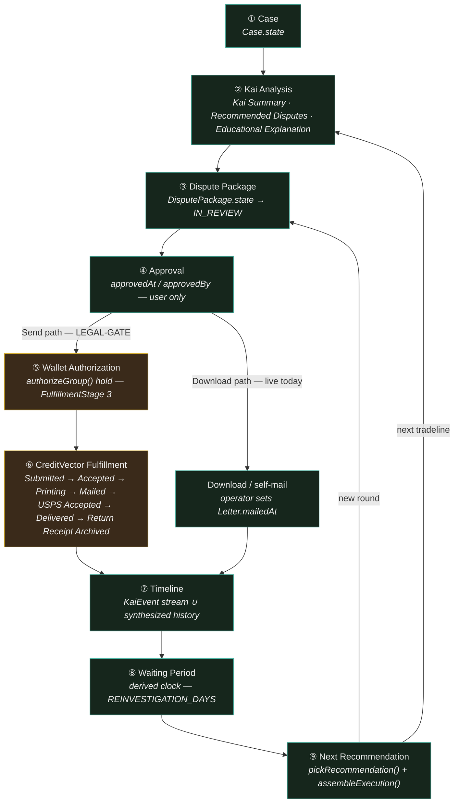

# CASE-JOURNEY-RUNTIME-PLAN.md — Case Journey Runtime (Phase 1 Execution Planning)

Agent E (Case Journey Runtime) · **Execution planning only — no implementation, no schema, no commit.** Continuation of the ACCEPTED, LOCKED architecture (`docs/fulfillment/CREDITVECTOR-FULFILLMENT-ENGINE-V1.md`, merged by the architecture-phase Agent E — same seat, a different assignment; not to be confused with this document). Binding brief: `docs/fulfillment/execution/EXECUTION-PLANNING-BRIEF.md`. This document plans the **convergence layer only**: it invents no new engine, no new table, no new provider, no new recommendation logic. Every fact below is either a verified citation (path-cited) or a labeled decision.

**Labels:** `PROPOSED` = new design, not yet founder-approved · `FOUNDER-GATE` = requires explicit Founder ratification before it may ship, even flag-off · `LEGAL-GATE` = blocked on Founder legal review + CROA §404 counsel review (brief Gate 2) — no wallet money code before this clears.

**Founder decision this document operationalizes** (brief, verbatim): *"Case Journey Runtime = the primary operational workflow. Everything reports INTO the Journey — not Mail, not Wallet, not Kai. Mail Center, Wallet, Kai, Timeline, Mission Control are participants/views of the Journey."*

Note on numbering: the brief's assignment list repeats "3." for two distinct items (the wallet-blocked interim, execution sequencing). This document renumbers them 3 and 4 cleanly; nothing is dropped.

---

## 0. Method — what this document does not invent

| Discipline | Applied here |
|---|---|
| No new persistence | The Journey's anchor is Agent A's `Case`/`DisputePackage` (`A-DOMAIN-MODEL.md` §1–2, PROPOSED, FOUNDER-GATE migration). This document adds zero schema. |
| No new engine | The Journey is a **read-model** — a projection function, the same discipline as `buildMailCenter()` (`lib/mailCenter.ts:1-8`, "zero AI, zero network") — over Prisma rows + the `KaiEvent` stream + the dormant Platform Event Bus. |
| No new recommendation logic | `pickRecommendation()` (`lib/kaiHome.ts:63-151`) and `assembleExecution()` (`lib/execution/ExecutionEngine.ts:214-239`) are reused verbatim; the Journey's Next-Recommendation node cites their output, never recomputes it. |
| No redesign of sibling agents' domains | The Fulfillment Policy Engine, Recovery Engine, Wallet ledger, and Provider Adapter are cited, not re-specified. |

---

## 1. The Case Journey as the Primary Runtime

### 1.1 What it is / is not

| The Journey IS | The Journey is NOT |
|---|---|
| A deterministic read-model: one ordered stage array + per-stage state, keyed by `Case.id` | A new database table, a new engine, or a new source of truth |
| The thing every surface (Kai, Mail Center, `/journey`, the Wallet UI, Mission Control) reads FROM | A page or component of its own — `/journey` and the evolved Mail Center (`app/mail/page.tsx`) RENDER it, they don't own it |
| Reused rows (`Case`/`DisputePackage`/`DisputePackageLetter`/`Letter`/`MailManifest`) + reused events (`KaiEvent`, Event Bus) | A reason to add a `JourneyEvent`/`JourneyState` table — none is proposed here |

### 1.2 The 9-node spine (Founder decision, brief's literal recap)

`Case → Kai Analysis → Dispute Package → Approval → Wallet Authorization → CreditVector Fulfillment → Timeline → Waiting Period → Next Recommendation`. Each node's owning fact and the `FulfillmentStage` sub-states it contains (`A-STATE-MACHINE.md` §4, `CREDITVECTOR-FULFILLMENT-ENGINE-V1.md` §3.2):

| # | Journey node | Contains `FulfillmentStage`(s) | Path |
|---|---|---|---|
| 1 | Case | *(pre-stage)* | Both |
| 2 | Kai Analysis | *(pre-stage — precedes composition)* | Both |
| 3 | Dispute Package | 1 `PREPARED` | Both |
| 4 | Approval | 2 `APPROVED` | Both |
| 5 | Wallet Authorization | 3 `WALLET_AUTHORIZED` | **Send only** — see §1.3(a) |
| 6 | CreditVector Fulfillment | 4–10 `SUBMITTED`…`RETURN_RECEIPT_ARCHIVED` | Send: provider webhooks. Download: operator's own `Letter.mailedAt` (no provider involved at all) |
| 7 | Timeline | *(continuous view across all of the above)* | Both |
| 8 | Waiting Period | 11 `WAITING_PERIOD` | Both |
| 9 | Next Recommendation | 12 `READY_FOR_NEXT_REVIEW` | Both — loops to node 3 (new round) or node 2 (next tradeline) |

### 1.3 Two flagged interpretation calls — report only, per this cluster's own discipline (A-DOMAIN-MODEL §7's convention)

**(a) Wallet Authorization's conditionality is not stated explicitly anywhere — a real tension between R1 and the literal chain diagram.** `EXECUTION-PLANNING-BRIEF.md` R1 rules "Download Package... needs NO wallet." But `KAI-FULFILLMENT-UX.md` §1.1's corrected chain reads as one **linear** sequence for every package — `Approve → authorizeGroup() (hold placed) → FINAL REVIEW → Submit → (Download/Send fork)` — with the Download/Send choice not appearing until *after* the hold. Read literally, every package would get a wallet hold even if the operator only ever intends to download it, which contradicts R1. This document adopts R1 (the newer, Program-Director-level ruling, binding on this planning phase) and treats the KAI-FULFILLMENT-UX §1.1 chain as **Send-path-specific** — the Download path branches off at Approve (or earlier) without ever entering Wallet Authorization. **Flagged, not silently resolved:** Agent A (state-machine authority) and whoever owns the Approve/FINAL REVIEW UI and Wallet Authorization plan should state explicitly which reading is correct before implementation. Repeated as a risk, §5.1.

**(b) "Timeline" as a discrete node vs. a continuous view.** The Founder's 9-node chain lists Timeline as a step *after* Fulfillment, but `/journey` and `buildTimeline()` render continuously from node 1 onward — nothing in any source document says Timeline is inert until node 7. This document's reading: Timeline is **dual-natured** — a continuous participant/view active across every node, AND the checkpoint where the round's evidentiary record closes (anchored at `RETURN_RECEIPT_ARCHIVED`, or the Download path's operator-logged `MAILED`). Stated so it is falsifiable, not asserted as settled.

### 1.4 Participants/views — the convergence table

| Stage | Source (real row/event) | Participant/View | Gate |
|---|---|---|---|
| Case | `Case.state` (`A-DOMAIN-MODEL.md` §1.5) | Data anchor — every other node keys off `Case.id` | FOUNDER-GATE (new migration; queues behind Gate D Phase −1) |
| Kai Analysis | `pickPackageCandidate()` / `KaiWhy` / `RecommendationIntelPanel` — computed, not stored (`D-KAI-EXPERIENCE.md` §2.2–2.3) | Kai (narrator) | PROPOSED — `lib/kaiPackage.ts` net-new, reuses existing engines verbatim |
| Dispute Package | `DisputePackage.state` reaching `IN_REVIEW` (`A-DOMAIN-MODEL.md` §2.6) | Mail Center / Package Review chain (compose view) | FOUNDER-GATE (same migration as Case) |
| Approval | `DisputePackage.approvedAt`/`.approvedBy` + `MailService.approve()` (existing, user-only law, `lib/mail/MailService.ts:125-132`) | Operator-chrome (non-Kai), per D-KAI §2.4 | Live today at the letter level; package-level approve is FOUNDER-GATE (same migration) |
| Wallet Authorization | `WalletLedger` `authorize` entry + `WALLET_AUTHORIZED@1` (`WALLET-COMMITMENT-MODEL.md` §3.2, §10.3) — **Send path only** | Wallet (money); Kai narrates only (`package.authorized`, never an amount) | **LEGAL-GATE** |
| CreditVector Fulfillment | `MailManifest.status`/`.auditTrail` rolled up via `DisputePackage.stage` (Send, provider webhooks) OR the operator's own `Letter.mailedAt` (Download, existing mechanism, unchanged) | Fulfillment (Policy Engine + Provider Adapter + Recovery Engine) for Send; the operator themself for Download | **LEGAL-GATE** for Send · **live today** for Download |
| Timeline | `KaiEvent` stream ∪ synthesized history (`lib/kaiEvents.ts`, `app/journey/page.tsx:82-144`) | Timeline (`/journey`, `buildTimeline()`) — continuous, both paths | Live today (stage array extension only) |
| Waiting Period | Derived clock — `lib/forecast.ts`, `REINVESTIGATION_DAYS` (`lib/kaiHome.ts:13`) | Clock — no owner; derive-on-read (docket #14) | Live today |
| Next Recommendation | `pickRecommendation()` (`lib/kaiHome.ts`) + `assembleExecution()` (`lib/execution/ExecutionEngine.ts`) — computed, not stored | Kai + **Mission Control** (cross-Journey aggregate view, §1.6) | Live today; query surface grows once `DisputePackage` exists |

**Mission Control is not a tenth node** — it has no single stage of its own. Its Executive Queue (`components/mission/ExecutiveQueue.tsx`) is the union, across every Case a user has open, of each Journey's Next-Recommendation output. This is not a new integration: the existing Mission Engine already carries fulfillment-shaped mission types — `dispute`, `approve_campaign`, `round_2`, `wait_response` (`lib/execution/ExecutionEngine.ts:118-125`) — computed today from raw `Letter`/`Campaign` rows. D-KAI-EXPERIENCE.md §6's own closing line already names the increment precisely: *"once the Package entity exists, `pickRecommendation()`'s DB reads... need a Package-aware read too... only the query surface grows."* The same is true of these Mission Engine types. No new Mission Control wiring is designed here (see §4.1 item 6 — explicitly deferred).

### 1.5 The event spine — one live, one dormant, reused verbatim

| Spine | State today | Role |
|---|---|---|
| `KaiEvent` (`lib/kaiEvents.ts`) | **Live.** 9 real call sites (`recordKaiEvent`, verified: `app/api/letters/generate/route.ts:73`, `app/api/letters/[id]/route.ts:81,94`, `app/api/letters/[id]/response/route.ts:80`, `app/api/reports/analyze/route.ts:39`, `app/api/reports/upload/route.ts:127,132`, `lib/campaignInput.ts:23`, `lib/mail/MailService.ts:30`). Fail-open (`recordKaiEvent` never throws, `kaiEvents.ts:45-49`). | The narration/display-grade spine — feeds `/journey`, Kai Home, notifications. Additive `KaiEventType` union per `D-KAI-EXPERIENCE.md` §1.2 (`package.prepared`/`.approved`/`.authorized`/`.submitted`/`.mailed`/`.delivered`/`.receipt_archived`, `fulfillment.status`) is the ONLY change this spine needs — code-only, no migration. |
| Platform Event Bus (`lib/eventBus/*`) | **Dormant.** `eventBusEnabled()` (`lib/eventBus/flags.ts`) returns `process.env.EVENT_BUS_ENABLED === "true"`, default OFF. **Verified independently this session:** the shared `publish()` function (`lib/eventBus/publish.ts:62`) has **zero call sites** anywhere in `app/` or `lib/` — not even the three seam contracts. Only `authorizePublish` (a sub-helper, not the full publish pipeline) is imported, by `lib/identity/events.ts:18` and `lib/reputation/events.ts:16`. | The cross-subsystem coordination spine — typed, zod-validated (`lib/eventBus/contracts.ts`), PII-denylisted (`lib/eventBus/validate.ts`), scoped self/agency/platform. **The adoption seam** — see table below. |

**Adoption seam (cited verbatim from `D-KAI-EXPERIENCE.md` §1.3 — not re-derived):**

| Contract | Status | Fires at Journey node | Payload (refs-only) |
|---|---|---|---|
| `DISPUTE_CREATED@1` | existing, 0 callers | Case (pre-Prepared) | `{disputeId, tradelineId, bureau}` |
| `LETTER_GENERATED@1` | existing, 0 callers | Dispute Package / `PREPARED` | `{letterId, tradelineId?, bureau?, status}` |
| `LETTER_SENT@1` | existing, 0 callers | CreditVector Fulfillment / `MAILED` | `{letterId, channel: "mail"\|"print"}` |

Because the entire `publish()` pipeline is unused today, wiring these three is genuinely "flip the seam on," not "compete against other producers for the same contract." Wiring them is **optional for v1 operator-facing truth** — the Journey's rendering depends on `KaiEvent` + Prisma rows, not on the Event Bus (§4.1 item 4).

**Naming-collision risk, flagged:** `lib/eventBus/envelope.ts:3` describes the Platform Event Bus envelope as *"a SUPERSET of the kernel's `KaiEvent{id,type,tenantId,stamp,payload}` (`lib/os/kernel/types.ts`)"* — a **second, unrelated** `KaiEvent` type living in the GIOS kernel layer, distinct from `lib/kaiEvents.ts`'s Prisma-backed `KaiEvent` table this plan reuses. An implementer wiring "the KaiEvent stream" could target the wrong one. Named here so the distinction is explicit before anyone builds against it (repeated as a risk, §5.1).

### 1.6 Journey-stage diagram



---

## 2. Deterministic Convergence

### 2.1 Zero-fabrication law, applied to the Journey

Every node renders `placeholder`/`null` until its owning row/event is real — never a guessed "in progress." Existing precedents this plan reuses, not reinvents:

- `lib/mailCenter.ts:84` — `RESERVED = "Available after live mail integration."`
- `lib/mailCenter.ts:224-230` — the placeholder loop for unreached stages.
- `app/journey/page.tsx:56-58` — `mailStatusLine()`'s `default: null`.
- `lib/kaiHome.ts:150` — `pickRecommendation()`'s final branch, *"quiet is allowed (no manufactured urgency)."*

### 2.2 Read, never recompute — the rollup discipline

`Case.state` and `DisputePackage.stage` are **cached rollups**, never re-derived by a second computation (`A-DOMAIN-MODEL.md` §1.5, §2.2 — "derived, never stored as truth elsewhere"). The Journey read-model MUST read these fields as its single source for nodes 1/3/5/6 — it must never compute its own parallel rollup from raw `MailManifest` rows. Two independent rollups of the same fact is exactly the failure mode `A-DOMAIN-MODEL.md` §5's "single-owner discipline" forbids.

### 2.3 The Next-Recommendation loop — reused, not rebuilt

`pickRecommendation()` (`lib/kaiHome.ts:63-151`, fixed-priority, single-pick, every branch states its `basis`) and `assembleExecution()` (`lib/execution/ExecutionEngine.ts:214-239`, pure, no AI, no DB, cites its sources) are the loop. The Journey's node 9 is a citation of their output, never a re-implementation. Closing-the-loop mechanics (round2 gate refusals, the "deleted" happy-terminal, the five-branch priority ladder) are already fully specified in `D-KAI-EXPERIENCE.md` §6 and are not restated here.

### 2.4 Kai's boundary, restated compactly for this domain

| Law (`D-KAI-EXPERIENCE.md` §0) | Journey-specific application |
|---|---|
| L1 — Kai never owns truth/money/policy | The Journey's stage array is written by SYSTEM code (Policy Engine / Recovery Engine / Wallet / provider webhook handlers); Kai only reads it to narrate. No `package.*` KaiEvent is ever the *source* of a transition — always downstream of one. |
| L2 — Kai never exposes vendor identity | The Journey's Kai-facing contract carries only `FulfillmentStage`/`kaiCopyClass` values, never a `MailProviderId` (Vendor Opacity DTO, `CREDITVECTOR-FULFILLMENT-ENGINE-V1.md` §7.1). |
| L3 — every event is SYSTEM-emitted | All `package.*`/`fulfillment.status` KaiEvents fire from routes/services (verified call-site list, §1.5) — the Journey read-model itself never writes an event. |
| L4 — every claim carries a `basis` | Node 9 inherits `pickRecommendation()`'s `basis` and `RecoveryVerdict.basis` (closed union, `KAI-FULFILLMENT-UX.md` §2.1.3) verbatim — never re-derives its own explanation. |

### 2.5 Idempotency

The unified `Claim` table (docket #12, `CREDITVECTOR-FULFILLMENT-ENGINE-V1.md` §3.5/§5.3) backs every `FulfillmentStage` transition the Journey reads. The Journey read-model performs no writes, so it needs no idempotency of its own — but it must tolerate a `Claim` row sitting `pending` (Recovery scenario 4, ambiguous timeout) by rendering the **current last-known-legal stage**, never a guessed next one (Recovery Constitution law 2, `RECOVERY-ENGINE.md` §7).

---

## 3. The Wallet-Blocked Interim — CRITICAL

### 3.1 Two sub-journeys, one spine

| Node | Download Package (live) | Send with CreditVector Fulfillment (LEGAL-GATE) |
|---|---|---|
| Case → Approval | Identical mechanism, identical UI, identical rows | Identical mechanism, identical UI, identical rows |
| Wallet Authorization | **Not entered.** No hold, no `WalletLedger` row, no `WALLET_AUTHORIZED@1`. | Hold placed via `authorizeGroup()`. |
| CreditVector Fulfillment | The operator's own action sets `Letter.mailedAt` — the exact mechanism already live today (`app/letters/page.tsx`'s "Mark mailed myself" path). No provider, no `MailManifest` state machine involved for this letter. | The 7-stage provider sub-machine (`SUBMITTED`…`RETURN_RECEIPT_ARCHIVED`), driven by the Policy/Recovery Engines and provider webhooks. |
| Timeline / Waiting Period / Next Recommendation | Identical mechanism for both — already true today: `lib/forecast.ts`'s clock runs off `mailedAt` regardless of who or what set it. | Identical mechanism. |

**The Download-Package Journey is not a degraded Journey.** It is a complete, 9-node walk that needs zero new money code and zero live provider — this is R1's "wallet-free value first" ruling, restated as a data-flow fact rather than a sequencing ruling alone.

### 3.2 Honest rendering mechanics — reuse, not invent

Wallet Authorization and the Send-path portion of CreditVector Fulfillment render `state: "placeholder"` using the **exact existing** `StageState`/`RESERVED` discipline (`lib/mailCenter.ts:54-57,84,224-230`) until a derived boolean is true — no new placeholder mechanism, no new copy pattern. This is the same mechanism already governing the six provider-mailed stages in today's shipped `/mail` room; this plan only re-keys two more stages onto it.

```
sendAvailable   = WALLET_RUNTIME_ENABLED === "true" && MAIL_LIVE === "true"   // both required, R4 + LEGAL-GATE
downloadAvailable = true                                                      // always — no gate
```

Neither is stored; both are computed at read time, mirroring `Case.state`'s own "derived, never stored" discipline (§2.2).

### 3.3 The two-option law under a legal gate — a FOUNDER-GATE decision, not resolved here

Founder decision (brief §1.4 / unified doc row 4): *"Operators always have two options."* Under the wallet-blocked interim, "Send" has no real content yet. Two ways to render the terminal fork:

| Option | For | Against | Recommendation |
|---|---|---|---|
| (a) Render both, Send labeled unavailable/"(soon)" | Matches an **existing, shipped** precedent — `app/letters/page.tsx:386-388,615-617`, "Mail via CreditVector (soon)" already renders as a de-emphasized ghost button while `MAIL_LIVE` is off. Preserves the two-option law's visual promise. | A disabled control can read as broken if the copy isn't unambiguous. | **RECOMMENDED** — re-key the existing precedent to `sendAvailable`, do not invent new copy or a new component. |
| (b) Render Download only until Send is real | Strictly avoids any non-functional control. | Arguably violates "operators ALWAYS have two options" *before* Send exists at all — a stricter, more literal reading. | Not recommended by this document. |

**FOUNDER-GATE:** final copy and choice of (a)/(b) require CCO compliance review before ship, per the existing rule that all new operator-facing copy clears `applyCompliance()`'s bar (`B-MAIL-CENTER-EVOLUTION.md` §8). This document states the tension and a recommendation; it does not rule.

### 3.4 Backward compatibility — Cases opened before `DisputePackage` existed

Agent A's domain model does not backfill `DisputePackage` rows for existing `Letter`s. The Journey read-model needs a fallback branch, mirroring `app/journey/page.tsx:128-144`'s existing dual-source dedup (`seen` set over live `KaiEvent`s ∪ synthesized history from raw rows): a `Letter` with no `DisputePackageLetter` row is treated as an **implicit single-item Package** — the same synthetic-key precedent `CampaignService.attachLetterForQueue` already uses (`letter:<id>` fallback, cited `A-DOMAIN-MODEL.md` §1.3). A pre-existing Case still renders a complete 9-node Journey; nothing regresses.

---

## 4. Execution Sequencing

### 4.1 Journey increments → the Program Brief's phase skeleton

| # | Increment | Depends on | Parallel-safe with |
|---|---|---|---|
| 1 | Read-model foundation (nodes 1–4: Case, Kai Analysis, Dispute Package, Approval) | P1 (Gate D Phase −1) + P5 (Fulfillment Engine — `Case`/`DisputePackage` must exist) | — |
| 2 | Download-path completion (nodes 6–9, self-mail variant) — R1's first wallet-free increment, a **complete** Journey | P6 (Mail Center evolution, Download path first) | P3/P4 (LetterStream/Provider work — never touched by this path) |
| 3 | Wallet Authorization placeholder rendering (§3.2) — zero money code, makes no promise | P5/P6 | Can ship **before** P2 clears — it renders honest unavailability, not a functioning feature |
| 4 | Event Bus adoption seam (3 contracts + `EVENT_BUS_ENABLED` flip) | P5 | Independent, optional — not required for operator-facing Journey truth (§1.5) |
| 5 | Wallet Authorization / Fulfillment **live** (real hold/settle/release, Recovery-verdict-driven Kai copy) | **P2 (LEGAL-GATE)** + P7 (Wallet Runtime) | — |
| 6 | Mission Control convergence (a Package-shaped Mission slotting into `ExecutionEngine`'s `ACTION` map, per D-KAI §6.4's own naming) | **Not in the Program Brief's P1–P10.** Named extension point only — FOUNDER-GATE future decision, explicitly out of this program's v1 scope (`OPERATIONAL-ROOM-CONSTITUTION-PROPOSAL.md` §4: Mission Control "not re-audited by this program") | — |

### 4.2 Flags — all fail-closed, `=== "true"` idiom (R5)

| Flag | Purpose | Default | Rollback |
|---|---|---|---|
| `CASE_JOURNEY_ENABLED` (PROPOSED, new) | Gates the new 9-node read-model rendering vs. today's plain `/journey` | OFF | Unset, redeploy |
| `MAIL_LIVE` (existing, `lib/mail/providers/LetterStreamProvider.ts:25`, verified) | Provider liveness | OFF | Unchanged — not owned by this document |
| `WALLET_RUNTIME_ENABLED`-shaped flag (name owned by the Wallet plan; consumed here) | Gates Wallet Authorization / Send-path Fulfillment from placeholder to live | OFF | Owned by the Wallet plan |
| `EVENT_BUS_ENABLED` (existing, `lib/eventBus/flags.ts`, verified) | Gates the dormant Event Bus (adoption seam, optional, §1.5/§4.1 item 4) | OFF | Unchanged |
| `sendAvailable` (derived, not a flag) | `WALLET_RUNTIME_ENABLED === "true" && MAIL_LIVE === "true"` | Computed, never stored | — |

### 4.3 Reuse map

| File | Change class | What |
|---|---|---|
| `app/journey/page.tsx` | Evolve | Extend the `mailStatusLine()`-style switch to the 9-node spine; "one timeline, never two" invariant (`:12-15`) unchanged |
| `lib/kaiEvents.ts` | Evolve | Additive `KaiEventType` union (`D-KAI-EXPERIENCE.md` §1.2) — code-only, no migration |
| `lib/mailCenter.ts` | Evolve (Agent C's file, cited not owned here) | `buildTimeline()`'s stage array extends to the canonical 12; `RESERVED`/placeholder discipline reused for Wallet Authorization / Send-Fulfillment |
| `lib/kaiHome.ts` | Reference pattern only, not modified by this plan | `pickRecommendation()` stays as-is until `DisputePackage` exists (D-KAI §6) |
| `lib/execution/ExecutionEngine.ts` | Reference pattern only | Mission Control convergence explicitly deferred (§4.1 item 6) |
| `Case`/`DisputePackage`/`DisputePackageLetter`/`Claim` migrations | New (Agent A's domain, not this document) | This plan reads them; it does not design them |

---

## 5. Per-Domain Risks + Tests

### 5.1 Risks

| # | Risk | Mitigation |
|---|---|---|
| 1 | Journey read-model silently diverges from Mail Center's own health/timeline computation if maintained as two separate code paths | The Journey IS `buildMailCenter()`/`buildTimeline()`'s output, re-consumed — never re-derived. Snapshot-equality test between `/journey`'s rendering and Mail Center's rendering for the same package. |
| 2 | A future stage renders `current`/`done` before its owning row/event exists — violates the zero-fabrication law | Reuse the exact `StageState` vocabulary + `RESERVED` constant; guard test asserts no stage renders `done`/`current` without its owning flag/row present. |
| 3 | Wiring `DISPUTE_CREATED@1`/`LETTER_GENERATED@1`/`LETTER_SENT@1` without the existing deterministic `dedupeKey`/`deriveEventId` convention causes duplicate publishes on retry | Dedupe keys follow the existing convention (`lib/eventBus/envelope.ts:145-148`); replay test asserts a repeated publish returns `replayed:true` with zero re-fanout. |
| 4 | Two different "KaiEvent" concepts in this codebase (`lib/kaiEvents.ts`'s Prisma table vs. `lib/os/kernel/types.ts`'s kernel type, per `envelope.ts:3`) get conflated by an implementer | Named explicitly in §1.5; a lint/type-level check distinguishing the two by import path before Journey code lands. |
| 5 | The R1-vs-`KAI-FULFILLMENT-UX.md` §1.1 sequencing tension (§1.3(a)) ships unresolved, and the Approve step places a wallet hold even for Download-only packages | Flag explicitly for Agent A + the Wallet plan before implementation; this document's own reading (hold fires only on the Send path) is stated as a planning assumption, not a ruling. |
| 6 | The two-option-law fork (§3.3) ships with Send as a fully clickable but non-functional button instead of an honestly labeled unavailable state | Name the decision explicitly (§3.3); reuse the existing "(soon)" ghost-button precedent; FOUNDER-GATE/CCO sign-off before ship. |
| 7 | `Case.state`/`DisputePackage.stage` rollup drift if the Journey computes its own parallel rollup instead of reading these fields | Journey MUST read the rollup fields as sole source (§2.2); property test asserts Journey-rendered stage === `DisputePackage.stage` across a fixture sample. |
| 8 | Pre-`DisputePackage` Cases render an incomplete Journey | Reuse the existing dual-source dedup fallback (§3.4); test a `Letter` with no `DisputePackageLetter` row still renders a complete 9-node Journey. |
| 9 | `RecoveryVerdict.resultingState` values with no native Journey slot (`ATTENTION`/`CANCEL_REQUESTED`/`RECEIPT_OVERDUE`/`TRACKING_STALLED`/`NO_CHANGE`, `RECOVERY-ENGINE.md` §2) get silently dropped by a Journey UI that only knows the 9 nodes | The Journey must carry an attention/exception overlay orthogonal to the 9 nodes — an **additional** labeled row beside whichever node is current, never a rewrite of that node's own honest state (same principle as `mailCenter.ts:215-216`'s "recommendation" row). |
| 10 | Mission Control double-presence once/if it adopts Journey items (`KaiPresence` talking over an embedded Kai voice) | Extend `KaiPresence.tsx:101`'s exclusion list to any new Journey-primary route — the same interface expectation D-KAI-EXPERIENCE.md §4.1 already places on Agent B, now also binding on Mission Control if §4.1 item 6 ever activates. |

### 5.2 Tests (guard-script convention, `npx tsx scripts/<g>.test.ts`)

| Test | Asserts |
|---|---|
| `journey-read-model.test.ts` | Pure function; given fixture rows + events, produces the 9-node array; snapshots an empty Case, a mid-flight Case, a completed Case, and a pre-`DisputePackage` Case. |
| `journey-no-fabrication.test.ts` | No stage renders `done`/`current` without its owning row/event/flag (mirrors `scripts/schema-safety.test.ts`'s assertion style). |
| `journey-wallet-interim.test.ts` | With the Wallet flag OFF: Wallet Authorization + Send-path Fulfillment always render `placeholder`; Download completes a full 9-node Journey standalone. |
| `journey-idempotent-events.test.ts` | Replay-dedupe check on the three adopted Event Bus contracts (risk 3). |
| `journey-rollup-fidelity.test.ts` | Journey-rendered stage === `DisputePackage.stage` / `Case.state` for a randomized fixture sample (risk 7). |
| `journey-recommendation-loop.test.ts` | `pickRecommendation()`/`assembleExecution()` outputs are cited verbatim inside node 9, never recomputed. |

---

## Interface Handles Exposed Downstream

**To the Mail Center plan (Agent C):**
1. The Journey read-model exposes an ordered array using the **exact existing** `TimelineStage` shape (`{key,label,state,at,description}`, `lib/mailCenter.ts:59-65`) — the evolved `buildTimeline()` IS this array's producer. No new shape needed.
2. Two derived booleans the terminal fork must *read*, never compute itself: `downloadAvailable` (always `true`) and `sendAvailable` (§3.2/§4.2).
3. Exactly ONE recommendation function must back both Mail Center's "Do this first" band and Mission Control's Executive Queue — `pickQueueRecommendation()` (Agent C's own proposed function) must be the same cross-row ranking the Journey's node 9 cites, never a second, independently-computed recommendation that could disagree.

**To the Wallet/VC runtime plan (Agent D):**
1. The Journey's Wallet Authorization node consumes exactly the 5 Event Bus wallet contracts — `WALLET_FUNDED@1`/`WALLET_AUTHORIZED@1`/`WALLET_SETTLED@1`/`WALLET_RELEASED@1`/`WALLET_CLAWBACK@1` (`WALLET-COMMITMENT-MODEL.md` §10.3) — plus the `package.authorized` KaiEvent (renamed from `package.funded`, docket #13). Never an amount, never a balance (PII-denylist, `CREDITVECTOR-FULFILLMENT-ENGINE-V1.md` §5.5).
2. The Journey needs exactly one boolean from the Wallet runtime: the real name of the flag gating Wallet Authorization's placeholder→live transition (this document assumes `WALLET_RUNTIME_ENABLED` as a placeholder name only).
3. **Flagged tension (§1.3(a), §5.1 risk 5):** does `Approve → authorizeGroup()` fire before or after the Download/Send choice is made? R1 requires Download to need no wallet; the literal FINAL REVIEW chain in `KAI-FULFILLMENT-UX.md` §1.1 does not visibly carve out that exception. The Wallet plan should state explicitly which is correct.
