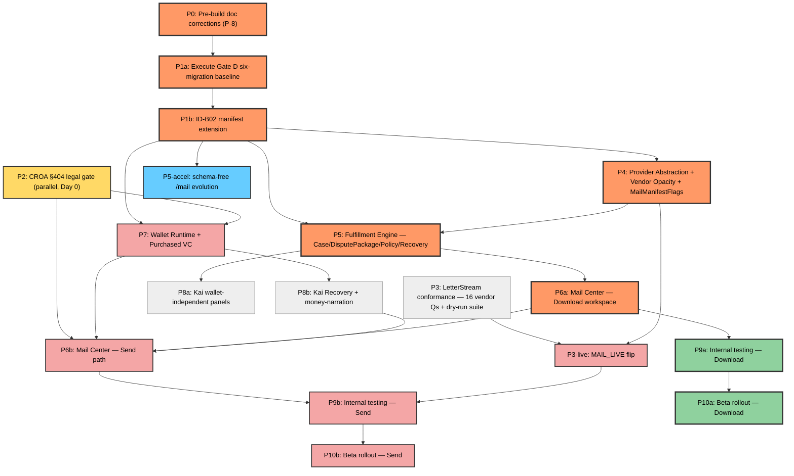

# DEPENDENCY-GRAPH.md — Unified Phase/Workstream Dependency Graph

Consolidation only — no new ruling. Nodes and top-level edges per `EXECUTION-PLAN.md` §3 (authoritative); finer intra-phase edges pulled from `EXEC-SEQUENCING.md` §2, `MAIL-CENTER-EVOLUTION-PLAN.md` §1.1–§1.7, `LETTERSTREAM-ADAPTER-PLAN.md` §1.3/§4.3, `WALLET-VC-RUNTIME-PLAN.md` §1.6, and `CASE-JOURNEY-RUNTIME-PLAN.md` §4.1. Every edge below is cited; none is invented. Conflicts between a domain doc's original phase graph and `EXECUTION-PLAN.md`'s adjudicated one are resolved in favor of `EXECUTION-PLAN.md` and flagged in §5.

---

## 1. Unified graph

**Legend (text, not color-only):**
- **Orange, thick border (`spine`)** — shared prefix of BOTH the engineering critical path and the earliest wallet-free milestone: `P0, P1a, P1b, P4, P5, P6a`.
- **Pink (`sendOnly`)** — the Send-path-only continuation of the critical path, all money-touching: `P7, P6b, P3-live, P9b, P10b`.
- **Green, thick border (`walletFree`)** — the Download-only continuation that reaches ship without ever touching money or a live provider: `P9a, P10a`.
- **Yellow (`legalNode`)** — the CROA §404 legal gate, `P2` — runs in parallel from Day 0, outside engineering control.
- **Blue (`valueNode`)** — `P5-accel`, the earliest operator-visible value of all, shipping on the shared spine's `P1b` alone.
- **Grey (`supportNode`)** — `P3`, `P8a`, `P8b` — necessary but not on either named path (see §3).

**Not a node here, by design:** Case Journey Runtime and Mission Control. Per `CASE-JOURNEY-RUNTIME-PLAN.md` §1.4 ("Mission Control is not a tenth node — it has no single stage of its own") and its own Method table (§0, "no new engine... the Journey is a read-model"), the Journey is the read-model threaded through `P5` (its anchor rows, `Case`/`DisputePackage`), `P6a`/`P8a` (its rendering and narration), and `P8b` (its money narration) — it earns no independent phase box in `EXECUTION-PLAN.md` §3's own roadmap, so none is added here either.

---

## 2. Dependency table

| Node | Depends on | Blocks | Gate |
|---|---|---|---|
| P0 | — | P1a (and, transitively, everything) | none — Founder ADR ratification is the gate for everything downstream (`EXEC-SEQUENCING.md` §1.1) |
| P1a | P0 | P1b | Gate D runbook (`.ai/RUNBOOKS/gate-d-production-migration.md`) + Founder sign-off, owner-executed |
| P1b | P1a | P4, P5, P5-accel, P7 — every new-schema phase | Gate D Phase −1, part b (ID-B02, CRITICAL/CONFIRMED per `ADVERSARIAL-REVIEW.md` F1, cited `EXEC-SEQUENCING.md` §1.1) |
| P2 | — (Day 0, independent of repo state) | P7, and transitively P6b, P8b, P9b, P10b | CROA §404 counsel + Founder legal — **LEGAL-GATE** |
| P3 | — (Day 0, vendor Q&A half is zero-dependency; conformance-suite half needs P4 — see §4) | P3-live | vendor answers to the 16-question set |
| P4 | P1b | P5, P3-live | Gate D Phase −1 (P1b) — reassigned scope, see §5 |
| P5 | P1b, P4 | P6a, P8a | Gate D Phase −1 |
| P5-accel | P1b | none downstream (independent acceleration slice) | Gate D Phase −1 |
| P6a | P5 | P6b, P9a | P5 exit |
| P6b | P2, P7, P6a, P8b | P9b | **LEGAL-GATE** (P2) + P7 exit |
| P7 | P1b, P2 | P6b, P8b | Gate D Phase −1 **and** CROA/legal gate — both, independently |
| P8a | P5 | (feeds P6a's Package Review steps 1–4, non-blocking — §4) | P5 exit |
| P8b | P7 | P6b | P7 exit (money-narration catalog is Send-only) |
| P3-live | P3, P4 | P9b | 16 vendor Qs + conformance green + Vendor Opacity guard green + `MailManifestFlags` shipped + Founder sign-off (own runbook, ADR-0011) |
| P9a | P6a | P10a | full guard suite + `release-verify.sh` green; cohort-scoped |
| P9b | P6b, P3-live | P10b | scope-matched upstream (P6b **and** P3-live both exited) |
| P10a | P9a | — | beta cohort live |
| P10b | P9b | — | `MAIL_LIVE` stays its own separate, later, FOUNDER-GATE runbook item even here |

Source: `EXECUTION-PLAN.md` §3 (phase table) and §5 (gate list) for the primary Depends-on/Gate columns; `EXEC-SEQUENCING.md` §2.1 for the original (pre-P-3-split) Blocks column, remapped onto the a/b sub-phases per `EXECUTION-PLAN.md`'s P-3 ruling.

---

## 3. Critical path and earliest wallet-free milestone

**Engineering critical path (Send), restated with the §5 correction:** `P0 → P1a → P1b → P4 → P5 → P6a → P7 (∥ P2) → P6b → P3-live → P9b → P10b`. Per `EXECUTION-PLAN.md` §3: "Bottleneck is P2 wall-clock (counsel), outside engineering control."

**Earliest shippable wallet-free milestone:** `P0 → P1a → P1b → P4 → P5 → P6a → P9a → P10a` — Download Package live, zero wallet, zero live provider, decoupled from CROA and vendor Q&A (`EXECUTION-PLAN.md` §3).

**Even earlier operator-visible value:** `P5-accel` ships the evolved `/mail` work queue/band/drawer/metrics/timeline over today's existing `Letter[]` data with a single flag (`FULFILLMENT_PACKAGE_UI_ENABLED`) the moment `P1b` clears — no `P4`, no `P5` schema needed at all (`MAIL-CENTER-EVOLUTION-PLAN.md` §1.4: "buildable in parallel with P1/P5 rather than queued strictly behind P5... the cheapest, most visible pre-September win"). This is the blue node in §1, off the shared spine.

---

## 4. Finer intra-phase edges (soft/supporting — not drawn in §1's diagram to keep it readable)

| From | To | Nature | Source |
|---|---|---|---|
| P4 | P3 | Soft — the conformance suite's dry-run battery (P3b half) needs P4's `MailProvider` interface to test against; the vendor Q&A half (P3a) has zero dependency | `EXEC-SEQUENCING.md` §1.1 (P3b entry: "P4 exit... P3a where it changes criteria"); `LETTERSTREAM-ADAPTER-PLAN.md` §1.3 |
| P4 | P6a | Soft — the evidence drawer's first real consumer of `TrackingInfo`/`ProofArtifact` needs P4's typed contract (dry-run acceptable; `RESERVED` placeholder otherwise) | `MAIL-CENTER-EVOLUTION-PLAN.md` §1.2 mermaid, §1.7 |
| P8a | P6a | Soft — Package Review chain steps 1–4 (Kai Summary/Recommended Disputes/Educational Explanation) render using P8a's components | `MAIL-CENTER-EVOLUTION-PLAN.md` §1.7 master stage table |
| P3a (Q&A) | P3b (suite) | Hard within P3 — suite assumptions re-run once Q&A answers land, before P3b is declared exit-complete | `EXEC-SEQUENCING.md` §6 risk row |

---

## 5. Reconciliation notes

1. **P4's gate dependency and the critical-path omission.** `EXEC-SEQUENCING.md` and `LETTERSTREAM-ADAPTER-PLAN.md` §1.3 both state P4 (interface + Vendor Opacity DTO/guard) is code-only and explicitly **not** Gate-D-gated. But `EXECUTION-PLAN.md` §3's authoritative phase table reassigns the `MailManifestFlags` migration to P4 (moved from `EXEC-SEQUENCING.md` §3.1 row 8, which had batched it into the same Tier-1 directory as `Case`/`DisputePackage`, applied at P5) and lists P4's own gate dependency as `P1b`. Reconciled in favor of `EXECUTION-PLAN.md`: P4's DTO/interface code could in principle proceed in parallel with P1a/P1b, but its migration cannot — so P4 as a whole phase now sits on the Gate-D-gated side, between P1b and P5. **Consequence, also corrected here:** `EXECUTION-PLAN.md` §3's own prose sentence for the "Engineering critical path" omits P4 even though its dependency column requires P5 to wait on P4 — this graph includes P4 on both paths for structural consistency with the dependency table, which this consolidation treats as the more authoritative fact than the abbreviated prose list.
2. **P6b's legal edge.** `EXECUTION-PLAN.md` lists P6b's gate dependency as "P2, P7." Since P2 → P7 → P6b is already transitive, the direct P2 → P6b edge is kept in the graph anyway (matching `EXEC-SEQUENCING.md`'s original table) so the legal gate's reach onto the Send UI stays visually direct, not buried two hops down.
3. **P8's split.** `EXEC-SEQUENCING.md` §4.1 sequences one `P8` behind `WALLET_ENABLED`-adjacent work. `EXECUTION-PLAN.md`'s P-3 ruling splits it into `P8a` (wallet-independent, pulls forward to depend only on P5) and `P8b` (stays gated on P7) — this graph uses the split, per `MAIL-CENTER-EVOLUTION-PLAN.md` §1.6's finding that seeded it.
