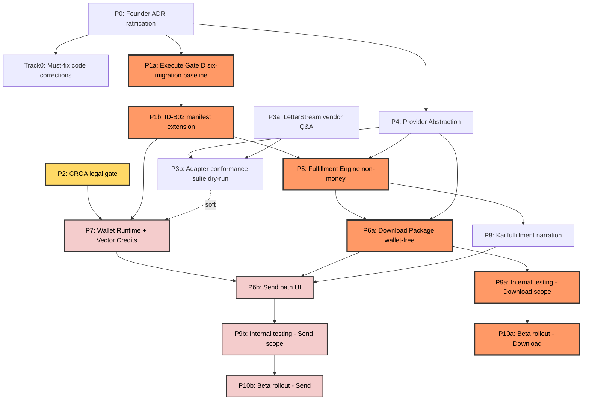

# EXEC-SEQUENCING.md — Master Sequencing Backbone

Agent A (Implementation Sequencing) · Status: **PROPOSED** · Planning only — no code, no schema, no flag, no merge, no commit. Baseline: branch `docs/fulfillment-engine-v1` @ `02716a0`.

**Scope discipline:** this document refines `IMPLEMENTATION-SEQUENCE.md`'s phased plan — it does not re-derive it — against `docs/fulfillment/execution/EXECUTION-PLANNING-BRIEF.md`'s rulings R1–R6 and gates, `COMMITMENT-RESOLUTION.md`'s verdict register, `COMMITMENT-REGATE.md`'s FOUNDER-GATE must-fixes, `ADR-PROPOSALS.md` (ADR-0041–0047), `REFINEMENT-2-DIRECTIVE.md`'s Rulings 1–4, `ADVERSARIAL-REVIEW.md`'s F1–F14, and repository Gate D truth (`.ai/CURRENT-STATE.md`, `.ai/RUNBOOKS/gate-d-production-migration.md`, `.ai/IDENTITY-CONSTITUTION-IMPLEMENTATION-PLAN.md`, `scripts/schema-safety.test.ts`, `scripts/gate-d-preflight.test.ts`). It does not re-specify domain schema, wallet mechanics, adapter mappings, or Kai copy — those stay owned by the cited artifacts and by Agents B/C/D/E's own execution documents.

Labels used throughout: **PROPOSED** (this document's own sequencing choices) · **FOUNDER-GATE** (needs a Founder ruling) · **LEGAL-GATE** (needs outside counsel + Founder) · **VENDOR-CONFIRMATION-REQUIRED** (needs LetterStream's answer).

---

## 0. Reconciliation

### 0.1 Rulings R1–R6, formalized into this sequence

| Ruling | Formalized as |
|---|---|
| **R1** — two-option law splits the critical path | §1 splits the brief's P6 into **P6a Download** (wallet-free, gated only on P4/P5) and **P6b Send** (gated on P7). §4.2's compositional flag rule keeps Download live while Send renders as a truthful disabled affordance — no third flag invented. |
| **R2** — Gate D is the universal unblock | §3's migration order gates every Tier-1 and Tier-2 table behind P1 (= P1a + P1b). §1 marks Track 0 / P3a / P4 / P8's contract *registration* as explicitly **not** Gate-D-gated — they touch zero new schema. |
| **R3** — non-money precedes money | P4 → P5 → P6a → P8 are sequenced ahead of P7. Tier-1 (non-money) migrations ship in a separate, earlier directory from Tier-2 (money) — see §3. |
| **R4** — provider stays dry-run until vendor answers | P3b and `MAIL_LIVE` stay last in the flag ladder (§4.1, order 5). P3a (the Q&A itself) is decoupled as its own zero-dependency parallel track so it isn't blocked waiting for code. |
| **R5** — flag-gated, fail-closed, additive-first, rollback per phase | every phase row in §1 carries a rollback-note column; §4 pins the exact-string `=== "true"` idiom for every new flag. |
| **R6** — Vendor Opacity is build-time, not late polish | owned by **P4**, sequenced before P6a's UI ships — not deferred into P8's later Kai-copy polish. |

### 0.2 Deltas this sequence carries forward (repo truth forced these — flagged, not silently applied)

| # | Prior artifact said | This sequence corrects to | Why |
|---|---|---|---|
| 1 | `IMPLEMENTATION-SEQUENCE.md` Phase 3: "the ledger/authorize/consume/void machinery **can be built and guard-tested without** [the top-up UI] decision" | **All** of P7 — ledger machinery included — waits for P2 | `EXECUTION-PLANNING-BRIEF.md`'s Authoritative Gates §2 is stricter: "block **ALL** wallet money-movement implementation… No plan may schedule wallet money code before that gate clears." |
| 2 | `IMPLEMENTATION-SEQUENCE.md` §2.2's migration table bundles `WalletLedger` into the same 5-table list as Case/DisputePackage/DisputePackageLetter/Claim | `WalletLedger` (+ its `Wallet` anchor) moved to its **own Tier-2 directory**, separately gated on P2 | bundling would force the non-money tables to wait on the legal answer too, defeating R3. |
| 3 | `ADR-0044`: `WalletLedger.entryKind ∈ {fund,authorize,consume,void,refund,adjust}`, no separate anchor row | `WALLET-COMMITMENT-MODEL.md` §3.1/§3.2 (newer, re-gated, and itself named as a **binding source doc** by the brief): a **`Wallet` anchor row** (holds no balance, exists only to be `SELECT…FOR UPDATE`-locked) + `WalletLedger.entryKind ∈ {fund,authorize,settle,release,clawback,adjust}` — "consume/void/refund never appear" (S8) | ADR-0044 predates the F3 overdraft fix. The anchor+ledger split is the actual mechanism that makes the lock real; agents still citing ADR-0044's older vocabulary should treat `WALLET-COMMITMENT-MODEL.md` as authoritative. |
| 4 | `A-DOMAIN-MODEL.md` §1.6/§2.6: `Case.userId`/`DisputePackage.userId` → `User` **Cascade** | **Restrict**, per `COMMITMENT-RESOLUTION.md` F14's ruling + §4's recorded (not-yet-textually-applied) correction | Cascade contradicted the Restrict FKs one hop away and repeated the Identity Constitution's flagged ID-H06 destructive-cascade pattern. |
| 5 | `A-DOMAIN-MODEL.md` §2.6: `DisputePackageLetter` `@@unique([letterId])` | `@@unique([letterId, attempt])`, per `REFINEMENT-2-DIRECTIVE.md` Ruling 1 | the plain unique made a retry after `RETURNED_TO_SENDER` database-impossible (F9-ii). |
| 6 | Original plan: `attention`/`cancelRequest` via `ALTER TABLE MailManifest ADD COLUMN IF NOT EXISTS` | new standalone `MailManifestFlags` table, own migration, per `FULFILLMENT-COMMITMENT-BOUNDARY.md` §4.1/§4.4 | the ALTER-TABLE plan was a self-heal-DDL violation of `CLAUDE.md` gotcha #1 (`COMMITMENT-REGATE.md` N5). |
| 7 | Both `ADVERSARIAL-REVIEW.md` and the brief read Gate D as one atomic "Phase −1" | split into **P1a** (execute the six-migration baseline) then **P1b** (land the ID-B02 manifest-extension mechanism) | the runbook and the preflight tooling (`scripts/gate-d-preflight.test.ts:366`, "manifest covers exactly six migrations") are two separable artifacts with two separable owner-approval chains. Collapsing them hides that the second half is a genuinely new engineering deliverable — one **shared with the Identity Constitution program's own Implementation Slice 7** (`.ai/IDENTITY-CONSTITUTION-IMPLEMENTATION-PLAN.md`), not exclusive to this program. |
| 8 | Old flag order (`IMPLEMENTATION-SEQUENCE.md` §8): `WALLET_ENABLED` (#3) before `FULFILLMENT_PACKAGE_UI_ENABLED` (#4), reasoning "the Wallet Authorization screen has nothing to authorize against otherwise" | swapped — `FULFILLMENT_PACKAGE_UI_ENABLED` (#3) before `WALLET_ENABLED` (#4) | once R1 splits Download from Send, the Package UI has plenty to show/authorize (Download) before any wallet exists; only Send needs the wallet, and it activates compositionally (§4.2) without re-touching the UI flag. |

---

## 1. Phased roadmap

Top-level phase IDs (**P0, P2–P10**) are fixed anchors from `EXECUTION-PLANNING-BRIEF.md`'s own skeleton — other agents' assignments cite them directly (e.g. Agent D: "money code LEGAL-GATE'd behind P2"). This document refines each into sub-phases (`P1a`/`P1b`, `P3a`/`P3b`, `P6a`/`P6b`) without renumbering anything upstream agents rely on, and adds one unnumbered parallel lane (**Track 0**) the brief's skeleton didn't name.

### 1.1 Goal / entry / exit / gate dependencies

| Phase | Goal | Entry criteria | Exit criteria | Gate dependencies |
|---|---|---|---|---|
| **P0** Founder ratification | Rule on ADR-0041–0047 + the Room Constitution proposal | this artifact set reviewed by Program Director | each ADR has a recorded status in `.ai/DECISIONS.md` (`.ai/CONSTITUTION.md` Art. IX) | none — this *is* the gate for everything downstream |
| **Track 0** Must-fix code corrections | Close 4 live contradictions of existing binding decisions (`IMPLEMENTATION-SEQUENCE.md` §2.1) | P0 (ADR-0042/0043 ruled — fix shape follows their design) | `certified:true` unconditional (`app/api/mail/prepare/route.ts:46`); `UNKNOWN_PROVIDER_STATUS` replaces the fail-open fallback (`lib/mail/providers/LetterStreamProvider.ts:45`); `MailPricing` breakdown resolved one way; vendor-name DTO/audit fix (`MailReceipt.ts:11`, `MailService.ts:186`); CCO Gate 1 recorded | none beyond P0 — **explicitly not Gate-D-gated** (zero new schema) |
| **P1a** Execute Gate D | Resolve prod's missing `_prisma_migrations` history; deploy the six already-committed migrations | `.ai/RUNBOOKS/gate-d-production-migration.md` preconditions P1–P10 all pass; **owner-executed** | all six `ALL_PRESENT_AND_MATCHING`; `NO_PENDING_MIGRATIONS`; 5 platform flags still OFF; `x-cv-release` unchanged | Gate D Phase −1 itself (part a) — pre-existing debt, not invented by this program |
| **P1b** ID-B02 manifest extension | Land a versioned, owner-approved manifest mechanism so a 7th+ migration directory can pass preflight | P1a complete | `gate-d-preflight-core.ts` + `.test.ts` accept a versioned post-baseline manifest while still proving byte-identical coverage of the frozen six | Gate D Phase −1 (part b) — **CRITICAL, CONFIRMED** blocker, `ADVERSARIAL-REVIEW.md` F1 |
| **P2** Wallet legal/CROA decision | Get outside counsel's answer to the CROA §404 question + a Founder ruling (A/B/C, `FOUNDER-SUMMARY.md`) | none — Day 0, fully independent of repo state | counsel's written answer received; Founder selects A/B/C | none — this phase **is** the CROA-legal gate |
| **P3a** LetterStream vendor Q&A | Get the 11-question vendor-confirmation set answered | none — Day 0, zero code dependency | all 11 filed; `VENDOR-CONFIRMATION-REQUIRED` cells become confirmed facts (or stay worst-case per KAI-FULFILLMENT-UX.md's copy law) | none |
| **P3b** Adapter conformance suite | Build the dry-run conformance battery (`A-PROVIDER-ABSTRACTION.md` §8) | P4 exit (interface to test against); P3a where it changes criteria | battery green in dry-run; `not_wired`/`MAIL_LIVE===false` unchanged; battery becomes the required gate before any live provider selection | P4, P3a |
| **P4** Provider abstraction | Formalize `MailProvider` (no shape change) + Vendor Opacity + honest `validateAddress` + fail-closed status mapping | P0 (ADR-0043 ruled) | `validateAddress` returns `undefined` not fabricated `true`; DTO strips `MailReceipt.provider`; regex guard green; `UNKNOWN_PROVIDER_STATUS` defined | none beyond P0 — **not Gate-D-gated** (zero new schema, code-only per `A-STATE-MACHINE.md` §5) |
| **P5** Fulfillment Engine (non-money) | Build the Policy Engine + Tier-1 migrations + FulfillmentStage additions + Recovery Engine skeleton | P1 (P1a **and** P1b), P4, P0 | Tier-1 migrations applied (§3); prepare/confirm consult the engine behind flag; guards green | Gate D Phase −1 |
| **P6a** Mail Center — Download Package | Evolve `/mail` into the Case Journey workspace; Download live, Send visibly present but disabled | P5, P4 | evolved work-queue/evidence-drawer/9-step chain through step 8 live; Approval-card split done; CCO Gate 3 recorded | P5, P4 — **not** P2 or P7 |
| **P6b** Mail Center — Send path UI | Light up "Send with CreditVector Fulfillment" + Wallet Authorization screen | P6a, P7, P8 | Wallet Authorization line-items; 402→top-up; FINAL REVIEW token wired; CCO Gate 2 recorded | P7 (transitively P1+P2), P6a, P8 |
| **P7** Wallet Runtime + Vector Credits | `Wallet`+`WalletLedger` runtime; VC's 3 further ledgers named as reserved points only | P1 (P1a **and** P1b) **and** P2, both | `COMMITMENT-REGATE.md` must-fix A1–A5/B6–B9 proven in `wallet-runtime.test.ts`; `WALLET_ENABLED` stays OFF | Gate D Phase −1 **and** CROA/legal gate — both, independently |
| **P8** Kai fulfillment narration | Extend `KaiEventType`; register 7 Bus contracts; guided Package Review copy | P5, P0 (ADR-0046 ruled) | 7 contracts registered, guard-green, `EVENT_BUS_ENABLED` still OFF; `waiting.*` stays derive-on-read | P5 |
| **P9** Internal Founder testing | Flip flags ON for an internal-only cohort | Download scope: P5+P6a+P8. Send scope: additionally P7 exited + P2 cleared | full guard suite + `release-verify.sh` green; CCO Gate 4; cohort-scoped rollout | scope-matched upstream phases |
| **P10** Beta rollout | Expand internal cohort to a real beta cohort | P9 (scope-matched) | beta cohort live; `MAIL_LIVE` stays its own separate, later, FOUNDER-GATE runbook item | P9 |

### 1.2 Flags / migrations / rollback / money-touching

| Phase | Flags introduced (default) | Migrations applied | Rollback note | Money-touching |
|---|---|---|---|---|
| P0 | none | none | N/A — paper decision | No |
| Track 0 | none — ships unconditionally, not flag-gated (bug fixes, not new behavior) | none | plain code revert | No *(pricing-display correctness, not a new charge mechanism — still CCO-reviewed)* |
| P1a | none (5 pre-existing platform flags stay OFF) | the six already-committed | application rollback only; no DB reversal for a clean apply | No |
| P1b | none | none (tooling/governance change) | revert the tooling change; frozen six untouched | No |
| P2 | none | none | N/A | **N/A — decision gate** that determines whether P7 may exist at all |
| P3a | none | none | N/A | No |
| P3b | none (reads existing `MAIL_LIVE`) | none | test-only, no rollback needed | No |
| P4 | none | none | code revert | No |
| P5 | `FULFILLMENT_POLICY_ENGINE_ENABLED` (OFF) | Tier-1 batch — Case, DisputePackage, DisputePackageLetter, Claim, MailManifestFlags (§3) | flag OFF = byte-identical; schema rollback = drop 5 new tables, zero pre-existing table altered | No |
| P6a | `FULFILLMENT_PACKAGE_UI_ENABLED` (OFF) | none (reads Tier-1 tables) | flag OFF | No |
| P6b | none new — reads `WALLET_ENABLED` compositionally (§4.2) | none (consumes P7's tables) | flag OFF (either one) collapses to Download-only | **YES → blocked behind P2/CROA-legal (transitively via P7)** |
| P7 | `WALLET_ENABLED` (OFF) | Tier-2 — Wallet, WalletLedger, own directory (§3) | flag OFF; schema rollback = drop Wallet/WalletLedger (zero rows expected pre-activation) | **YES — LEGAL-GATE, the whole phase** |
| P8 | `EVENT_BUS_ENABLED` (existing, new contracts) | none | code revert, flag stays OFF | No — narration only (L3) |
| P9 | all upstream flags flipped ON, cohort-scoped | none new | flag OFF reverts instantly | Download No; Send **Yes** (internal-only, still behind P2/P7) |
| P10 | same set, cohort broadened | none new | flag OFF / cohort narrowing | Download No; Send **Yes — LEGAL-GATE**, CCO Gate 5 before live-postage expansion |

---

## 2. Dependency graph

**Legend (text, not color-only):** orange = the wallet-free critical path; yellow = the legal gate; pink = money-touching, blocked behind it. The dashed `P3b -.soft.-> P7` edge means P7's core ledger mechanics (Stripe fund/authorize/release/clawback) don't need P3b at all — only the `settle`-trigger's provider-callback integration point does.

### 2.1 Dependency table

| Node | Depends on | Blocks |
|---|---|---|
| P0 | — | Track 0, P1a, P4, P8 (ADR ruling) |
| Track 0 | P0 | none strictly (ships standalone); its `certified:true` fix seeds P5's Policy Engine stub |
| P1a | P0 | P1b |
| P1b | P1a | P5, P7 — every new-schema phase |
| P2 | — | P7, and transitively P6b, P9b, P10b |
| P3a | — | P3b |
| P3b | P4, P3a | P7 (soft — settle-trigger integration point only) |
| P4 | P0 | P3b, P5, P6a |
| P5 | P1b, P4, P0 | P6a, P8 |
| P6a | P5, P4 | P6b, P9a |
| P6b | P7, P6a, P8 | P9b |
| P7 | P1b, P2, P3b (soft) | P6b |
| P8 | P5, P0 | P6b |
| P9a | P6a | P10a |
| P9b | P6b | P10b |
| P10a | P9a | — |
| P10b | P9b | — |

### 2.2 Critical path and the wallet-free path

**Engineering critical path** (assumes P2 clears in parallel without delay): `P0 → P1a → P1b → P5 → P6a → P6b → P7(∥P2) → P9b → P10b`.

**The wallet-free early-value path — fully decoupled from P2 and P3, guaranteed not to wait on legal counsel or the vendor:** `P0 → P1a → P1b → P5 → P6a → P9a → P10a`. This is the earliest shippable milestone under R1 — Download Package, live, with zero wallet and zero live provider.

Because P2's wall-clock duration is outside engineering control, it — not engineering throughput — is the likely actual bottleneck for the Send path specifically; the Download path has no such external dependency.

---

## 3. Migration order

**Precondition, restated because it gates everything below:** production has no `_prisma_migrations` history (baseline-resolve was preview-only) **and** `scripts/gate-d-preflight-core.ts` + `scripts/gate-d-preflight.test.ts:366` ("manifest covers exactly six migrations") accept **exactly six** migration directories today — a 7th is rejected (ID-B02, `.ai/IDENTITY-CONSTITUTION-IMPLEMENTATION-PLAN.md:41`, CRITICAL/CONFIRMED). **Every row below queues behind both P1a (execute the six) and P1b (land the versioned extension that admits a 7th+).** P1b is shared infrastructure — the Identity Constitution program's own Implementation Slice 7 needs the identical mechanism; coordinate rather than duplicate.

### 3.1 Order table

| Order | Proposed directory | Table / Enum | Tier | Depends on | New FK (direction, delete rule) | Applies in | Note |
|---|---|---|---|---|---|---|---|
| 1 | `fulfillment_domain_v1` (PROPOSED name) | `CaseState` enum | 1 | none | — | P5 | additive enum |
| 2 | (same dir) | `Case` | 1 | `User`, `Tradeline` (existing) | `userId→User` **Restrict** (corrected, was Cascade — §0.2#4); `tradelineId→Tradeline` SetNull | P5 | `A-DOMAIN-MODEL.md` §1.6, corrected per `COMMITMENT-RESOLUTION.md` F14 |
| 3 | (same dir) | `PackageState` enum | 1 | none | — | P5 | additive enum |
| 4 | (same dir) | `DisputePackage` | 1 | `Case` (row 2), `User` | `caseId→Case` Restrict; `userId→User` **Restrict** (corrected); `campaignId` plain unenforced `String` | P5 | `A-DOMAIN-MODEL.md` §2.6 — `Campaign` is self-heal, no FK possible |
| 5 | (same dir) | `DisputePackageLetter` | 1 | `DisputePackage` (row 4), `Letter` (existing) | `packageId→DisputePackage` Cascade; `letterId→Letter` Restrict | P5 | `@@unique([letterId, attempt])` **not** `@@unique([letterId])` — `REFINEMENT-2-DIRECTIVE.md` Ruling 1; `@@unique([mailId])` unchanged |
| 6 | (same dir) | `ClaimDomain` enum | 1 | none | — | P5 | `MAIL_TRANSITION \| WALLET` — ADR-0045 |
| 7 | (same dir) | `Claim` | 1 | none (standalone) | — | P5 | generic `key` PK; canonical grammars per `REFINEMENT-2-DIRECTIVE.md` Ruling 2 |
| 8 | (same dir) | `MailManifestFlags` | 1 | none (app-level reference to self-heal `MailManifest.mailId`, no DB FK) | — | P5 | `FULFILLMENT-COMMITMENT-BOUNDARY.md` §4.1/§4.4 — `mailId String @id`, `attention Json?`, `cancelRequest Json?` |
| 9 | `wallet_purchased_vc_v1` (PROPOSED name, **separate** directory) | `Wallet` | 2 | `User` (existing) | `principalId→User` Restrict | P7 | anchor row, holds no balance — `WALLET-COMMITMENT-MODEL.md` §3.1; `@@unique([principalId])` |
| 10 | (same dir) | `WalletLedger` | 2 | `Wallet` (row 9), `User` (existing, nullable actor/onBehalfOf) | `walletId→Wallet` Restrict; `actorId→User` **nullable** Restrict (corrected from non-null, must-fix B6); `onBehalfOfId→User` nullable Restrict | P7 | = Purchased VC ledger; `WALLET-COMMITMENT-MODEL.md` §3.2; `@@unique([walletId, subjectId, entryKind, attempt])` |
| 11 | **NOT SCHEDULED** | Earned VC ledger | 3 | `Wallet` (by analogy) | TBD | deferred, beyond v1 | net-new founder decision, no existing doc designs this — Agent D reconciles |
| 12 | **NOT SCHEDULED** | Bonus VC ledger | 3 | `Wallet` (by analogy) | TBD | deferred, beyond v1 | same |
| 13 | **NOT SCHEDULED** | Pending Payout VC ledger | 3 | `Wallet` (by analogy) | TBD | deferred, beyond v1 | same, further gated (payout/cash-adjacent) |

**⚠️ Open reconciliation, flagged not resolved:** the brief's new VC decision ("ONE Wallet, SEPARATE append-only ledgers: Purchased/Earned/Bonus/Pending Payout") predates no existing doc. `WalletLedger` (rows 9–10) is fully designed and is treated here as the **Purchased VC** ledger's schema; whether it gets renamed or stays `WalletLedger` while the other three are added alongside it is Agent D's call, not sequenced further here.

### 3.2 Batching rationale (PROPOSED)

Rows 1–8 are recommended as **one** migration directory (mirrors the `operator_identity` precedent — 3 tables, 1 directory) rather than 5 separate directories: it minimizes how many times the new post-ID-B02 extension mechanism (P1b) must be exercised, and keeps one preflight-reconciliation event instead of five. Rows 9–10 ship in their **own, later** directory — bundling them with rows 1–8 would force the non-money tables to wait on P2's legal answer too, defeating R3.

### 3.3 Apply mechanics

Rows 1–8 apply once **P1 (P1a and P1b)** clears, as one `prisma migrate deploy`, owner-approved, mirroring `.ai/RUNBOOKS/gate-d-production-migration.md`'s own shape (preflight → any reconciliation → deploy → post-deploy verification) as extended by P1b's new mechanism. Rows 9–10 apply once **P1 and P2 both** clear, as a **separate** deliberate release step — never bundled with rows 1–8's deploy.

**Schema-safety-allowlist note:** none of rows 1–10 is ever added to `LEGACY_SELF_HEAL_ALLOWLIST` (`scripts/schema-safety.test.ts:106-114`, frozen at 32 legacy tables). `scripts/schema-safety.test.ts`'s `newlySelfHealed.length === 0` check (lines 117–120) must stay green **unmodified** — proving none of these new tables self-heals. Row 8 (`MailManifestFlags`) is declared in `schema.prisma` from birth, so it is never even matched by the `CREATE TABLE IF NOT EXISTS` self-heal scan (`FULFILLMENT-COMMITMENT-BOUNDARY.md:122`) — that guard needs no edit at all for this row.

---

## 4. Feature-flag strategy

### 4.1 Flag ladder (activation order — no flag flips as part of this program; this is the order once the Founder begins)

| Order | Flag | Default | Idiom | Introduced in | Gates | Money-gated? | Prerequisite |
|---|---|---|---|---|---|---|---|
| 1 | `FULFILLMENT_POLICY_ENGINE_ENABLED` | OFF | `=== "true"` | P5 | Policy Engine consulted by prepare/confirm routes | No | P5 exit |
| 2 | `EVENT_BUS_ENABLED` (existing flag, new contracts) | OFF | `=== "true"` (existing) | P8 | 7 new Fulfillment/Wallet contracts observable | No | P8 exit |
| 3 | `FULFILLMENT_PACKAGE_UI_ENABLED` | OFF | `=== "true"` | P6a | evolved Mail Center + Package Review chain visible — **Download live; Send visible-disabled** (§4.2) | No | P6a exit, CCO Gate 3 |
| 4 | `WALLET_ENABLED` | OFF | `=== "true"` (`C-WALLET-INTEGRATION.md:784` verbatim pattern) | P7 | real fund/authorize/settle/release/clawback/adjust; **Send becomes live inside the already-shipped P6a UI** (§4.2) | **YES — LEGAL-GATE** | P7 exit, P2 cleared, CCO Gate 2 |
| 5 | `MAIL_LIVE` (existing, unchanged) | OFF | `=== "true"` (existing) | pre-existing | real LetterStream network calls, real postage spend | **YES** — own runbook (ADR-0011), CSO+CCO Gate 5 | P3b exit + its own FOUNDER-GATE runbook — last, never bundled |

Order reversed vs. `IMPLEMENTATION-SEQUENCE.md` §8's original (which put `WALLET_ENABLED` at #3, ahead of the Package UI flag) — see §0.2#8 for why.

### 4.2 Compositional Download/Send gating rule (no third flag needed)

| `FULFILLMENT_PACKAGE_UI_ENABLED` | `WALLET_ENABLED` | Operator sees |
|---|---|---|
| false | false | today's `/mail` + 3-step wizard, byte-identical |
| **true** | false | evolved Mail Center + 9-step Package Review; **Download Package live**; **Send with CreditVector Fulfillment visibly present, disabled**, honest-placeholder copy (precedent: `lib/mailCenter.ts:84`'s `RESERVED` string, "Available after live mail integration") |
| **true** | **true** | both options live |
| false | true | should not occur — no route exposes Wallet UI without the Package UI flag; treat as a bug, not a copy state |

This operationalizes R1 at the flag layer, not just the phase layer, and is the interface handle Agent C's and Agent D's plans both consume directly.

Every new flag follows the fail-closed guarantee: when OFF, the door returns a typed refusal (`{ok:false, code:"disabled"}`, `ADR-0044` verbatim), never a silent 200.

---

## 5. Repository-impact map

Reuse-first — every phase's touchpoints on existing code, named per-file.

| Phase | Existing file(s) touched | Change class | Invariant preserved |
|---|---|---|---|
| P1a/P1b | `scripts/gate-d-preflight-core.ts`, `scripts/gate-d-preflight.ts`, `scripts/gate-d-preflight.test.ts`, `.ai/RUNBOOKS/gate-d-production-migration.md` | extend | exact six-file baseline equality proof stays intact; new mechanism *adds* coverage, never loosens it |
| Track 0 | `app/api/mail/prepare/route.ts:46`, `lib/mail/providers/LetterStreamProvider.ts:45,76`, `lib/mail/MailPricing.ts`, `lib/mail/MailReceipt.ts:11`, `lib/mail/MailService.ts:186` | extend (bug fix, unconditional) | byte-identical UI except the 4 named corrections; CCO Gate 1 |
| P4 | `lib/mail/MailProvider.ts:102-124` (no shape change), `lib/mail/providers/LetterStreamProvider.ts`; new vendor-opacity static guard | extend + new guard | `not_wired`/`MAIL_LIVE` fail-closed unchanged; interface shape unchanged |
| P5 | new `lib/fulfillment/PolicyEngine.ts` (illustrative path); `app/api/mail/prepare/route.ts`, `app/api/mail/[mailId]/confirm/route.ts`; `lib/mail/MailStatus.ts` (FORWARD table, TEXT-column string additions, no migration); `prisma/schema.prisma` (5 new models / 3 enums + additive back-relations on `User`/`Tradeline`/`Letter`) | new-additive (schema+module) + extend (routes/status table) | 16-state `MailManifest` machine forward-only law preserved; `scripts/mail.test.ts`/`scripts/mailCenter.test.ts` stay green; `Campaign`'s self-heal status untouched |
| P6a | `app/mail/page.tsx`, `lib/mailCenter.ts`, `app/mail/send/[letterId]/page.tsx` (per `B-MAIL-CENTER-EVOLUTION.md` §7's file-by-file map); `app/letters/print/[id]/page.tsx` + `PrintActions.tsx` (reused verbatim, single-letter); one new package-level print aggregator route (multi-letter Download) | extend + one new-additive route | "zero AI, zero network" Mail Center projection law; browser-print-to-PDF truth stays disclosed |
| P7 | new `Wallet`+`WalletLedger` models; new illustrative `lib/wallet/*` runtime (mirrors `lib/fulfillment/PolicyEngine.ts`'s "illustrative path" convention); `lib/billing.ts` (Stripe top-up reuses existing `mode:"payment"` shape verbatim); `lib/eventBus/envelope.ts` (`EventType` union, additive) | new-additive (schema+module) + extend (billing, event union) | PGE-3/4 five-instruments-never-converted law; zero cross-imports with `lib/reputation/**`; `User.letterCredits` untouched, coexists |
| P8 | `lib/kaiEvents.ts:1-23`, `lib/mail/MailService.ts:1-13,125-132` (SYSTEM-emitted call sites), `components/kai/KaiPresence` (page-exclusion list) | extend | L3 (Kai never emits its own events); ADR-0006 gate (no server-persisted Kai prose) |

---

## 6. Per-phase risks + validation gates

Risks specific to **this sequencing/ordering** — not a re-listing of the wallet-mechanics defects (F1–F14, N1–N8) already owned by `COMMITMENT-REGATE.md`/`ADVERSARIAL-REVIEW.md`.

| Phase | Top sequencing risk | Validation gate to exit |
|---|---|---|
| P1a/P1b | Rushing the ID-B02 manifest-extension under schedule pressure weakens the "exact six-file baseline equality" proof that makes Gate D auditable today | extended `scripts/gate-d-preflight.test.ts` proves byte-identical six-file coverage **plus** the new directory; `--manifest` machine-derived totals match; runbook §15 approval ledger completed |
| Track 0 | `certified:true` is a live, unconditional pricing change (+$4.95 + 15% markup) shipping ahead of the fuller wallet-copy CCO review | CCO Gate 1 recorded before merge; the Policy-Engine stub (or a direct assertion) pins `certified` always `true` |
| P2 | Treating P2 as "just" a parallel track undersells that its answer may invalidate P7 entirely (`ADVERSARIAL-REVIEW.md` §5) | no P7 work proceeds past schema-sketch-on-paper before counsel answers |
| P3a/P3b | Building the conformance suite against assumptions P3a's answers later contradict | cancellation-window/webhook-vs-poll assertions are re-run after P3a lands, before P3b is declared exit-complete |
| P4/P5 | ADR-0042/0043's co-ratified fail-closed status mapping ships inconsistently if built on different schedules | `scripts/fulfillmentPolicy.test.ts` + the provider conformance battery both assert `UNKNOWN_PROVIDER_STATUS` totality against the *same* transition table |
| P6a/P6b | The Send-disabled affordance in P6a reads as fabricated/hidden rather than truthful if not reviewed against the Room Constitution's §9 no-fabrication law | CCO Gate 3 explicitly signs off the disabled-Send copy against the `RESERVED`/honest-placeholder precedent |
| P7 | Shipping the Wallet/WalletLedger migration before `COMMITMENT-REGATE.md`'s must-fix A+B items are proven **in code** (not just documented by Rulings 1–4) silently reintroduces F4 | `wallet-runtime.test.ts` executes every must-fix A1–A5 scenario as a negative-controlled case before `WALLET_ENABLED` is even proposed for flip |
| P8 | An agent unaware of docket #14's ruling later bolts persistence onto `waiting.*`, creating a second, driftable clock source | `scripts/kai-manifest.test.ts` extended: asserts zero Bus-contract registration for `waiting.started`/`waiting.ready_for_review` |
| P9/P10 | Cohort-scoped rollout is skipped under launch-date pressure, exposing a beta cohort to Send-path spend before P2/P7 truly clear for that cohort | flag rollout is cohort-scoped (mirrors `OPERATOR_NETWORK_COHORT` precedent), proven via config review before any Send-path beta invite |

### 6.1 Compliance gate summary (compact; reused from `IMPLEMENTATION-SEQUENCE.md` §10, remapped)

| Gate | Phase | Reviews | Type |
|---|---|---|---|
| CROA §404 counsel gate | P2 | full legal analysis (`ADVERSARIAL-REVIEW.md` §3.4's 6-question block) | **LEGAL-GATE** |
| CCO Gate 1 | Track 0 exit | vendor-opacity copy, neutral audit phrasing, certified-pricing display | Compliance |
| CCO Gate 2 | P7 entry/exit | Wallet Authorization line-items, 402 top-up messaging, FINAL REVIEW warning copy | Compliance |
| CCO Gate 3 | P6a entry | all Mail Center/Package Review copy incl. the disabled-Send affordance | Compliance |
| CCO Gate 4 | P9/P10, before each flag flip | re-review at actual activation time | Compliance |
| CCO Gate 5 | before `MAIL_LIVE` (beyond P10, own runbook) | full CSO+CCO review, ADR-0011 | Compliance |

---

## 7. Interface handles for Agents B/C/D/E

| Agent / doc | Depends on, from this sequence |
|---|---|
| **B** — `LETTERSTREAM-ADAPTER-PLAN.md` | P3a/P3b split (vendor Q&A is zero-dependency parallel; conformance suite depends on P4); P4 owns Vendor Opacity DTO + fail-closed mapping (co-ratified w/ P5's Policy Engine); flag-ladder position 5 = `MAIL_LIVE` (last, never bundled, own runbook) |
| **C** — `MAIL-CENTER-EVOLUTION-PLAN.md` | the P6a/P6b split **is** the two-option law operationalized — P6a is your wallet-free exit target, gated only on P5+P4, not P2/P7; §4.2's compositional flag table (no 3rd flag — Send's enablement rides `WALLET_ENABLED` inside your existing UI); CCO Gate 3 sits at P6a entry |
| **D** — `WALLET-VC-RUNTIME-PLAN.md` | P7's entry = P1 (P1a+P1b) **and** P2, no exceptions — all wallet code waits, not just activation; `Wallet` anchor + `WalletLedger` (§3 rows 9–10) is the binding schema (`WALLET-COMMITMENT-MODEL.md`, not ADR-0044's older vocabulary); Earned/Bonus/Pending-Payout VC ledgers are Tier-3, unscheduled — reconcile against `WalletLedger` yourself (§3.1's open flag); P7 exit = `COMMITMENT-REGATE.md` must-fix A+B proven in `wallet-runtime.test.ts`, not just documented |
| **E** — `CASE-JOURNEY-RUNTIME-PLAN.md` | the 3-track model (Track 0 code-only / P1-gated schema / P2-gated money) is how the Journey must render truthfully across the interim — "Download live, Send pending" is exactly P6a-done/P6b-pending; Case/DisputePackage (§3 rows 1–8) is your read-model's anchor, landing in P5; P1a/P1b's shared dependency with Identity Constitution Slice 7 matters if the Journey ever joins `OperatorIdentity`/`Organization` |

---

## 8. Summary for the Program Director

Three tracks run in parallel from Day 0: **Track 0** (code-only bug fixes), **P2** (legal, zero code), **P3a** (vendor Q&A, zero code). Everything schema-touching funnels through **P1 = P1a (execute Gate D's six-migration baseline) then P1b (land the ID-B02 manifest-extension so a 7th+ directory can exist at all)** — a shared dependency with the Identity Constitution program's own Slice 7. Once P1 clears, non-money work (P4 → P5 → P6a → P8) proceeds independent of P2; money work (P7 → P6b) waits on P2 in addition to P1. The migration order batches Case/DisputePackage/DisputePackageLetter/Claim/MailManifestFlags into one Tier-1 directory (P5) and holds Wallet/WalletLedger back into a separate Tier-2 directory (P7) so the legal answer's timeline never holds the non-money schema hostage; the 3 further Vector Credit ledgers (Earned/Bonus/Pending Payout) are named but not scheduled — no migration authored, reconciliation against `WalletLedger` left to Agent D.
