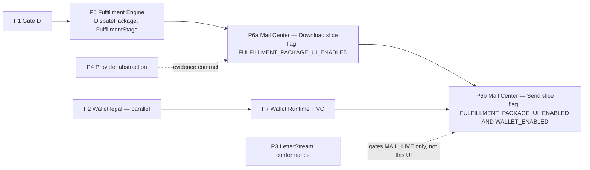

# MAIL-CENTER-EVOLUTION-PLAN.md — Mail Center Evolution, Execution Plan

Agent C (Mail Center Evolution), Phase 1 Execution Planning — per `docs/fulfillment/execution/EXECUTION-PLANNING-BRIEF.md`. **Planning only** — no code, no schema, no dependency, no commit. This document does not redesign Mail Center; it maps the already-accepted `docs/fulfillment/B-MAIL-CENTER-EVOLUTION.md` design onto Agent A's phase sequence, folds in `docs/fulfillment/KAI-FULFILLMENT-UX.md`'s Refinement Cycle 2 corrections (which postdate B and change its FINAL REVIEW placement), and folds in the Brief's new Founder decisions (Vector Credits, Case Journey Runtime primacy) that B's document predates.

**Labels:** `PROPOSED` = new, not founder-approved. `FOUNDER-GATE` = needs explicit Founder/CCO ratification before it ships, even flag-off. `FINDING` = a gap, conflict, or delta this document discovered while reconciling sources — flagged for the Program Director / Agent A / Agent E, not silently resolved.

---

## 0. Method — sources, and two artifact-freshness issues found

| Source | Role here |
|---|---|
| `EXECUTION-PLANNING-BRIEF.md` | Binding — R1–R6, the gate list, the P1–P10 phase skeleton this document maps onto |
| `B-MAIL-CENTER-EVOLUTION.md` | The accepted evolution design — reused verbatim wherever cited; not re-derived |
| `KAI-FULFILLMENT-UX.md` (Refinement Cycle 2) | Supersedes B on FINAL REVIEW placement (§1.1), vocabulary (`authorize`/`settle`/`release`/`clawback`/`adjust` — `consume` retired), and adds on-behalf-of voice (§2.2) — folded in below where it changes B's plan |
| `A-DOMAIN-MODEL.md`, `A-STATE-MACHINE.md`, `A-POLICY-ENGINE.md`, `A-PROVIDER-ABSTRACTION.md`, `C-WALLET-INTEGRATION.md` | Cited for the DisputePackage shape, canonical `FulfillmentStage`, and wallet lifecycle this UI consumes |
| `IMPLEMENTATION-SEQUENCE.md` | A **prior-cycle** sequencing doc (its own Phase 0–6, pre-dating the Brief's VC/Case-Journey-Runtime decisions) — reused below for flag names and guard-test conventions, **not** as the canonical phase graph (see Finding 0-a) |
| `CREDITVECTOR-FULFILLMENT-ENGINE-V1.md` §8, §10 | Resolves one of B's own open questions (docket #17) — carried forward as resolved, §2 row "Package Review scope" |

**FINDING 0-a — two phase-numbering schemes coexist, not yet reconciled.** `IMPLEMENTATION-SEQUENCE.md` already sequenced Mail Center work as its own "Phase 4" (Week 3) with flag `FULFILLMENT_PACKAGE_UI_ENABLED` and a flag-activation order that places `WALLET_ENABLED` (its step 3) **before** `FULFILLMENT_PACKAGE_UI_ENABLED` (its step 4) — i.e., in that plan, no evolved Mail Center UI ships before Wallet. That plan pre-dates R1 ("sequence the wallet-free value first"), which is a **newer, binding** Founder ruling. This document maps onto the Brief's P1–P10 skeleton (the current binding frame, per the Brief's own "Agent A refines against repo truth; the Founder's 10 phases are the starting frame") and treats `IMPLEMENTATION-SEQUENCE.md` as a reuse source for flag names/guard conventions only. Agent A's `EXEC-SEQUENCING.md` does not yet exist on disk as of this writing (`docs/fulfillment/execution/` contains only the Brief) — Agent A should treat this document's phase mapping as input to reconcile, not a competing source of truth.

**FINDING 0-b — vocabulary drift.** `A-STATE-MACHINE.md` and `C-WALLET-INTEGRATION.md` use `consume` for the Accepted-moment wallet transition. `KAI-FULFILLMENT-UX.md`'s vocabulary lock retires `consume` in favor of `settle` (S8, both documents pre-date the lock). This document uses `settle` throughout.

**Resolved, not re-litigated:** `CREDITVECTOR-FULFILLMENT-ENGINE-V1.md` §8 (docket #17) already closed B §3.5's open question — `app/letters/page.tsx`'s tradeline/strategy/bureau selection UI is **not** absorbed into the Package Review chain in v1; `/letters` stays the generation entry point, Package Review renders a read-only summary of choices already made there. Carried forward as fact in §2 below.

---

## 1. Evolution Stages → Phase Mapping

### 1.1 The phase skeleton (Brief, restated with Mail-Center relevance)

| Phase | Name | Mail Center relevance |
|---|---|---|
| P1 | Gate D Phase −1 | Universal unblock (R2) — nothing below with new schema starts until this lands |
| P2 | Wallet legal/CROA decision (parallel) | Gates P6b (Send fork) only — does not gate P6a (Download) |
| P3 | LetterStream conformance | Gates `MAIL_LIVE`, not the UI — Send button already renders/works dry-run today and continues to |
| P4 | Provider abstraction (interface, no live wiring) | Evidence drawer (§2.4 below) needs `MailProvider.retrieveTracking()/retrieveProof()` to exist as a typed, even-dry-run contract |
| P5 | Fulfillment Engine (Case/DisputePackage/state machine/Policy Engine/Recovery Engine — non-money) | **Hard prerequisite** for Package-level (multi-letter) Download, the canonical `FulfillmentStage` timeline, and the certified-mail pricing fix |
| P6 | Mail Center evolution | This document's core deliverable — splits into P6a/P6b, see §1.3 |
| P7 | Wallet Runtime + Vector Credits (after P2) | Unlocks P6b only |
| P8 | Kai Fulfillment guidance | Splits — see §1.6 |
| P9 | Internal Founder testing | Validation gates, §5 |
| P10 | Beta rollout | Flag activation order, reconciled in §1.3 |

### 1.2 Two independent dependency chains (R1, formalized)



Chain 1 (wallet-free, ships first, R1): `P1 → P5 → P6a`. Chain 2 (wallet-gated): `P2` (parallel to Chain 1) `→ P7 → P6b`, and P6b is additionally built on top of P6a's shell (same page, same components, one more rendered option). **P6b never blocks P6a** — this is the concrete mechanism that satisfies R1 and R3.

### 1.3 FINDING — P6 splits into two flag-gated sub-phases (PROPOSED, for Agent A to ratify into `EXEC-SEQUENCING.md`)

`IMPLEMENTATION-SEQUENCE.md`'s single `FULFILLMENT_PACKAGE_UI_ENABLED` flag (its Phase 4) bundles the whole evolved `/mail` + Package Review chain, gated in its own flag-order table **behind** `WALLET_ENABLED`. That ordering is now superseded by R1. Proposed split, reusing existing/named flags rather than inventing new ones:

| Sub-phase | Ships | Flag | Depends on | Terminal-fork rendering |
|---|---|---|---|---|
| **P6a** | Evolved work queue, "Do this first" band, evidence drawer, demoted metrics, canonical timeline labels, 12-step Package Review chain steps 1–7, Download Package terminal | `FULFILLMENT_PACKAGE_UI_ENABLED` (reused name, redefined scope) | P1, P5, P4 (evidence contract) | Download = primary/co-equal; Send = **unchanged from today** — de-emphasized "soon" link, same honest copy already shipped (`app/letters/page.tsx:386-388,615-617`) |
| **P6b** | Wallet Authorization screen, FINAL REVIEW screen (§1.5 below), Submit, Send terminal promoted to co-equal | `FULFILLMENT_PACKAGE_UI_ENABLED` **AND** `WALLET_ENABLED` (existing flag, `C-WALLET-INTEGRATION.md` §8.1, `process.env.WALLET_ENABLED === "true"`) | P2, P7, P6a (shares its shell) | Both options co-equal, per B §3.4 |

This reuses `WALLET_ENABLED` as the second gate rather than inventing a new flag name — one flag change (`WALLET_ENABLED` off→on) is the entire mechanism that promotes Send from "soon" to co-equal; no Mail Center code needs to change at that moment, only the boolean it reads. `MAIL_LIVE` gates real postage spend, not this UI (R4) — the Send button already works fully dry-run today (`app/api/mail/[mailId]/confirm/route.ts:52-54`) and continues to under P6b.

### 1.4 FINDING — a schema-free acceleration slice exists inside P6a (PROPOSED, for Agent A)

`lib/mailCenter.ts`'s `buildMailCenter()` already reads `Letter[]` directly and is pure (no DB, no AI, `mailCenter.ts:1-8`). The row-level evolution — work-queue reorder, the "Do this first" band, evidence-drawer wiring, metrics demotion, timeline stage-label extension — is a composition/data-shape change over **today's existing Letter/MailManifest data**, with **zero new table**. It does not structurally need `DisputePackage` (P5) to exist to ship; B §7 itself says the function's "inputs generalize from raw `Letter[]` to Agent A's Dispute Package read shape" — implying build-now-generalize-later is compatible with the design. Only the **Package Review 12-step chain's** multi-letter cardinality (steps 2–9) and **Package-level Download** genuinely need `DisputePackage`.

| Slice | Needs | Can build starting |
|---|---|---|
| `/mail` row/queue/band/drawer/metrics/timeline evolution (B §2) | Today's schema only | Immediately — no phase gate beyond normal code review |
| Package Review 12-step chain + Package-level Download (B §3) | `DisputePackage`, canonical `FulfillmentStage` (P5) | After P5 |

Recommend Agent A treat the first row as buildable in parallel with P1/P5 rather than queued strictly behind P5 — it touches zero schema and is the cheapest, most visible pre-September win.

### 1.5 FINDING — the Approve / Wallet-Authorization branch point (flagged ambiguity — this document's resolved reading, pending Agent E confirmation)

B §3.1 row 8–9 states "Wallet Authorization... inserts between Approve and this fork" (implying it sits before **both** options), and `KAI-FULFILLMENT-UX.md` §1.1's corrected chain diagram labels the terminal Download/Send fork as "triggered by Submit" for both. Read literally, that would mean even Download passes through a wallet hold + FINAL REVIEW — which directly contradicts R1's unconditional "Download needs NO wallet." Neither document states the branch point explicitly. **This document's resolved reading:** Approve (chain step 7) is a single, shared, non-money consent gate for **both** paths — the existing law, unchanged (`MailService.approve()`, `lib/mail/MailService.ts:125-132`: "a user, never Kai, never the system, approves"). Clicking **Send with CreditVector Fulfillment** after Approve is what triggers `authorizeGroup` (entering Wallet Authorization → FINAL REVIEW → Submit, per Ruling 4); clicking **Download Package** after Approve calls no wallet function at all and terminates immediately in the package-level print aggregator (§2 below). This reading is the only one consistent with R1, with Ruling 4's stated purpose (FINAL REVIEW protects the one action that "actually crosses into commitment territory" — Submit → `createMailJob()`, which Download never calls), and with B §3.4's own "self-mail remains first-class... unaffected." Flagged for Agent E to ratify or correct at merge — not silently assumed upstream of this document.

### 1.6 FINDING — P8 (Kai Fulfillment guidance) should split; the Package-narration half is wallet-independent (PROPOSED, for Agent A)

The Brief's skeleton sequences P8 after P7 (Wallet). But `D-KAI-EXPERIENCE.md` §2.1–2.3 (Kai Summary, Recommended Disputes, Educational Explanation — chain steps 2–4) are explicitly deterministic, own-rows-only, zero-AI-required projections ("same 'own rows + KaiEvent stream, zero AI, zero network' projection style as `lib/mailCenter.ts`", `D-KAI-EXPERIENCE.md:119`) — they have no wallet dependency and are needed by **both** P6a (Download) and P6b (Send), since they render before Approve. Only `KAI-FULFILLMENT-UX.md` §2–§3 (the Recovery failure-translation catalog, truthful money narration, on-behalf-of voice) are genuinely wallet/Recovery-Engine-dependent.

| Sub-phase | Contents | Depends on | Needed by |
|---|---|---|---|
| **P8a** (pull forward) | `components/kai/KaiSummary.tsx`, `lib/kaiPackage.ts` (`pickPackageCandidate()`), reuse of `RecommendationIntelPanel`/`KaiWhy` | Nothing beyond P5 (needs a Package to summarize) | P6a (both Download and Send share these three panels) |
| **P8b** (stays late) | 19-class `kaiCopyClass` catalog, `RecoveryVerdict.basis` closed union, §3's money-narration lines, §2.2's on-behalf-of voice selection | Recovery Engine, Wallet (P7) | P6b only |

### 1.7 Master stage table

| Increment | Phase | Flag | Depends on |
|---|---|---|---|
| `/mail` row evolution (queue reorder, "Do this first" band, metrics demotion, timeline labels) | P6a (schema-free slice, §1.4) | none required to build; `FULFILLMENT_PACKAGE_UI_ENABLED` to expose | Today's schema only |
| Evidence drawer (first consumer of `TrackingInfo`/`ProofArtifact`) | P6a | `FULFILLMENT_PACKAGE_UI_ENABLED` | P4 (typed contract, dry-run acceptable) |
| Package Review chain steps 1–4 (Client, Kai Summary, Recommended Disputes, Educational Explanation) | P6a, using P8a components | `FULFILLMENT_PACKAGE_UI_ENABLED` | P5 (DisputePackage), P8a |
| Package Review chain steps 5–7 (Letter Preview, PDF Preview, Approve) | P6a | `FULFILLMENT_PACKAGE_UI_ENABLED` | P5 |
| Download Package (package-level, multi-letter aggregation) | P6a | `FULFILLMENT_PACKAGE_UI_ENABLED` | P5 |
| Wallet Authorization screen | P6b | `FULFILLMENT_PACKAGE_UI_ENABLED` AND `WALLET_ENABLED` | P7 |
| FINAL REVIEW screen + `FinalReviewToken`/`FinalReviewConfirmation` | P6b | same | P7; persistence mechanism is Agent A's call (open join, §7) |
| Submit → Send with CreditVector Fulfillment (terminal) | P6b | same | P7, P3 (for eventual `MAIL_LIVE`, not for this flag) |
| Recovery-verdict Kai copy on Mail Center rows (19 classes) | P6b, using P8b | same | P8b, Recovery Engine |
| `app/journey/page.tsx` `mailStatusLine()` extension to canonical stages | P6a (non-money stages) / P6b (money stages) | n/a (server component, no flag of its own — reads the same data P6a/P6b expose) | P5 / P7 respectively |

### 1.8 Earliest wallet-free Mail Center milestone — precisely defined

**Milestone: "Evolved Mail Center, Download-complete."** Concretely: `/mail` renders a health-priority work queue (not DB order) with a single "Do this first" band, demoted metrics strip, a per-package evidence drawer (real once P4's contract exists, honest `RESERVED` placeholder otherwise), and a canonical 12-stage timeline; the Package Review chain (renamed route `app/mail/send/[packageId]/page.tsx`) walks Client → Kai Summary → Recommended Disputes → Educational Explanation → Letter Preview → PDF Preview → Approve → **Download Package** (package-level print aggregator, multi-letter); Send with CreditVector Fulfillment remains visible in its current, honest, de-emphasized dry-run form (unchanged copy). **Dependency chain: P1 → P5 → P6a only** — zero wallet, zero legal gate, zero live provider. Flag: `FULFILLMENT_PACKAGE_UI_ENABLED` (off by default per R5).

---

## 2. Reuse Map

| Evolved capability | Existing file/component reused or extended | Change class | What's preserved | Phase |
|---|---|---|---|---|
| Work queue (6-state health pill + rows) | `app/mail/page.tsx:92-163` (rows), `lib/mailCenter.ts:35-52` (`HEALTH_LABEL`/`HEALTH_TONE`) | Extend | 6-state vocabulary unchanged; `orderBy: createdAt desc` (`page.tsx:24`) replaced by a priority-ladder sort over existing `row.health` — no new query | P6a |
| Single recommended-action band | New composition; idiom from `components/mission/ExecutiveQueue.tsx:38-39` (`HeadTile`, "Do this first") + `lib/kaiHome.ts:60-67` (`pickRecommendation()` anti-overwhelm law) | New-additive (pure function `pickQueueRecommendation()` in `lib/mailCenter.ts`) | Reuses `recommendationFor()`'s text verbatim as `sub` (`mailCenter.ts:151-179`); ExecutiveQueue's CSS module (`components/mission/mc.module.css`) is **not** imported — Mail Center uses its own `card`/`pill`/`btn-*` classes | P6a — see §3 for the later Journey-scoped supersession |
| Evidence drawer | New UI; data types already exist unused — `TrackingInfo`/`ProofArtifact` (`lib/mail/MailProvider.ts:71-91`), `MailService.syncTracking()` (`lib/mail/MailService.ts:193-220`) | New-additive | `RESERVED` placeholder discipline (`mailCenter.ts:84`) governs every field until P4's contract is live; letter link reuses `/letters/print/[id]` verbatim | P6a (placeholder) → real once P4 ships |
| Per-package timeline | `buildTimeline()` (`lib/mailCenter.ts:191-232`), `<ol>`/`StageIcon` (`app/mail/page.tsx:133-154,171-178`) | Extend (data only) | Identical `TimelineStage` shape and `StageState` vocabulary (`done/current/pending/placeholder`); zero component change — only the emitted stage array changes to the canonical 12-stage + 6-side-state taxonomy (`A-STATE-MACHINE.md` §4–§6) | P6a (non-money stages), P6b (money stages) |
| Metrics → context demotion | `StatCard` grid (`app/mail/page.tsx:64-77`) | Reposition | Same component, same data (`stats.delivered` stays `null`→`"—"` until truthfully live) — repositioned below the recommendation band, no data change | P6a |
| Package Review chain (3-step → 12-step) | `app/mail/send/[letterId]/page.tsx` → renamed `app/mail/send/[packageId]/page.tsx` | Extend + rename | Server-status-derived resumability pattern (`load()`'s status→step map, `:66-68`) generalizes to Package canonical stage; existing `Steps()` component pattern extends | P6a (steps 1–7 + Download), P6b (Wallet Auth/FINAL REVIEW/Submit/Send) |
| Approval-card split | `Approval()` (`app/mail/send/[letterId]/page.tsx:165-205`) | Extend (structural) | Splits into: (a) Kai-labeled explanation card (unchanged `<dl>` block, `:174-184`), (b) non-Kai Approve card, (c) non-Kai FINAL REVIEW card (new, Send-only) — three renders per `KAI-FULFILLMENT-UX.md` §1.4, not two | P6a (a+b), P6b (c) |
| FINAL REVIEW pre-Submit gate | New card; visual precedent `Payment()`'s live-mailing notice (`app/mail/send/[letterId]/page.tsx:230-235`) | New-additive | Same amber/non-alarm register, `≥44px` touch targets, `role="alert" aria-live="polite"` pattern (`:196,237`) reused verbatim | P6b only |
| Download Package (single-letter) | `app/letters/print/[id]/page.tsx` + `PrintActions.tsx` | No change | Browser-print truth (`window.print()`, `PrintActions.tsx:8`), unbranded footer (`page.tsx:119-124`) — untouched, stays the immediate zero-friction path on `/letters` | Ships today already |
| Download Package (package-level, N letters) | Same two files, aggregated | New-additive (new sibling route, not yet named — e.g. a `print-package/[packageId]` route) | Same print CSS/enclosure/unbranded-footer discipline, applied per-letter inside one session | P6a |
| Send with CreditVector Fulfillment fork | `Payment()`/`Receipt()` (`app/mail/send/[letterId]/page.tsx:207-283`), `POST /api/mail/[mailId]/confirm` | Extend | Itemized `p.lines.map(...)` breakdown reused (pending the certified-line fix, Policy Engine's call, B §4.2); campaign-gate pattern (`app/api/mail/[mailId]/confirm/route.ts:30-49`) reused | P6b |
| Two-option law (co-equal fork) | Today's de-emphasized links (`:112,201`; `app/letters/page.tsx:386-388,615-617`) | Reposition/promote | Neutral copy, no steering — Download promoted alone in P6a; Send promoted alongside it only in P6b (§1.3) | P6a (Download), P6b (Send) |
| `KaiPresence` exclusion | `components/kai/KaiPresence.tsx:101` | Extend (one line) | Never-auto-open / session-dismiss / one-recommendation law unchanged (`:32-63,103`) — adds `/mail` + renamed Package Review route | P6a |
| Agency/consumer scoping | `lib/session.ts:39-63` (`currentUser()`), `components/AgencyBar.tsx` (global via `AppShell.tsx:25`) | No change | Zero new code — evolved room inherits scoping exactly as today | P6a |
| Timeline page integration | `app/journey/page.tsx:46-59` (`mailStatusLine()`) | Extend | "One timeline, never two" (`:12-15`); honest-`null`-until-live rule (`:57-58`) — switch extended to canonical stages beyond today's four | P6a/P6b split by stage |
| Copy/compliance | `lib/compliance.ts`, `components/Disclaimer.tsx` | No change | All new copy hand-written to the same bar, CCO-reviewed before ship — not literally passed through `applyCompliance()` (that runs on letter bodies) | P6a/P6b |

---

## 3. Case Journey Integration

### 3.1 What changes about Mail Center's ownership

**Delta from B's original design, flagged.** B-MAIL-CENTER-EVOLUTION.md was finalized cross-referencing D-KAI-EXPERIENCE.md, but was written treating `/mail` as an independently-computing room: it reads `prisma.letter.findMany` inline (`app/mail/page.tsx:22-26`) and proposes its own cross-row pick, `pickQueueRecommendation()` (B §2.3). The Brief's **new** Founder decision — "Case Journey Runtime = the primary operational workflow. Everything reports INTO the Journey — not Mail, not Wallet, not Kai... Mail Center, Wallet, Kai, Timeline, Mission Control are participants/views of the Journey" — post-dates B's finalization and was not structured around in that document. Under this decision, Mail Center should **stop being a second, independently-ranked source of "what's next"** and instead render a Mail-scoped slice of the Journey's single Next-Recommendation loop (Brief, Agent E's remit) — the same anti-overwhelm law (`pickRecommendation()`, one recommendation account-wide) applied one level up, so that Kai Home's account-wide pick, Mail Center's row-level pick, and the Journey's top-level pick don't drift into three different answers to "what's next."

### 3.2 Interface expected from Agent E — `CaseJourneyMailView` (named, not designed)

```ts
// PROPOSED shape — Agent E (CASE-JOURNEY-RUNTIME-PLAN.md) owns the actual design;
// this is what Mail Center needs to consume without changing any of its JSX.
interface CaseJourneyMailView {
  packageId: string;
  caseId: string;
  stage: FulfillmentStage;          // A-STATE-MACHINE.md §4's 12 + 6 side-states, unchanged vocabulary
  health: MailHealth;                // Mail Center's existing 6-state enum (mailCenter.ts:31-33) — Journey
                                      // either adopts this vocabulary or maps onto it; not re-invented
  recommendation: {                  // a MAIL-SCOPED slice of the Journey's single top-level pick —
    title: string; sub: string; href: string; basis: string;
  } | null;
  timeline: TimelineStage[];         // identical shape to mailCenter.ts:59-65 — zero component change
  evidence: { tracking: TrackingInfo | null; proof: ProofArtifact[] };  // lib/mail/MailProvider.ts:71-91
  onBehalfOf: string | null;         // KAI-FULFILLMENT-UX.md §2.2's voice-selection field — needed so
                                      // Mail Center rows/copy pick self-pay vs on-behalf-of voice per row
}
```

### 3.3 Migration posture — bridge now, swap later (phased, not a rewrite)

| Phase | Data source | Component impact |
|---|---|---|
| P6a/P6b (as built by this plan) | `buildMailCenter()` reads `Letter[]`/`DisputePackage` rows directly via Prisma, exactly as B specified — a **bridge** implementation | None — this is B's original design, unmodified |
| Post-P6 (folded into P8b or a dedicated Journey-merge step, Agent E's to name) | Swap `buildMailCenter()`'s input from a direct Prisma read to `CaseJourneyMailView[]` | **Zero JSX change** — `StatCard` grid, work-queue rows, recommendation band, evidence drawer, and the timeline `<ol>` all keep rendering the identical shapes; only the data-fetching call at the top of `app/mail/page.tsx` changes |

This ordering means Mail Center does not wait on the Journey Runtime to exist before shipping — it ships the wallet-free milestone (§1.8) against its own Prisma read first, then swaps sources later with no visible product change, exactly the "reuse-first, delta later" posture the whole program uses elsewhere (e.g., `A-STATE-MACHINE.md` §5's new stage values flowing through an existing `TEXT` column with no migration).

### 3.4 What Mail Center still computes locally, even post-Journey

Presentation stays local and unchanged regardless of data source: evidence-drawer rendering, the timeline `<ol>`, `StatCard` layout, row grouping/bands, all copy. Only two things move to the Journey: the **primary read** (§3.3) and the **cross-row recommendation rank** (§3.1) — `recommendationFor()`'s per-row text (`mailCenter.ts:151-179`) is untouched either way; it is a per-row fact, not a cross-row rank.

### 3.5 Interface handles expected from each agent (summary)

| From | Handle | Status |
|---|---|---|
| Agent A | `DisputePackage` shape + cardinality (1:N letters, rollup `stage`) | **Resolved** — `A-DOMAIN-MODEL.md` §2.2–2.3 |
| Agent A | Canonical `FulfillmentStage` taxonomy (12 + 6 side-states) | **Resolved** — `A-STATE-MACHINE.md` §4, §6 |
| Agent A | Exact endpoint names for approve/wallet-authorize/final-review/submit/send/cancel/evidence/list | Open — this document's §7.1-equivalent table (below) is a consumption expectation, not a design |
| Agent A | `Campaign.campaignId` on `DisputePackage` — unenforced string FK (self-heal table vs. migration-backed model conflict) | Open, no UI impact either way (`A-DOMAIN-MODEL.md:125`) |
| Agent D | `KaiSummary`/`kaiPackage.ts` server-component prop contract (data-fetching ownership) | Open — `D-KAI-EXPERIENCE.md` names the components, not the prop shape |
| Agent D | 19-class `kaiCopyClass` catalog + on-behalf-of voice | **Resolved** — `KAI-FULFILLMENT-UX.md` §2.1–§2.3 |
| Agent E | `CaseJourneyMailView` read-model (§3.2) | New ask from this document |
| Agent E | Confirm/correct the Approve/Wallet-Authorization branch point (§1.5) | New ask from this document |
| Agent E | Reconcile P6a/P6b split + P8a/P8b split into the canonical phase graph | New ask from this document |

---

## 4. Genuinely New vs. Reused

### 4.1 Classification

| Class | Items |
|---|---|
| **Reused verbatim, no change** | `components/AppShell.tsx`; `components/AgencyBar.tsx`; `lib/session.ts`; `lib/compliance.ts`; `components/Disclaimer.tsx`; `app/letters/print/[id]/page.tsx` + `PrintActions.tsx` (single-letter case); `app/letters/page.tsx` (resolved per docket #17 — not touched) |
| **Reference pattern only, not imported** | `components/mission/ExecutiveQueue.tsx` (idiom, not code — `mc.module.css` stays Mission-Control-scoped); `lib/kaiHome.ts` (idiom, not code) |
| **Evolved (existing file, behavior/data added)** | `app/mail/page.tsx`; `lib/mailCenter.ts`; `app/mail/send/[letterId]/page.tsx` → renamed `[packageId]`; `app/journey/page.tsx`; `components/kai/KaiPresence.tsx` (one line) |
| **Genuinely new UI surfaces** | Evidence drawer; package-level print aggregator (new sibling route); Wallet Authorization screen; FINAL REVIEW screen; `components/kai/KaiSummary.tsx`; `lib/kaiPackage.ts` |
| **New-additive API routes (each a new file, but a 1:1 evolution of an existing route's pattern — not a new concept)** | `GET /api/packages`, `POST /api/packages/:id/prepare`, `GET /api/packages/:id`, `POST /api/packages/:id/approve`, `POST /api/packages/:id/wallet-authorize`, `POST /api/packages/:id/final-review` (issues/validates the token), `POST /api/packages/:id/submit`, `POST /api/packages/:id/send`, `GET /api/packages/:id/evidence`, `POST /api/packages/:id/cancel`, `POST /api/packages/:id/download` — each evolves 1:1 from an existing `/api/mail/[mailId]/*` route (B §7.1) |

### 4.2 File-reuse ratio

Of the roughly 13 files this evolution touches at the component/page/lib level: **7 are reused verbatim or as reference-pattern-only** (no code change), **5 are evolved** (existing file, extended), and **6 are genuinely new UI/lib surfaces** — call it roughly **2:1 reused-or-evolved to new** at the component layer, before counting the ~11 API routes, each new-as-a-file but a direct 1:1 pattern-evolution of an already-shipped route (not a new concept). No existing file is deleted or rewritten; the two structural changes forced by external law (Approval-card split, §2 above; FINAL REVIEW as a third render, §2 above) are both flagged, code-grounded findings from B/W3, not net-new invention.

### 4.3 Copy discipline

B §8's copy table (CROA bar, `applyCompliance()`'s `PROHIBITED` precedent, no vendor names, no fabricated telemetry) is reused as-is for Package Review chain copy — not re-derived here. Two deltas since B §8 was written:

| Gap | Fix |
|---|---|
| B §8 covers Package Review chain copy only, not Mail Center **row-level** copy (`kaiIntel` bullets, health-pill states) | Same bar applies; no new table needed since `recommendationFor()`'s text is reused verbatim (§2 above) — already compliance-shaped |
| B §8 predates `KAI-FULFILLMENT-UX.md` §2.2's on-behalf-of voice rule | Every row-level copy line that states a concrete wallet fact (deficit pill, settled/released state) must carry both self-pay and on-behalf-of variants per the substitution table at `KAI-FULFILLMENT-UX.md` §2.2 — applies to P6b only, since P6a states no wallet facts |

No vendor name (`letterstream`/`lob`/etc.) appears anywhere in Mail Center copy, by the same Vendor Opacity DTO discipline named in `A-PROVIDER-ABSTRACTION.md` §9 — Mail Center is a pure consumer of already-scrubbed `RecoveryVerdict`/`FulfillmentStage` values, never a raw provider payload.

---

## 5. Per-Phase Risks + Validation

| Phase | Risk | Reuse-collision risk | Honest-placeholder rule | Validation gate |
|---|---|---|---|---|
| P6a — row/queue evolution | Priority-ladder sort silently diverges from `recommendationFor()`'s own internal priority, giving two different "what matters most" answers on one page | Low — pure function, same input shape | N/A (no new placeholder introduced) | `npm run typecheck`; unit test asserting the ladder order matches `mailHealth()`'s branches |
| P6a — evidence drawer | Rendering a real-looking tracking/receipt field before P4's contract is live | Medium — first-ever UI consumer of `TrackingInfo`/`ProofArtifact`, easy to accidentally fabricate a field | **Binding** — every field renders `RESERVED` ("Available after live mail integration.") until a real `ProofArtifact`/`TrackingInfo` exists (`mailCenter.ts:84`) | Guard test asserting no drawer field renders non-`RESERVED` content when `MAIL_LIVE`/P4 contract is absent |
| P6a — Package Review chain steps 1–7 | Kai Summary/Recommended Disputes silently duplicate `app/letters/page.tsx`'s selection logic instead of read-only summarizing it (re-opens the closed docket #17 boundary) | Medium — two UIs computing the same recommendation independently | N/A | Manual QA: Package Review step 3 renders the same primary pick `app/letters/page.tsx` already made, never a second computation |
| P6a — Download Package (package-level) | Multi-letter print aggregator silently changes single-letter print output (regression on the existing, working `/letters/print/[id]` path) | Medium — new sibling route, shared print CSS | Browser-print truth stays disclosed (`PrintActions.tsx:8`, no silent PDF-library upgrade) | `npx next build`; manual print-preview diff against today's single-letter output |
| P6a — Approval-card split | Kai-labeled and non-Kai sections accidentally re-merge in a future edit (the exact violation B §3.2 found) | High — this is a structural law, easy to regress silently | N/A | `approval-card-split.test.ts` (named, `IMPLEMENTATION-SEQUENCE.md` §5.1) — asserts the Approve control's DOM subtree never shares a container with a KAI-badge element |
| P6b — Wallet Authorization / FINAL REVIEW | FINAL REVIEW renders before the hold exists (repeats Cycle-1's placement error `KAI-FULFILLMENT-UX.md` §1.1 already corrected once) | High — this exact regression already happened once in the doc history | Checkbox state never pre-checked, never resumed from cache (`KAI-FULFILLMENT-UX.md` §1.3, §1.8) | Guard test: FINAL REVIEW route 400s if no unexpired, unconsumed `FinalReviewToken` exists; manual QA against §1.4's three-render order |
| P6b — Send terminal / recovery copy | A `kaiCopyClass`/`basis` value renders raw or a vendor name leaks through | High — this is the single most consequential fix in `KAI-FULFILLMENT-UX.md` (Ruling 3) | `RecoveryVerdict.basis` validated against the closed union before Kai's translation runs (§2.1.3); generic fallback on mismatch, never interpolation | DTO guard test (`RecoveryVerdictBasisSchema.safeParse`); static vendor-name regex sweep across new copy files |
| P6b — flag sequencing | `FULFILLMENT_PACKAGE_UI_ENABLED` and `WALLET_ENABLED` flip together, skipping the P6a-only window R1 exists to create | Low | N/A | Manual runbook check before any flag flip: confirm `WALLET_ENABLED` flips strictly after `FULFILLMENT_PACKAGE_UI_ENABLED` has already been live Download-only for at least one release |
| All phases | `certified: false` hardcode (`app/api/mail/prepare/route.ts:46`) ships un-fixed into a UI that now prominently displays price | High — tri-confirmed by Agents A, B(orig), C(wallet); not this document's file to fix | N/A | Block P6b's FINAL REVIEW price re-display on the Policy Engine's `certified: true` fix landing first (B §4.2, this document does not re-design the fix) |

---

## 6. Findings Flagged for the Program Director / Agent A / Agent E (consolidated)

- **§0-a** — Two phase-numbering schemes (`IMPLEMENTATION-SEQUENCE.md`'s prior-cycle Phase 0–6 vs. the Brief's P1–P10) need Agent A's reconciliation; this document maps onto P1–P10.
- **§1.3** — Propose splitting `FULFILLMENT_PACKAGE_UI_ENABLED` in scope (P6a alone) from a second AND-gate on `WALLET_ENABLED` (P6b), reversing `IMPLEMENTATION-SEQUENCE.md`'s stale wallet-before-UI flag order.
- **§1.4** — The `/mail` row-level evolution needs no schema and can build ahead of `DisputePackage`.
- **§1.5** — The Approve/Wallet-Authorization branch point is unstated in both B and `KAI-FULFILLMENT-UX.md`; this document's resolved reading (Approve is shared and non-money; only Send triggers `authorizeGroup`) needs Agent E's confirmation.
- **§1.6** — Propose splitting P8 into P8a (Kai Package narration, wallet-independent, pull forward) and P8b (Recovery/money narration, stays gated behind Wallet).
- **§3.1–3.3** — Mail Center's primary read and cross-row recommendation should migrate to the Case Journey Runtime read-model once it exists; this document specifies a bridge-then-swap sequencing so P6a/P6b need not wait on Agent E's runtime.

---

## 7. Interface Expectations (for Agent E merge)

**Agent A:** endpoint names/shapes for approve / wallet-authorize / final-review / submit / send / cancel / evidence / list (table in §4.1 is a consumption expectation, not a design); `FinalReviewToken`/`FinalReviewConfirmation` persistence mechanism (new table vs. `MailAudit` extension) — open per `KAI-FULFILLMENT-UX.md` §6 item 2; confirm/refute the P6a/P6b and P8a/P8b phase splits proposed in §1.3/§1.6.

**Agent D:** `<KaiSummary packageId=... />` server-component prop contract and data-fetching ownership — open, `D-KAI-EXPERIENCE.md` names the component, not the contract.

**Agent E (Case Journey Runtime):** the `CaseJourneyMailView` read-model shape (§3.2); confirmation of the Approve/Wallet-Authorization branch-point reading (§1.5); reconciliation of the phase-numbering and phase-split findings (§6) into the canonical `EXEC-SEQUENCING.md`; a ruling on whether Mail Center's `pickQueueRecommendation()` is a permanent room-local function or a bridge implementation superseded by the Journey's scoped Next-Recommendation feed (§3.1).

---

## Summary

The evolution stages in `B-MAIL-CENTER-EVOLUTION.md` map onto the Brief's P1–P10 skeleton as two independent chains: the wallet-free **Download** path runs `P1 (Gate D) → P5 (DisputePackage/FulfillmentStage) → P6a`, needing neither the Wallet legal gate (P2) nor the Wallet Runtime (P7); the wallet-gated **Send** path adds `P2 → P7 → P6b` on top of P6a's shared shell, with `WALLET_ENABLED` (already-named, `C-WALLET-INTEGRATION.md` §8.1) doubling as the flag that promotes Send from today's honest "soon" link to a co-equal option — no new flag invented. The earliest wallet-free milestone is the evolved `/mail` work queue + "Do this first" band + evidence drawer + canonical timeline, plus the Package Review chain's steps 1–7 ending in a package-level Download, gated by one flag (`FULFILLMENT_PACKAGE_UI_ENABLED`) and zero legal/vendor/wallet dependency. Of the roughly 13 component/page/lib files this evolution touches, 7 are reused verbatim or as reference-pattern-only and 5 are evolved in place — call it 2:1 reused-to-new before the ~11 new-but-pattern-evolved API routes are counted; the 6 genuinely new surfaces are the evidence drawer, the package-level print aggregator, the Wallet Authorization and FINAL REVIEW screens, and Agent D's `KaiSummary`/`kaiPackage.ts`. Interface handles expected: from Agent A, exact Package endpoint shapes and the FINAL REVIEW token's persistence home; from Agent D, the `KaiSummary` prop contract; from Agent E, the `CaseJourneyMailView` read-model that lets Mail Center's primary read and cross-row recommendation migrate from a room-local Prisma query to a Journey-scoped view with zero JSX change, plus a ruling on the Approve/Wallet-Authorization branch point and the P6a/P6b, P8a/P8b phase-split findings this document surfaces for the canonical sequencing doc.
