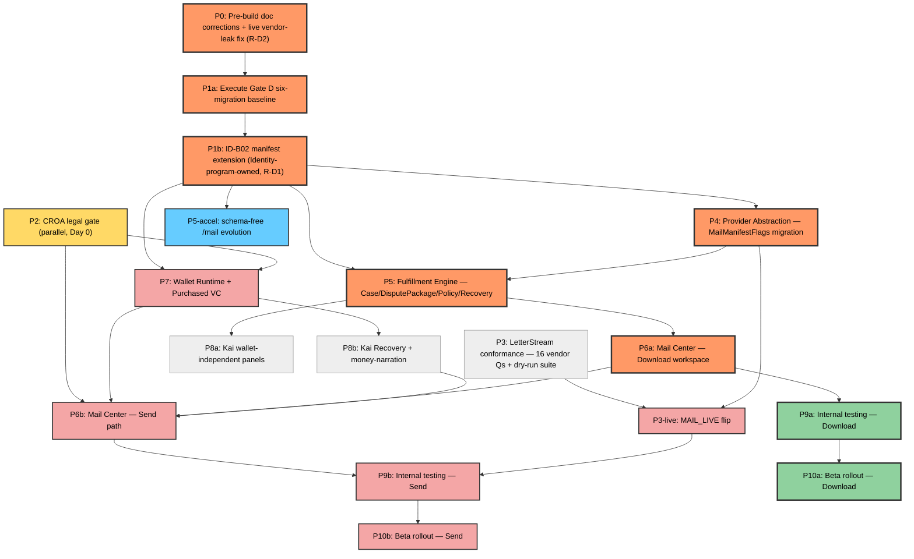

# CreditVector Fulfillment Platform — Phase 1 Execution Plan — Dependency and Migration

**2026-08-03 · branch `docs/fulfillment-engine-v1` · HEAD `fcfc5b6` · base `origin/main f449c35` (untouched)**

Base source: `docs/fulfillment/execution/DEPENDENCY-GRAPH.md` (unified graph + table) and `docs/fulfillment/execution/MIGRATION-PLAN.md` (additive migration order), corrected per `docs/fulfillment/execution/SEQUENCE-REVIEW.md`'s **R-D5** (Gate D P1a's mechanics) and **R-D6** (P1b is per-wave, not one-time).

## Contents
1. [The unified dependency graph](#the-unified-dependency-graph)
2. [Dependency table](#dependency-table)
3. [The Gate D prerequisite — P1a and P1b, corrected](#the-gate-d-prerequisite)
4. [Additive migration order](#additive-migration-order)
5. [Schema-safety-allowlist note](#schema-safety-allowlist-note)

## 1. The unified dependency graph 

Per `DEPENDENCY-GRAPH.md` §1 (nodes/edges cited to `EXECUTION-PLAN.md` §3 as authoritative; finer intra-phase edges pulled from the five domain plans). Rendered as Mermaid source (preformatted — no diagram-rendering dependency required to read this document):

**Legend:** **Orange, thick border** — shared prefix of both the engineering critical path and the earliest wallet-free milestone: `P0, P1a, P1b, P4, P5, P6a`. **Pink** — the Send-path-only continuation, all money-touching: `P7, P6b, P3-live, P9b, P10b`. **Green, thick border** — the Download-only continuation that reaches ship without ever touching money or a live provider: `P9a, P10a`. **Yellow** — the CROA §404 legal gate, `P2`, running in parallel from Day 0. **Blue** — `P5-accel`, the earliest operator-visible value of all, shipping on the shared spine's `P1b` alone. **Grey** — `P3`, `P8a`, `P8b`: necessary but on neither named path.

**Not a node here, by design:** the Case Journey Runtime and Mission Control. Per `CASE-JOURNEY-RUNTIME-PLAN.md` §1.4 ("Mission Control is not a tenth node — it has no single stage of its own") and its Method table ("no new engine... the Journey is a read-model"), the Journey is threaded through P5 (its anchor rows), P6a/P8a (rendering/narration), and P8b (money narration) — it earns no independent phase box (`DEPENDENCY-GRAPH.md` §1 note).

## 2. Dependency table 

| Node | Depends on | Blocks | Gate |
|---|---|---|---|
| P0 | — | P1a (transitively, everything) | Founder ADR ratification |
| P1a | P0 | P1b | Gate D runbook + Founder sign-off, owner-executed |
| P1b | P1a | P4, P5, P5-accel, P7 — every new-schema phase | Gate D Phase −1, part b (ID-B02) |
| P2 | — (Day 0) | P7, and transitively P6b, P8b, P9b, P10b | CROA §404 counsel + Founder legal — **LEGAL-GATE** |
| P3 | — (Day 0, Q&A half); P4 (conformance-suite half) | P3-live | vendor answers to the 16-question set |
| P4 | P1b | P5, P3-live | Gate D Phase −1 (P1b) |
| P5 | P1b, P4 | P6a, P8a | Gate D Phase −1 |
| P5-accel | P1b | none downstream | Gate D Phase −1 |
| P6a | P5 | P6b, P9a | P5 exit |
| P6b | P2, P7, P6a, P8b | P9b | **LEGAL-GATE** (P2) + P7 exit |
| P7 | P1b, P2 | P6b, P8b | Gate D Phase −1 **and** CROA/legal gate — both, independently |
| P8a | P5 | (feeds P6a's Package Review steps 1–4, non-blocking) | P5 exit |
| P8b | P7 | P6b | P7 exit |
| P3-live | P3, P4 | P9b | 16 vendor Qs + conformance green + Vendor Opacity guard green + `MailManifestFlags` shipped + Founder sign-off |
| P9a | P6a | P10a | full guard suite + `release-verify.sh` green; cohort-scoped |
| P9b | P6b, P3-live | P10b | both P6b and P3-live exited |
| P10a | P9a | — | beta cohort live |
| P10b | P9b | — | `MAIL_LIVE` stays its own separate, later Founder-gate runbook item |

Source: `DEPENDENCY-GRAPH.md` §2, citing `EXECUTION-PLAN.md` §3/§5 as primary and `EXEC-SEQUENCING.md` §2.1 for the pre-split Blocks column.

## 3. The Gate D prerequisite — P1a and P1b, corrected 

**Nothing in the migration order below exists until both of these clear, in order** (`MIGRATION-PLAN.md` §0):

**P1a — execute Gate D's six-migration baseline.** Production has **no `_prisma_migrations` history** — the prior baseline-resolve was preview-only. The base plan's text described running `migrate resolve --applied 0_init` directly; `SEQUENCE-REVIEW.md`'s **R-D5** corrects this: P1a instead **defers to the Gate-D runbook's own per-migration state taxonomy** — a read-only preflight, then a per-migration state determination, then resolving only `SCHEMA_ONLY` migrations one at a time, re-running preflight after each. A `0_init = ALL_ABSENT` reading **aborts** as wrong-target evidence rather than proceeding with a flat resolve. Exit: all six migrations `ALL_PRESENT_AND_MATCHING`, `NO_PENDING_MIGRATIONS`, the 5 pre-existing platform flags still OFF (`EXEC-SEQUENCING.md` §1.1; `MIGRATION-PLAN.md` §0).

**P1b — land the ID-B02 manifest-extension mechanism.** `scripts/gate-d-preflight.test.ts:366` and `gate-d-preflight-core.ts` accept **exactly six** migration directories today and reject a 7th (CRITICAL/CONFIRMED, `ADVERSARIAL-REVIEW.md` F1). P1b lands a versioned, owner-approved manifest mechanism proving byte-identical six-file coverage **plus** the new directory. `SEQUENCE-REVIEW.md`'s **R-D1** rules this is **shared infrastructure the Identity Constitution program's own Implementation Slice 7 also needs** — that program is the **sole owner**; Fulfillment consumes the mechanism, it does not re-implement it. Before P1b begins, the owner must pre-agree migration-directory numbering across both programs so both bump one shared manifest, not two competing ones — a Founder/owner cross-program coordination decision. **R-D6** further rules that P1b is a **per-wave mechanism, not a one-time unlock**: every subsequent migration wave (P4, P5, P7, and the Identity program's own tables) re-derives the pinned totals through it; the preflight tooling pins 34 tables / 304 columns / 21 FKs / 62 indexes / 11 enums today, and every wave bumps these (`SEQUENCE-REVIEW.md` Finding 6).

**No fulfillment migration exists until P1b lands** (`EXECUTION-PLAN.md` P-1). Every row in §4 below queues behind both P1a and P1b.

## 4. Additive migration order 

Per `MIGRATION-PLAN.md` §1 (primary source `EXEC-SEQUENCING.md` §3, reconciled against `EXECUTION-PLAN.md` §3 and `WALLET-VC-RUNTIME-PLAN.md` §5.2):

| Order | Directory | Table / Enum | Tier | Applies in phase | Note |
|---|---|---|---|---|---|
| — | (pre-existing) | the six already-committed Gate-D migrations | 0 | P1a | Pre-existing debt, not authored by this program |
| 1–7 | `fulfillment_domain_v1` (PROPOSED name) | `CaseState` enum, `Case`, `PackageState` enum, `DisputePackage`, `DisputePackageLetter`, `ClaimDomain` enum, `Claim` | 1 | P5 | One batched directory (mirrors the `operator_identity` precedent); `Case.userId`/`DisputePackage.userId` are **Restrict** (corrected from Cascade, per `COMMITMENT-RESOLUTION.md` F14); `DisputePackageLetter` carries `@@unique([letterId, attempt])`, **not** `@@unique([letterId])` — a plain unique made a `RETURNED_TO_SENDER` retry database-impossible |
| 8 | own directory (reassigned) | `MailManifestFlags` | 1 | **P4** | `mailId String @id`, `attention Json?`, `cancelRequest Json?` — a standalone table, **not** a self-heal `ALTER TABLE ... ADD COLUMN IF NOT EXISTS` (that was the original, rejected plan). Ships in its **own** migration, applied at P4, ahead of rows 1–7's P5 deploy, because the fail-closed `attention` mechanism P4 owns has no compliant place to live otherwise (`MIGRATION-PLAN.md` §5) |
| 9–10 | `wallet_purchased_vc_v1` (PROPOSED name, separate directory) | `Wallet` (anchor), `WalletLedger` | 2 | P7 | `Wallet.principalId→User` Restrict, `@@unique([principalId])`; `WalletLedger.actorId→User` **nullable** Restrict (corrected from non-null); = the Purchased VC ledger |
| 11–13 | **NOT SCHEDULED** | `EarnedVcLedger`, `BonusVcLedger`, `PendingPayoutVcLedger` | 3 | DEFERRED — counsel + CCO | Net-new Founder decisions; row 13 additionally requires Stripe Connect, which does not exist in this codebase today |

**Batching rationale:** rows 1–7 batch as one directory to minimize how many times the P1b extension mechanism must be exercised. Row 8 (`MailManifestFlags`) ships in its own directory ahead of rows 1–7's deploy — a delta from the domain plan's original batching, corrected because P4 precedes P5 in the phase order. Rows 9–10 ship in their own, later directory — bundling them with rows 1–8 would force the non-money tables to wait on P2's legal answer too, which the "non-money precedes money" ruling exists to prevent (`MIGRATION-PLAN.md` §2).

**Apply mechanics:** rows 1–7 apply as one `prisma migrate deploy` once P1 (P1a and P1b) clears, Founder sign-off on that specific apply. Row 8 applies as its own deploy step, once P1 clears, preceding rows 1–7. Rows 9–10 apply as a separate, deliberate release step once **P1 and P2 both** clear — never bundled with rows 1–8's deploy. Rows 11–13 have no migration to apply until their own counsel + CCO gates clear. No step ever reorders: Gate D precedes the legal-gate check for Tier 2, migration precedes flag flip, always (`MIGRATION-PLAN.md` §3).

## 5. Schema-safety-allowlist note 

None of the rows above is ever added to `LEGACY_SELF_HEAL_ALLOWLIST` (`scripts/schema-safety.test.ts:106-114`, frozen at 32 legacy tables). `scripts/schema-safety.test.ts`'s `newlySelfHealed.length === 0` check must stay green **unmodified** — proving none of these new tables self-heals (`EXEC-SEQUENCING.md` §3.3; `MIGRATION-PLAN.md` §4). `MailManifestFlags` (row 8) is declared in `schema.prisma` from birth, so it is never even matched by the `CREATE TABLE IF NOT EXISTS` self-heal scan — that guard needs no edit at all for this row. Every migration in rows 9–13, if/when scheduled: additive only, zero `DROP`/`TRUNCATE`/`DELETE FROM`/`RENAME`.
