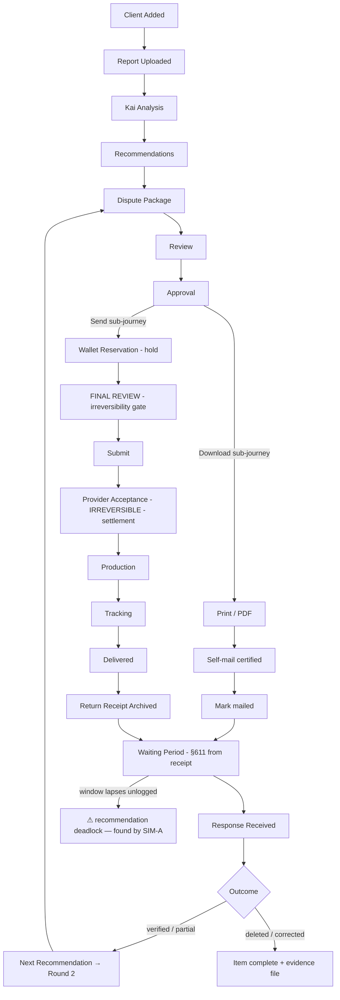

# Journey Map — CreditVector Case Journey, Canonical Map (Phase -0)

**Date:** 2026-08-03 · **Branch:** `docs/fulfillment-engine-v1` · **HEAD (base):** `871d420`
**Source:** `docs/fulfillment/simulation/JOURNEY-MAP.md`, faithful copy.

The full operator-visible journey, every canonical node: what the operator sees, Kai's register, the wallet effect, the evidence produced, the room, and the sim scene that storyboards it. `TARGET STATE` = designed, not yet built. On-behalf-of voice applies wherever an agency pays for a managed client.

| # | Node | Operator sees | Kai register | Wallet effect | Evidence | Room | Sim ref |
|---|---|---|---|---|---|---|---|
| 1 | Client Added | New workspace, empty case anchor | quiet | — | — | Agency → Client | C§1 |
| 2 | Report Uploaded | Parse progress → tradeline grid | attentive | — | raw report retained | Upload/Tradelines | A§6, C§2 |
| 3 | Kai Analysis | Per-item KaiWhy evidence panels; myth-corrections on request | teaching | — | analysis basis | Tradelines | A§7-9, C§3 |
| 4 | Recommendations | ONE primary + alternatives (RecommendationIntel) | focused | — | basis recorded | Mission Control/Client | A§10, C§4 |
| 5 | Dispute Package | Multi-letter assembly (bureau + furnisher) | explaining | — | draft letters (encrypted) | Package chain 1–4 | C§5 |
| 6 | Review | Letter + PDF preview; compliance-scrubbed text | reviewing | — | content hash | Package chain 5–6 | A§12, C§6 |
| 7 | Approval | Non-Kai approval control (split from Kai panel) | steps back | — | approval audit (⚠ actor identity GAP for agencies) | Package chain 7 | C§7, B§14 |
| 7a | Download path | Print/PDF + certified self-mail guide → "mark mailed" | supportive | **none** | operator-attested mailing | Letters/Print | A§13-15 |
| 8 | Wallet Reservation | Line-item price; "a hold, not a charge" (on-behalf-of: "Meridian placed a hold…") | precise | **authorize (hold)** | ledger entry | ⚠ no Wallet room (SIM-E seam #1) | A§18, C§8 |
| 9 | FINAL REVIEW | Four unchecked assertions + prominent irreversibility warning; server-bound token | serious, calm | — | FinalReviewConfirmation (⚠ who-clicked GAP) | Pre-Submit gate | A§19, B§20, C§9 |
| 10 | Submit → Provider Acceptance | Stage advances; settlement narrated at the boundary | matter-of-fact | **settle (permanent)** | acceptance record | Mail Center | C§10-11 |
| 11 | Production → Tracking | Truthful per-letter stages; USPS consumer language only | quiet | — | tracking events | Mail Center/Timeline | C§12-13 |
| 12 | Delivered (per-letter) | Partial delivery rendered honestly (2-of-3 → 3-of-3) | pleased | — | delivery events | Mail Center/Timeline | C§14 |
| 13 | Return Receipt Archived | Evidence artifact attached to the package | pleased | — | **the certified receipt** | Timeline/Evidence | C§15 |
| 14 | Waiting Period | §611 clock **from receipt**; day-5/20/28 states; quiet is allowed | quiet | — | clock derivation | Timeline | A§21, C§16 |
| 15 | Response Received | Outcome logged (verified/deleted/updated); analysis | concerned-but-forward or pleased | — | response + analysis | Letters/Timeline | C§17,19 |
| 16 | Next Recommendation / Round 2 | ONE next action; escalation letter at round+1 | focused | (new cycle) | round lineage | Mission Control | C§18 |
| 17 | Completion (per item) | Resolved state + evidence file | pleased, bounded | — | full evidence bundle (⚠ no client-facing export GAP) | Timeline | C§20-22 |
| ⚠ | Failure branches | Rejection → translation → correction → retry (new attempt, new hold); release restores balance | concerned, dignified | **release** / re-authorize a+1 | audit preserved | Recovery via Mail Center | B§16-18, E Part 2 |

**Structural annotations (the phase's findings):** the deadlock at STALE (SIM-A); no Wallet room for nodes 8/W (SIM-E); actor-identity gap at nodes 7/9 for agencies (SIM-B/D); no client-facing view of any node (SIM-C); no completion moment at day/client/week altitude despite node 17 (all sims).
