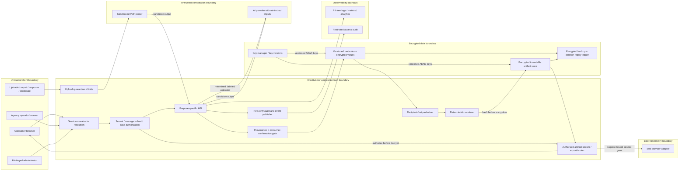

# CreditVector P0 Phase 1 Security and Privacy Threat Model

**Status:** Design gate; implementation is not authorized by this document

**System:** P0 credit-truth, identity, correspondence, packet, artifact, fulfillment, and response lifecycle

**Review date:** 2026-08-08

**Decision:** **P0 remains closed** until the mandatory controls and verification gates in this document pass.

> **NO PRODUCTION / NO PII SCOPE.** This threat model was prepared from repository code and sanitized design contracts only. It authorizes no production connection, migration, backfill, deploy, vendor transmission, key operation, or source-report reprocessing. All Phase 1 implementation and verification must use a disposable database, synthetic records, synthetic files, non-production keys, and non-production vendor stubs. Do not place consumer data, evidence paths, credentials, or raw report/letter contents in fixtures, prompts, logs, screenshots, issue trackers, or this document.

## 1. Purpose, scope, and security decision

This document defines the security and privacy contract for the additive P0 model described in `docs/p0-launch-correctness/P0-CORRECTNESS-ROOT-CAUSE-AND-IMPLEMENTATION-PLAN.md:155-179` and the correspondence/artifact lifecycle at `docs/p0-launch-correctness/P0-CORRECTNESS-ROOT-CAUSE-AND-IMPLEMENTATION-PLAN.md:284-345`. It covers:

- uploaded raw reports and report versions;
- encrypted value-bearing `FieldObservation` and `HistoricalEvidence` records;
- versioned identity baselines and consumer assertions;
- recipient and address resolution;
- correspondence versions, packetization, enclosures, and deterministic PDFs;
- vendor-neutral encrypted canonical artifacts;
- preview, download, print, export, and fulfillment access;
- CRA, furnisher, collector, and regulator response ingestion;
- refs-only evidence events, product analytics, operational logs, and access audit;
- key lifecycle, retention, export, erasure, tombstones, orphan cleanup, backups, and restore;
- consumer, agency, managed-client, administrator, worker, parser, AI-provider, and mail-provider privilege boundaries;
- concurrency, idempotency, integrity verification, and disposable-database safeguards.

This is a design-time threat model, not a certification. It does not validate cloud configuration, vendor contracts, production secrets, infrastructure logs, backup policy, incident readiness, or deployed behavior. Those remain launch gates.

### 1.1 Security objectives

1. **Confidentiality:** only the correctly authorized principal may access the minimum data needed for an allowed purpose.
2. **Integrity:** every factual claim, recipient, enclosure, approval, PDF, and response remains bound to the exact immutable versions the consumer reviewed.
3. **Tenant isolation:** no consumer, managed client, agency, administrator session, job, retry, export, or vendor adapter can cross a tenant or case boundary accidentally.
4. **Privacy minimization:** value-bearing consumer data remains encrypted and absent from observability systems; vendors receive only purpose-limited inputs.
5. **Accountability:** privileged access and lifecycle transitions are attributable to the real actor, not merely the effective data owner.
6. **Recoverability:** restore does not corrupt versions, duplicate fulfillment, or resurrect erased data.
7. **Safe failure:** missing provenance, authorization, address readiness, key material, integrity, or idempotency evidence blocks the operation.

### 1.2 Severity rubric

| Severity | Meaning for this program |
|---|---|
| **Critical** | Plausible cross-tenant disclosure, bulk regulated-data compromise, unauthorized mailing, production-data mutation from a test path, or integrity failure capable of sending another case's content. Blocks all affected flows. |
| **High** | Single-tenant sensitive-data disclosure, artifact/claim tampering, privilege escalation, persistent PII leakage, or a failure that can produce unsupported consumer correspondence. Blocks the affected flow. |
| **Medium** | Bounded exposure or integrity weakness requiring preconditions, recoverability gap, replay window, or operational weakness that materially increases incident impact. Must be fixed or explicitly accepted before launch. |
| **Low** | Defense-in-depth or low-impact weakness with no direct sensitive-data or correspondence-integrity consequence. Track with an owner and due date. |

## 2. Assets and data classification

| Class | Assets | Required handling |
|---|---|---|
| **Restricted metadata** | opaque IDs, tenant/case references, policy/template/parser versions, state, timestamps, byte/page counts, integrity digests | Tenant scoped; least-privilege access; refs-only logs; digests are still sensitive linkable metadata. |
| **Sensitive consumer data** | raw and normalized field observations, history, credit-score observations, report differences/outcomes, identity-baseline values, consumer assertions, recipient addresses, response text/analysis | AEAD-encrypted at rest; masked by default; authorize before decrypt; purpose-limited display/export; never in analytics/events/log prose. |
| **Highly sensitive artifacts** | raw reports, identity-document bytes, outgoing canonical PDFs, enclosures, response files, consumer exports | Encrypted immutable storage; no public URL; strict owner/case authorization; integrity verification before every release; short-lived delivery; governed deletion. |
| **Security secrets** | encryption keys, signing keys, session secrets, provider credentials, database credentials | Secret manager/KMS only; no database columns, source, client bundles, telemetry, URLs, or support tools; rotation and revocation procedures required. |
| **Security audit data** | actor, tenant, purpose, resource reference, decision, key version, time, request/correlation reference | Dedicated restricted sink; no content values; immutable or append-only; retention and access separately governed. |

An unsalted or salted hash of a low-entropy identifier is not encryption or anonymization. A PDF/content digest can reveal equality and must be access-controlled even though it is not plaintext.

## 3. Actors, privileges, and trust boundaries

### 3.1 Actors

| Actor | Intended authority | Explicit non-authority |
|---|---|---|
| Consumer | Own tenant/cases, own confirmed assertions, own approved artifacts and exports | Any other consumer, agency-wide records, unapproved versions, system keys |
| Managed client | Own data while signed in directly | Agency stream, peer clients, agency billing or operator controls |
| Agency operator | Only currently managed clients for whom the server verifies an active relationship; real actor remains the agency account | Any client selected solely by cookie/body/URL; former or other-agency clients; unrestricted bulk decrypt/export |
| Administrator | Narrow support/security operations explicitly granted and audited | Routine browsing/decryption; silent impersonation; automatic access merely because a route is admin-only |
| Background worker | One explicit job purpose, tenant/case scope, and idempotency key | Arbitrary tenant IDs, interactive browsing, broad database access, unrelated secrets |
| PDF/parser process | Transform untrusted bytes into quarantined candidate text | Network access, secrets, database access, authoritative facts, correspondence generation |
| AI provider/model | Produce untrusted candidate extraction/classification/analysis from minimized inputs | Authorization, truth determination, consumer confirmation, recipient choice, dispatch, secrets, cross-request memory |
| Renderer | Deterministically render an approved specification | Current mutable profile data, live recipient re-resolution, network retrieval, arbitrary HTML/script execution |
| Mail/export provider | Receive one approved artifact for one declared purpose | App database access, report/baseline/assertion plaintext, reusable user sessions, arbitrary artifact fetches |
| Attacker/insider | None | Enumeration, IDOR, injection, replay, tampering, bulk export, key misuse, production-test confusion |

### 3.2 Trust boundaries and data flow



Principal boundary and data-owner boundary are deliberately separate. The signed-in actor is used for accountability; the server-resolved tenant/case is used for data authorization. Parser, AI, renderer, observability, backup, test database, and external-provider boundaries are not trusted merely because they run on behalf of the application.

## 4. Existing repository foundations and gaps

These are patterns to preserve or extend, not proof that the P0 model is implemented.

| Area | Existing pattern | P0 consequence / gap |
|---|---|---|
| Authenticated encryption | `lib/docCrypto.ts:3-7`, `lib/docCrypto.ts:9-20`, and `lib/docCrypto.ts:36-48` use AES-256-GCM, per-record 96-bit IVs, and authentication tags; `lib/docCrypto.ts:50-94` applies an authenticated `cv1` envelope to report text and rejects malformed/tampered encrypted values. | Reuse AEAD semantics. The current envelope has no key ID or AAD binding and the text reader accepts legacy plaintext (`lib/docCrypto.ts:78-83`). New protected fields/artifacts must never use plaintext fallback and must carry algorithm/envelope/key/AAD versions. |
| Owner-authorized stream | `app/api/documents/[id]/raw/route.ts:13-28` resolves the user and owner-scopes the row before decryption; `app/api/documents/[id]/raw/route.ts:31-37` returns a private, no-store response. | Make this the minimum order of operations for every value/artifact. Canonical artifact responses must also use `nosniff`, sandboxing where inline content is allowed, frame denial, safe filenames, and exact content length. |
| Hardened encrypted attachment stream | `lib/attachments.ts:62-99` validates type/size/magic bytes, `lib/attachments.ts:109-140` encrypts before persistence, and `lib/attachments.ts:176-197` deliberately defers decrypt. `app/api/attachments/[id]/route.ts:19-46` authorizes through the owning record before decrypting, returns 404 on denial, and applies no-store/nosniff/CSP/frame controls at `app/api/attachments/[id]/route.ts:48-70`. | Reuse the parent-resource authorization and response-header pattern for artifacts, enclosures, responses, and exports. Do not reuse runtime self-healing DDL for new P0 tables. |
| Actor/tenant resolution | `lib/session.ts:15-32` resolves and rechecks the real account; `lib/session.ts:35-62` verifies an agency-selected client belongs to that agency. `app/api/agency/select/route.ts:24-36` verifies the relationship before setting the selector cookie. | Preserve real actor and effective tenant as distinct fields. A cookie or request tenant/client ID is a selector only, never authority; revoked relationships must fail immediately. |
| Refs-only, tenant-aware events | `lib/eventBus/envelope.ts:13-16` distinguishes actor, tenant, and agency; `lib/eventBus/envelope.ts:69-82` specifies refs-only payloads and erasure tombstones; `lib/eventBus/envelope.ts:139-147` derives tenant-scoped deterministic IDs. `lib/eventBus/store.ts:41-49` scopes reads and `lib/eventBus/store.ts:66-106` provides idempotent append behavior. | Extend this pattern for P0 evidence events. Do not copy report/letter/assertion/address values into events. A dedicated access-audit sink must also record purpose and decision without content. |
| Report ingestion | `app/api/reports/upload/route.ts:46-54` caps uploaded PDFs; `app/api/reports/upload/route.ts:96-118` extracts, caps, encrypts, and stores report text; `app/api/reports/upload/route.ts:199-204` attempts orphan cleanup on an incomplete analysis. | Add magic validation, parser isolation, execution limits, content quarantine, idempotent upload identity, and durable cleanup jobs. The current event payload includes the original filename (`app/api/reports/upload/route.ts:127-137`); filenames must not enter P0 events/analytics. |
| Authorize before report decrypt | `app/api/reports/analyze/route.ts:15-35` owner-scopes reports before calling `decryptText`. | Preserve this sequence in reanalysis/backfill. Reanalysis creates a new version/run; it never rewrites source truth. |
| Identity comparison | `app/api/identity/discrepancies/route.ts:74-94` owner-scopes the user/report; `app/api/identity/discrepancies/route.ts:101-123` decrypts identity images in memory; the route sends typed identity, ID images, and report text to AI at `app/api/identity/discrepancies/route.ts:125-173`. | A future identity baseline must be consumer-classified, encrypted, minimized, and versioned. Neither typed profile data, an image, nor an AI interpretation is self-proving “verified identity.” Vendor disclosure and consumer confirmation are separate gates. |
| Untrusted model output | `lib/aiParse.ts:112-153` supplies extraction rules and a JSON schema; `lib/aiParse.ts:158-212` parses and maps the candidate output. The fallback at `lib/aiParse.ts:169-177` assigns all covered bureaus when no bureau was returned. `lib/kai.ts:58-64` and `lib/kai.ts:83-116` demonstrate explicit untrusted-input labeling and bounded prompt content. | Treat report/response text and all model output as tainted. Schema validation is necessary but insufficient; semantic provenance, bureau isolation, completeness, and consumer confirmation must pass before a claim. Remove fail-open attribution for P0 truth. |
| Response ingestion | `app/api/letters/[id]/response/route.ts:18-29` owner-scopes the letter, `app/api/letters/[id]/response/route.ts:31-60` accepts text/PDF, and `app/api/letters/[id]/response/route.ts:62-84` stores encrypted response/analysis and an outcome event. | Preserve the outgoing version. Store a new immutable response artifact/version; AI outcome is provisional until confirmed. Add file-type isolation, source/recipient association, hash binding, idempotency, and no automatic escalation. |
| Immutable process patterns | `lib/mail/MailManifest.ts:13-31` defines immutable mail identity, and `lib/mail/MailStore.ts:167-193` excludes identity from updates and uses an optimistic concurrency guard. `lib/campaign/CampaignStore.ts:1-11` and `lib/campaign/CampaignStore.ts:27-58` protect write-once snapshots and append-only audit. | Reuse immutable identity, append-only versions, and last-writer-loses/retry semantics. Add canonical artifact, enclosure-manifest, recipient-address, case, tenant, and approval hashes to the pinned identity. |
| Erasure tombstone | `lib/eventBus/store.ts:150-157` clears payload while retaining envelope ordering/idempotency; `app/api/event-bus/redact/route.ts:6-29` exposes a scoped admin path and explicitly notes that cascading deletion is deferred. `lib/attachments.ts:199-205` deletes attachment rows with deleted parents. | Define a complete subject/case erasure orchestrator before launch. Current event redaction and caller-driven attachment cleanup are useful primitives, not full erasure coverage. |
| Database safety | `scripts/schema-safety.test.ts:24-31` forbids database mutation from build paths and records the schema/self-heal split; `scripts/gate-d-preflight.ts:82-149` requires a separately approved database fingerprint and fails closed when identity is missing/mismatched. | New P0 tables are migration-first. Phase 1 uses a separately named disposable-database guard that rejects every known production/preview fingerprint and never treats a URL label as proof of safety. |

## 5. Non-negotiable security invariants

| ID | Invariant |
|---|---|
| **INV-01** | Every sensitive P0 row has explicit `tenantId`, `consumerId`, and `caseId` scope where applicable; every relationship is checked through scope-compatible compound keys. |
| **INV-02** | `actorId` is the real authenticated principal; `tenantId` is the server-resolved data owner. Neither is accepted from a request as authority. |
| **INV-03** | An agency-client selector grants nothing. Every request revalidates the active managed-client relationship; revocation takes effect on the next request. |
| **INV-04** | Authorization, purpose, state, and parent-resource existence are verified before any decrypt, render, export, preview, download, dispatch, or AI/vendor disclosure. |
| **INV-05** | Missing scope, provenance, consumer confirmation, key version, integrity match, recipient/address readiness, or policy compatibility fails closed. |
| **INV-06** | Raw reports, value-bearing observations/history, identity baselines, assertions, recipient addresses, responses, enclosures, canonical PDFs, and exports are AEAD-encrypted at rest. |
| **INV-07** | Every new encrypted value uses a versioned envelope and AAD that binds tenant, entity type, record ID, immutable version, and purpose. Moving ciphertext between rows or tenants fails authentication. |
| **INV-08** | New P0 protected data has no plaintext read fallback. Legacy plaintext is isolated, explicitly labeled, measured by value-free counters, and removed through a separately approved migration. |
| **INV-09** | No value-bearing PII, original filename, address, free-form consumer prose, prompt, model output, decrypted body, or artifact bytes enter application logs, analytics, event payloads, traces, URLs, exception messages, or support telemetry. |
| **INV-10** | Parser and AI output is candidate data, never authority. It cannot create a consumer assertion, approve correspondence, choose a recipient, or dispatch a packet. |
| **INV-11** | A consumer assertion is explicit, versioned, immutable after use, attributable to the consumer/authorized actor, and bound to the exact observation value/version and bureau. |
| **INV-12** | Identity baselines distinguish consumer-entered, document-observed, report-observed, and consumer-confirmed sources. AI output cannot be labeled verified or consumer-confirmed. |
| **INV-13** | Packetization includes tenant, case, canonical recipient, recipient type, address version, strategy/policy version, round, claim class, and enclosure compatibility. No grouping heuristic may omit tenant or case. |
| **INV-14** | Every approved correspondence, recipient address, enclosure manifest, and canonical artifact is append-only and content-addressed. Regeneration creates a new version; it never overwrites approval history. |
| **INV-15** | Preview, download, print, export, and fulfillment use the same approved canonical bytes. Decrypted bytes are hash-verified against the approved artifact immediately before release. |
| **INV-16** | Signed or opaque artifact grants are short-lived, resource/version/purpose/tenant bound, non-PII, revocable, and reauthorized against current server state when redeemed. |
| **INV-17** | Approval, artifact creation, dispatch, response ingestion, export, erasure, and rotation jobs are transactionally idempotent. A retry cannot create a second version, packet, mailing, response, or erasure side effect. |
| **INV-18** | Response ingestion appends an immutable artifact and candidate analysis to the intended case/correspondence version; it never overwrites the outgoing artifact or triggers escalation without review. |
| **INV-19** | Erasure covers primary rows, encrypted objects, projections, indexes, caches, queued jobs, provider copies where supported, access grants, and orphans; retained tombstones contain no consumer content. |
| **INV-20** | Restore replays completed erasures and revocations before serving traffic and cannot re-dispatch prior idempotency keys. |
| **INV-21** | Phase 1 tests and migrations cannot connect to production or shared preview, cannot use production keys/vendors, and cannot load Founder-provided or other consumer evidence. |
| **INV-22** | Administrator decrypt/export/impersonation is break-glass, purpose-bound, step-up authenticated, time-limited, independently audited, and never granted merely by possession of an admin session. |
| **INV-23** | Every upload is a new immutable report version and every reanalysis is a new extraction run. A source report date is explicit/provenanced; upload time never fills an unknown report date. |
| **INV-24** | Credit scores remain bureau/source/model/version/date scoped. Missing or failed extraction cannot invent a score, and manual entries remain secondary, visibly distinct provenance. |
| **INV-25** | A report-to-report deletion or no-longer-reported decision requires exact current-bureau completeness and confirmed account absence. Parser silence, partial/failed sections, and lost bureau coverage yield `UNABLE_TO_DETERMINE`. |
| **INV-26** | Report differences and dispute outcomes pin both report/extraction snapshots and exact bureau/account/field/assertion evidence. An Equifax change cannot become a TransUnion or global result. |
| **INV-27** | Score movement and report changes may be described only as chronology or correlation. No structured state, event, projection, or model prompt can claim that a dispute or deletion caused a score change. |

## 6. Threat register and mandatory mitigations

| ID | STRIDE / privacy class | Threat and exploit path | Severity | Mandatory mitigations | Required verification |
|---|---|---|---|---|---|
| T-01 | Information disclosure / IDOR | A guessed report, observation, baseline, assertion, correspondence, packet, artifact, enclosure, response, or export ID is fetched without matching tenant/case ownership. | **Critical** | Parent-resource authorization; compound tenant/case queries; 404 non-disclosure; authorize before decrypt; no unscoped `findUnique` in request paths. | Full endpoint IDOR matrix with same-tenant/wrong-case and cross-tenant IDs; decrypt spy remains uncalled on denial. |
| T-02 | Elevation / managed-client breakout | An agency changes a workspace cookie/body ID to another agency's client, or retains access after the relationship is revoked. | **Critical** | Treat selector as untrusted; resolve real actor; verify active `managedByAgencyId` server-side on every request and job; scope queued work to relationship version; revoke grants immediately. | Cross-agency, peer-client, revoked-client, disabled-account, stale-cookie, and queued-job tests. |
| T-03 | Elevation / admin or impersonation abuse | An administrator or compromised admin session silently decrypts, exports, or changes consumer data at platform scale. | **Critical** | Separate support metadata permission from content-access permission; step-up + reason + case scope + short TTL; dual approval for bulk access; break-glass alerts; immutable access audit; no shared admin credentials. | Permission matrix; negative tests for ordinary admin; break-glass expiration/revocation; alert and audit assertions. |
| T-04 | Information disclosure | Code loads/decrypts a sensitive value before proving ownership/purpose, including through error handling, background jobs, or prefetch. | **Critical** | Central `authorizeResource()` result required by crypto API; encrypted-only loaders; purpose-specific decrypt capability; no plaintext in thrown errors; fail closed on stale parent. | Instrument crypto calls and assert authorization happens first across route, worker, export, AI, and vendor paths. |
| T-05 | Information disclosure / remanence | Raw report, identity image, PDF, response, or rendered artifact touches temp disk, swap, cache, trace, crash dump, or a public object URL. | **High** | Stream/in-memory processing; isolated no-egress parser; encrypted object storage with blocked public ACL; `no-store`; bounded buffers; ephemeral encrypted volume only if unavoidable; cleanup on success/failure/timeout. | Temp-directory and cache inspection; public-ACL policy test; forced crash/timeout cleanup test; response-header test. |
| T-06 | Tampering / ciphertext substitution | Valid ciphertext is copied between tenants, entity fields, records, or versions and decrypts as plausible plaintext. | **Critical** | AEAD AAD binds tenant/entity/record/version/purpose; immutable envelope metadata; reject unknown AAD/envelope versions. | Ciphertext-swap tests across tenant, case, entity, field, and version all fail authentication. |
| T-07 | Key compromise / rotation failure | A single long-lived application key exposes all data, or rotation makes records unreadable, reuses nonces, or leaves unknown legacy rows. | **Critical** | KMS/secret-manager key ring; per-record key version; envelope encryption where available; random unique nonce; staged write-new/read-old rotation; idempotent rewrap; value-free progress; backup/key compatibility; documented revoke/rollback. | Wrong-key/tag/nonce tests; dual-read rotation; interrupted/resumed rotation; zero-unknown-version scan; old-key revocation drill. |
| T-08 | Spoofing / grant replay | A signed download/provider URL is replayed, shared, altered, or redeemed for another artifact/version/purpose. | **High** | Opaque or signed grant binds actor/service, tenant, artifact ID/version/hash, purpose, disposition, expiry, and nonce/JTI; maximum short TTL; single use for exports/provider pulls; no PII/ciphertext in URL/token; current-state reauthorization. | Signature mutation, expiry, wrong actor/tenant/purpose/version, replay, revoked session/grant, and clock-skew tests. |
| T-09 | Injection / parser exploit | A malicious or malformed PDF exploits the parser, consumes resources, embeds active content, or causes extraction of unrelated bytes. | **High** | Magic-byte and MIME agreement; size/page/decompression/time/memory limits; sandboxed no-network parser with no secrets/DB; dependency pinning/scanning; quarantine; reject encrypted/polyglot/unsupported inputs as policy requires. | Fuzz corpus, malformed/polyglot/zip-bomb-like controls, timeout/OOM tests, no-egress/no-secret assertions. |
| T-10 | Injection / AI prompt attack | Report or response text contains instructions that override extraction/analysis policy or attempts to exfiltrate prompts/secrets/other tenant data. | **High** | Explicitly label and delimit untrusted content; minimize input; no secrets/tools in model context; tenant-isolated requests; provider no-training/retention controls; bounded content; output schema and semantic validator. | Adversarial prompt corpus; prompt-boundary spoofing; exfiltration canaries; cross-request isolation; provider configuration evidence. |
| T-11 | Tampering / model data poisoning | Schema-valid model output invents a fact, collapses bureaus, marks absence as clean, or changes provenance and becomes source truth. | **Critical** | Deterministic parser evidence where possible; immutable source locators; per-field/per-bureau semantic validation; completeness states; quarantine conflicts; no fail-open bureau attribution; model version/input digest; consumer review. | Golden per-bureau fixtures; property test that bureau A never populates B; missing-attribution blocks; hallucinated locator blocks. |
| T-12 | Integrity / identity-baseline overclaim | Typed profile, document OCR, or AI comparison is treated as verified identity and auto-generates an inaccurate identity dispute. | **High** | Source-typed baseline fields; six-state consumer classification; explicit consumer confirmation; baseline version pinning; masked review; no automatic dispute; high-risk mixed-file escalation without identity-theft declaration. | Classification matrix, stale/edit/reconfirmation tests, AI-output cannot set confirmed state, and no-auto-letter test. |
| T-13 | Spoofing / assertion forgery or staleness | A request fabricates a consumer assertion, changes the observation after confirmation, or reuses confirmation for another bureau/field/version. | **Critical** | Server creates assertion from displayed observation; CSRF/session protections; immutable assertion; bind tenant/case/report/observation/bureau/field/value digest/baseline; actor/time/policy; invalidate on source-version change. | Request-tamper tests; cross-field/bureau/version reuse rejection; source edit forces reconfirmation; audit actor is real principal. |
| T-14 | Information disclosure / cross-case packetization | A grouping query merges items or enclosures from different tenants/cases because recipient, debt, or address appears similar. | **Critical** | Recipient-first composite key including tenant and case; compound foreign keys; compatibility validator; deterministic scoped ordering; final pre-render and pre-dispatch scope assertion. | Property/fuzz tests across identical recipients and synthetic debts in different tenants/cases; DB constraint tests; no mixed manifest possible. |
| T-15 | Tampering / recipient-address swap | Mutable profile/report/contact data replaces the reviewed recipient or sender address between preview, approval, and dispatch. | **Critical** | Immutable `RecipientAddressVersion`; source/verification metadata; strategy-recipient compatibility; completeness gate; approval pins version/hash; provider receives only pinned address; edits create new review. | Change source address after approval and prove artifact/dispatch unchanged; incomplete/mismatched address is `NOT_READY`. |
| T-16 | Tampering / canonical artifact substitution | PDF bytes, enclosure order, renderer output, or provider payload differs from the approved artifact; an attacker swaps an object under the same reference. | **Critical** | Deterministic render; immutable object/version; plaintext SHA-256 plus AEAD; manifest digest; approved state pins all hashes; verify after decrypt and before every release; provider adapter accepts only approved artifact reference. | Byte equality across preview/download/print/fulfillment; one-bit tamper; object/version swap; enclosure reorder; rerender determinism. |
| T-17 | Repudiation / concurrency / replay | Concurrent evidence/assessment writes create stale CLEAN truth, or concurrent approvals, renders, retries, webhooks, or sends create conflicting versions, duplicate charges, or duplicate mail. | **Critical** | Exact input-set transaction lock; tenant-scoped idempotency key; unique constraints; transactional compare-and-swap state/version; append-only event in same transaction/outbox; provider idempotency; fail-closed retry from current state. | Both-order evidence/assessment concurrency tests plus parallel generation/approval/dispatch/response/export/erasure bursts; no stale CLEAN+adverse state, one side effect, and one canonical winner. |
| T-18 | Injection / response misassociation | A hostile response PDF exploits parsing, is attached to the wrong case/recipient/version, or AI output automatically escalates a dispute. | **High** | Same quarantine as report upload; owner/case/correspondence lookup before parse/decrypt; immutable response artifact/hash/source metadata; consumer confirms association; AI result labeled provisional; no automatic round/claim/dispatch. | Wrong-letter/case/recipient, duplicate upload, malformed file, prompt injection, and no-auto-escalation tests. |
| T-19 | Privacy / observability leakage | PII or consumer prose leaks through filenames, errors, analytics properties, event payloads, traces, model telemetry, or access logs. | **High** | Closed schemas and allowlists; refs/counts/category codes only; centralized redaction; safe error codes; never log request bodies/URLs with IDs where avoidable; restricted pseudonymous access audit; DLP scanning. | Capture all sinks in tests; seeded forbidden tokens/patterns produce zero matches; schema rejects unknown/free-text fields. |
| T-20 | Privacy / incomplete erasure | Deletion removes the parent but leaves observations, artifacts, exports, grants, search projections, queues, vendor copies, or orphaned objects. | **High** | Data inventory and erasure graph; transactional deletion request; revoke grants first; async deletion ledger with retries; object orphan sweeper; vendor deletion workflow; completion receipt with value-free counts; tombstone policy. | End-to-end erasure, forced partial failure/resume, orphan injection/sweep, and post-erasure access/IDOR tests. |
| T-21 | Privacy / backup resurrection | Restore brings back erased data, revoked grants, old keys, or already-dispatched jobs. | **High** | Encrypted immutable backups; separate key control; bounded retention; restore in isolated environment; replay deletion/revocation ledger before traffic; preserve idempotency ledger; reconciliation and restore drill. | Synthetic backup/restore drill proves erased objects remain unavailable and dispatched jobs do not replay. |
| T-22 | Information disclosure / export abuse | A compromised session triggers bulk export, export URL is forwarded, or archive contents cross tenant/case scope. | **Critical** | Reauthentication/step-up; per-tenant scoped query; rate/volume anomaly controls; encrypted archive; manifest/hash; single-use short grant; no email attachment; revoke on logout/security event; access audit. | Cross-tenant export, high-volume throttling, expired/replayed grant, archive-manifest, and post-revocation tests. |
| T-23 | Privacy / vendor over-disclosure | AI, mail, storage, or analytics vendor receives more data than needed, retains it, trains on it, or can fetch arbitrary artifacts. | **High** | Vendor inventory/DPA; purpose/field minimization; no training and shortest supported retention; region/subprocessor review; per-provider service identity; egress allowlist; provider-scoped one-artifact grant; deletion and incident terms. | Contract/config evidence, egress test, provider grant scope, deletion exercise, and payload-field snapshot tests. |
| T-24 | Tampering / disposable DB confusion | Migration or destructive test points to production/shared preview because of a reused `DATABASE_URL`, misleading name, or stale shell environment. | **Critical** | Dedicated test variable; local/ephemeral host allowlist; deny known prod/preview fingerprints; random database/schema prefix; synthetic marker; empty/owned-database check; least-privilege role; interactive fail-closed guard; no production secrets/vendors. | Guard tests for every forbidden fingerprint/host/config; deliberate production-like URL must abort before a query that can mutate; teardown verification. |
| T-25 | Denial of service / cost abuse | Oversized uploads, decompression, repeated AI calls, render storms, or export retries exhaust memory, CPU, provider budget, or queues. | **Medium** | Per-actor and per-tenant quotas; byte/page/time/token limits; bounded concurrency; circuit breakers; dedupe/idempotency; backpressure; job cancellation; cost alerts without content. | Load/adversarial tests prove bounded resource use, clean cancellation, and no partial artifact/packet state. |
| T-26 | Repudiation / audit ambiguity | Effective tenant is recorded as actor, system jobs lack initiating actor/purpose, or redaction destroys evidence of privileged access. | **High** | Record real actor, effective tenant, agency, job/correlation, purpose, decision, resource/version refs, and break-glass approval in a dedicated refs-only audit; append-only/tamper-evident storage; clock synchronization. | Direct, agency, admin, impersonated, and worker scenarios produce the correct separate axes; audit tamper/reorder tests. |
| T-27 | Integrity / false progress | A failed or incomplete current parser run is treated as deletion, a change on one bureau is flattened globally, or an unrelated account is matched across reports. | **Critical** | Exact prior/current report+run+bureau/account/field pins; explicit coverage and account-index completeness; confirmed-absence gate; stable match rules with version/digest; `UNABLE_TO_DETERMINE` on ambiguity. | Cross-bureau deletion fixture, incomplete-section fixture, wrong-account/field/run replay, coverage loss, and hand-crafted invalid joins all fail closed. |
| T-28 | Deception / score comparability and causality | Unlike/unknown scoring models are plotted as one trend, manual scores masquerade as report evidence, or Kai claims a dispute/deletion caused score movement. | **High** | Source/model/version/date comparability state; manual-secondary policy; no delta when not directly comparable; closed noncausal enum and phrase allowlist; structured facts before language generation. | Model mismatch/unknown tests, manual/report coexistence, score-with-item-removal fixture, and forbidden-causality phrase tests. |
| T-29 | Tampering / outcome misassociation | A prior assertion or correspondence item is mapped to a different report, bureau, account, field, case, or comparison, producing a false corrected/deleted outcome. | **Critical** | Immutable exact-field outcome decision; compound scope/report/run/comparison/difference/assertion/correspondence membership FKs; version/idempotency; no `WON`/`LOST`; consumer review before escalation. | Cross-case/tenant/bureau/account/field substitution, stale assertion, changed observation, and post-decision mutation tests. |

## 7. Required security architecture

### 7.1 Migration-minimal protected model

The full P0 model needs additive migration-backed tables; the current mutable `Tradeline`, `Letter`, and `MailManifest` cannot safely encode the contract (`docs/p0-launch-correctness/P0-CORRECTNESS-ROOT-CAUSE-AND-IMPLEMENTATION-PLAN.md:349-364`). Security-critical minimums are:

| Entity | Minimum security fields / constraints |
|---|---|
| `ReportVersion` | `id`, `tenantId`, `consumerId`, `caseId`, immutable source digest, encrypted raw-artifact ref/envelope, key/envelope/AAD versions, covered-section completeness, created actor/time, retention state; unique immutable version per case. |
| `ExtractionRun` | tenant/case/report compound reference, parser/model/rules versions, input digest, completion/error categories, status; append-only; retry creates or reuses a tenant-scoped idempotent run, never rewrites observations. |
| `FieldObservation` / `HistoricalEvidence` | tenant/case/report/run/account/bureau/section/field/source locator; encrypted raw and normalized values; value digest only for integrity binding, never lookup exposure; key/envelope/AAD versions; immutable. |
| `IdentityBaselineVersion` | tenant/consumer/case, source class per field, encrypted values, classification, consumer confirmation actor/time, supersedes reference, policy version; correspondence pins one version. |
| `ConsumerAssertion` | tenant/case, exact observation/version/bureau/field/value digest, encrypted requested correction/basis, actor/time/method/policy, status; immutable once referenced. |
| `Recipient` / `RecipientAddressVersion` | tenant or reviewed global party identity, recipient role, encrypted normalized address, source/verification/method/effective window, editor/time; immutable after reference; strategy compatibility constraint. |
| `Correspondence` / `CorrespondenceVersion` | tenant/case/recipient/strategy/round, immutable item refs and rendered specification, template/policy/baseline/address versions, parent version, approval state and optimistic version; no in-place body rewrite. |
| `Packet` / `PacketItem` / `PacketEnclosure` | complete packetization key, tenant/case scoped compound FKs, ordered item/enclosure refs, compatibility and manifest digest, state/idempotency/version; DB must make cross-scope membership unrepresentable. |
| `CanonicalArtifact` | tenant/case/packet/correspondence version, opaque encrypted-storage ref, AEAD metadata, plaintext content digest, ciphertext/object digest where useful, MIME/length/pages, renderer/template/font versions, enclosure/address/baseline/policy digests, immutable creation actor/time. |
| `ResponseArtifact` | tenant/case/correspondence/artifact refs, encrypted immutable bytes/text, content digest, source/received metadata, candidate analysis version/status, dedupe key; outgoing records remain untouched. |
| `EvidenceEvent` / `AccessAudit` | refs-only axes and integrity metadata; no values/prose. Evidence events support lifecycle projection; access audit separately records authorization/decrypt/export decisions and privileged purpose. |
| `ErasureJob` / `ErasureTombstone` | opaque subject/case ref, policy/reason category, state, value-free per-store counts, retry cursor, requested/completed time; tombstone contains only the minimum needed to prevent resurrection/replay. |

Required database controls:

- Migration-first schema; no new runtime self-heal DDL.
- Composite uniqueness and foreign keys include tenant/case scope, not only globally unique-looking IDs.
- Check constraints restrict state, recipient type, version monotonicity, and required encryption metadata.
- Application authorization remains mandatory. PostgreSQL row-level security may add defense in depth only if tenant context is transaction-bound and tested; it is not a substitute for scoped queries.
- Append-only entities expose create/read only. Corrections are compensating/new-version records.
- Lifecycle transitions use `version`/compare-and-swap plus a tenant-scoped unique idempotency key.
- No searchable index contains decrypted values, address fragments, names, or low-entropy identifier hashes.

### 7.2 Encryption and key lifecycle

Use an authenticated envelope with at least:

```text
envelopeVersion, algorithm, keyId/keyVersion, aadVersion,
nonce/iv, authenticationTag, ciphertext
```

AAD must be deterministically constructed from immutable, non-secret context:

```text
tenantId | caseId | entityType | recordId | recordVersion | field/purpose
```

Controls:

1. Generate a fresh 96-bit GCM nonce for every encryption under a key; never derive it from IDs.
2. Prefer envelope encryption with KMS-managed key-encryption keys and scoped data-encryption keys. If Phase 1 temporarily uses a server key ring, retain the same version/AAD contract so KMS migration does not change rows.
3. Keep keys out of the database, source, build artifacts, logs, error messages, client code, and vendor payloads. Key identifiers are metadata, not secrets.
4. New P0 writes use only the current key version; reads accept an explicit allowlist of active legacy versions. Unknown versions fail closed.
5. Rotation is an idempotent, bounded job: authorize job scope, decrypt with old version, verify tag/AAD, encrypt with current version/new nonce, transactionally compare-and-swap, and record value-free outcome counters.
6. Do not revoke an old key until the primary store, object store, queued jobs, exports within retention, and restorable backups are accounted for. Define emergency compromise rotation separately from routine rotation.
7. Artifact integrity is layered: AEAD protects stored bytes; a plaintext SHA-256 digest pinned by approval proves exact canonical bytes after decrypt. Never treat a bare digest as authorization.

### 7.3 Authorize before decrypt

Every sensitive access follows one shared order:

```text
authenticate real actor
-> resolve effective tenant and current managed-client relation
-> load parent/resource metadata with tenant + case scope
-> authorize action + purpose + lifecycle state
-> record allow/deny audit metadata
-> load encrypted value/bytes
-> decrypt and authenticate envelope/AAD
-> verify pinned content/manifest hash where applicable
-> minimize/stream/use
-> release plaintext and return no-store response
```

The crypto interface should require an opaque authorization capability returned by the authorization layer, making decrypt-before-authorize difficult to express. Batch jobs receive a bounded query/scope and purpose, not a general decrypt helper. Denied and wrong-scope resource IDs return 404 after authentication to reduce enumeration.

### 7.4 Signed and time-bound artifact access

Canonical objects are never public. The preferred browser path is a session-authenticated application stream. When a delegated grant is necessary for export or a provider:

- issue an opaque one-time grant or a signed token containing only opaque refs;
- bind actor/service identity, tenant, artifact ID and immutable version/hash, allowed purpose, content disposition, expiry, and JTI/nonce;
- keep lifetime to the minimum operational window and no more than five minutes by default;
- recheck tenant ownership, case state, approval, hash, session/service status, and revocation at redemption;
- make high-sensitivity export/provider grants single-use;
- never put name, address, filename, report/letter content, ciphertext, or storage location in the token/URL;
- set `Cache-Control: no-store, private`, `X-Content-Type-Options: nosniff`, safe `Content-Disposition`, exact `Content-Length`, and frame/CSP controls appropriate to the media;
- log only grant reference, actor/service, purpose, decision, resource/version reference, and time.

### 7.5 Packet and canonical-artifact integrity

Packetization must implement the complete key specified at `docs/p0-launch-correctness/P0-CORRECTNESS-ROOT-CAUSE-AND-IMPLEMENTATION-PLAN.md:297-311`. Security enforcement occurs at four points:

1. **Selection:** all eligible items are queried by server-resolved tenant and case.
2. **Grouping:** the grouping key includes tenant, case, canonical recipient/type/address version, strategy/policy/round/claim class, and enclosure compatibility.
3. **Persistence:** compound foreign keys and unique constraints prevent cross-scope packet membership.
4. **Pre-release:** renderer and dispatch independently revalidate a single tenant/case/recipient/address/version and match the approved item/enclosure manifest digest.

The renderer runs without network access and consumes a closed, versioned render specification. It must not read current profile, current address, mutable letter body, live document preferences, remote fonts/images, or arbitrary HTML. Canonical artifact storage is provider-neutral: CreditVector owns encrypted immutable bytes and metadata; provider adapters receive the exact approved bytes or one narrowly scoped pull grant. Provider job IDs and URLs are delivery metadata, never canonical artifact identity.

### 7.6 Untrusted report, response, parser, and AI boundaries

1. Validate declared type, magic bytes, size, page count, compression ratio, and supported encryption before parsing.
2. Run PDF parsing in an isolated, no-network, no-secret, no-database process with CPU, memory, wall-clock, output-size, and process-count limits.
3. Treat extracted text as tainted content. Delimit and label it as untrusted; never interpolate it into system/developer instructions, SQL, filenames, headers, selectors, log templates, or tool arguments.
4. Send the AI provider only the minimum sections/fields required. Do not send a whole raw report or identity document when a smaller locally derived slice is sufficient.
5. Use a closed JSON schema and then a deterministic semantic validator for bureau membership, source locator reachability, value/type bounds, completeness, cross-record references, and prohibited claims.
6. Quarantine candidate observations on ambiguity, missing attribution, parser/model disagreement, truncation, or unknown completion. Do not fill missing bureaus, dates, addresses, or facts.
7. Record parser/model/prompt-policy versions and input digest without storing the prompt or consumer content in telemetry.
8. AI identity/response analysis is advisory. A human consumer/authorized operator must confirm the exact baseline classification, assertion, recipient association, and next action.
9. Disable tool use and access to application secrets for parser/model calls. Provider requests must be tenant-isolated and configured for no training and the shortest approved retention.

### 7.7 Logs, analytics, events, and audit

Use three distinct sinks:

| Sink | Allowed | Forbidden |
|---|---|---|
| Product analytics | event type, coarse category, counts, latency bucket, success/failure code, plan/cohort only when approved | names, filenames, addresses, exact balances/dates, bureau report prose, assertions, letter/response text, prompts/output, object URLs |
| Evidence event ledger | opaque refs, actor/tenant/agency axes, versions, policy/category codes, lifecycle state, hashes, timestamps | all value-bearing fields and free-form prose |
| Restricted security access audit | real actor, effective tenant, role/grant, purpose/reason code, allow/deny, resource/version ref, break-glass approval, key version, request/correlation ref, time | decrypted content, credentials, tokens, signed URLs, raw request/response bodies |

Closed schemas must reject unknown properties. Central safe-error helpers map internal exceptions to codes; production error output never serializes the exception object, SQL, prompt, file metadata, provider request, or storage key. Treat opaque IDs as pseudonymous personal data: retain and expose them only where operationally necessary.

### 7.8 Concurrency and idempotency

Each mutating command uses a stable, tenant-scoped idempotency key derived from immutable command inputs, never consumer prose. For example:

```text
tenant | case | command type | logical subject/version | client request key
```

- Store the key and a material-input digest under a unique constraint.
- A duplicate with the same digest returns the original result; a duplicate key with different material inputs fails as a conflict.
- Approval transaction pins correspondence, baseline, address, packet/enclosure manifest, and artifact hashes together.
- Artifact generation writes immutable bytes, verifies the digest, then atomically publishes the reference/state.
- Dispatch uses an outbox and provider idempotency key; payment and send state cannot advance independently.
- Response upload deduplicates by tenant/case/correspondence/source digest and never overwrites prior responses.
- Rotation, export, erasure, and orphan cleanup are resumable and compare-and-swap their cursor/state.
- Webhook consumers authenticate the provider, enforce tenant/resource association from stored job state, and reject stale or impossible transitions.

### 7.9 Retention, export, erasure, tombstones, and orphan cleanup

Before migration approval, the data owner must ratify a retention schedule by data class and legal/business purpose. “Keep forever” is not a default. The architecture must support:

1. **Retention state:** every report, baseline, assertion, artifact, response, export, and vendor delivery has a policy version, retention trigger, hold state, and purge eligibility without exposing values.
2. **Export:** owner-authorized, step-up protected, tenant/case scoped, encrypted archive; manifest lists opaque record refs, versions, hashes, and omissions. Delivery uses a single-use short-lived grant, not an email attachment or public URL.
3. **Erasure orchestration:** revoke active grants/jobs first; mark the subject/case unavailable; remove encrypted values/objects and derived projections; request provider deletion; sweep orphans; verify value-free counts; complete or retry from a durable cursor.
4. **Tombstones:** retain only the minimum refs/category/times/idempotency evidence required to prevent replay or demonstrate processing. Clear payloads. If a retained tenant/actor ref remains linkable, classify and protect it as personal data; do not call it anonymous.
5. **Cryptographic erasure:** per-subject/per-artifact DEK destruction can accelerate erasure but does not replace removal from indexes, caches, exports, provider systems, or backups, and it requires proof that no shared key makes other records unavailable.
6. **Orphan cleanup:** periodically reconcile every encrypted object and grant to a live, scope-compatible parent. Quarantine then delete according to policy; alert on age/count without logging object names or content.
7. **Legal hold/conflict:** holds are explicit, narrowly scoped, access-controlled, and audited; they do not silently disable unrelated erasure.

### 7.10 Backup and restore

- Encrypt backups with keys and access controls separated from the primary application path.
- Restrict create/list/restore/delete permissions; require step-up and dual control for restore or bulk export.
- Keep an inventory of database snapshots, artifact backups, key versions, retention/expiry, and restore compatibility without consumer content.
- Restore only into an isolated environment first. Before traffic, validate schema, artifact hashes, key versions, tenant constraints, and idempotency state; replay completed erasures, grant revocations, and vendor-deletion state.
- Prevent workers/outboxes/webhooks from dispatching in a restore environment. External egress is off until an authorized cutover.
- Perform synthetic restore drills and measure recovery objectives. A production restore drill or production backup access is a separate, explicitly authorized operation outside Phase 1.

### 7.11 Disposable-database boundary

Phase 1 schema/migration tests must fail closed unless all conditions are true:

1. A dedicated `P0_TEST_DATABASE_URL`-style variable is present; the ordinary application or production migration URL is ignored.
2. Environment is explicitly test, outbound vendor access is disabled, and only synthetic fixture mode is enabled.
3. The host/container is on an approved local/ephemeral allowlist and the observed database fingerprint is not any registered production, staging, or shared-preview fingerprint.
4. Database/schema name has a generated test prefix and a fresh ownership marker created by the test harness; the role lacks access outside it.
5. The database is empty or contains only the expected synthetic marker/migration history. Unexpected relations or data abort the run.
6. Migration commands use the reviewed migration directory and checksum manifest. No `db push`, `--accept-data-loss`, build-time mutation, or runtime self-heal is allowed for new P0 entities.
7. Destructive setup/teardown targets the resolved generated name only, never a broad host, default database, user home, workspace root, unresolved variable, or wildcard.
8. Test logs redact URLs/credentials and report only safe fingerprints, migration checksums, counts, and decisions.
9. The database and local artifact store have a TTL/teardown; teardown failure is visible. No synthetic artifact may be uploaded to a real vendor.

The existing database-fingerprint preflight is evidence of a useful fail-closed identity pattern (`scripts/gate-d-preflight.ts:82-149`), but its production-oriented URL rules are not a disposable-test guard and must not be reused as proof that a test target is safe.

## 8. Verification plan and launch evidence

All tests use sanitized synthetic fixtures and non-production services. A static source scan alone cannot close a runtime security invariant.

| Gate | Verification | Pass criterion |
|---|---|---|
| V-01 Tenant/IDOR | Endpoint/service matrix for consumer, direct managed client, agency-own client, peer client, other agency, revoked relation, disabled account, ordinary admin, approved break-glass admin, and worker | Every unauthorized case is 401/403/404 as designed; no data or existence leak; no decrypt/render/provider call occurs. |
| V-02 Authorize-before-decrypt | Instrument the centralized decrypt API and authorization capability in route, worker, export, AI, response, and provider paths | No decrypt can be invoked without a valid purpose/resource capability; denied paths make zero crypto calls. |
| V-03 Cryptography | Known-answer round trip; random-nonce checks; tampered tag/ciphertext/AAD; wrong tenant/record/version/key; malformed/unknown envelope | Valid records round-trip; every tamper/substitution/unknown version fails closed without plaintext/log leakage. |
| V-04 Key rotation | Write-old/read-old, write-new/read-both, bounded rewrap, interruption/resume, compare-and-swap conflict, backup compatibility, old-key revocation | No data loss/nonce reuse/downgrade; zero unknown/old primary rows before revocation; only value-free metrics emitted. |
| V-05 PII-free observability | Capture logs, events, analytics, traces, errors, job payloads, and audit using synthetic forbidden markers in every sensitive field | Zero forbidden markers; closed schemas reject free text/unknown fields; access audit retains only approved refs/categories. |
| V-06 Parser/upload | Magic mismatch, malformed/truncated/polyglot/encrypted/oversized/high-page/high-compression PDFs, timeout, crash, retry | Resource limits hold; parser has no network/secrets/DB; no temp/plaintext residue or orphan remains; safe errors only. |
| V-07 AI/adversarial | Prompt injection, delimiter spoofing, fabricated account/bureau/date/address, missing source, cross-request isolation, schema-valid semantic lies | Candidate output cannot bypass provenance/completeness/confirmation; no cross-tenant or secret output; failures quarantine rather than infer. |
| V-08 Identity/assertions | All baseline classifications, source types, masking, edit/staleness, assertion request tampering, cross-bureau/field/version reuse | AI cannot confirm; exact consumer confirmation and observation binding required; edits/new reports force review when inputs change. |
| V-09 Packet isolation | Property/fuzz generation with identical recipient/address/account-like attributes across many tenants/cases/rounds/strategies/enclosure classes | No packet contains mixed tenant/case or incompatible recipient/type/address/policy/round/enclosure; constraints reject handcrafted invalid joins. |
| V-10 Canonical artifact | Deterministic rerender, one-bit object tamper, manifest reorder, address/profile change after approval, preview/download/print/provider byte capture | Approved bytes/hash remain stable and equal on every path; tamper/version mismatch blocks release/dispatch. |
| V-11 Signed access/export | Modified token, wrong actor/service/tenant/artifact/version/purpose/disposition, expiry/skew, replay, logout, revocation, already-erased object | Every invalid/replayed grant fails; valid grant exposes one exact object once, with hardened headers and audit. |
| V-12 Concurrency/idempotency | Parallel generation, approval, render, payment/dispatch, response, export, rotation, erasure, webhook redelivery/out-of-order sequences | Exactly one canonical state/side effect; conflicting duplicate inputs fail; retries return original result; audit is append-only. |
| V-13 Response ingestion | Wrong case/recipient/version, duplicate bytes, adversarial PDF/text, model ambiguity, conflicting responses | Immutable response is scoped and deduped; outgoing artifact unchanged; analysis remains provisional; no automatic escalation/send. |
| V-14 Retention/erasure | Full lifecycle, partial-store/provider failure and resume, active grants, queued jobs, injected orphan, hold, tombstone inspection | Data becomes unavailable immediately; all required stores converge to deleted; tombstone has no content; orphan/grant cleanup completes. |
| V-15 Backup/restore | Synthetic snapshot with completed erasure, revoked grant, historical key versions, settled dispatch and pending outbox | Restored system reapplies deletion/revocation before access and never re-sends settled work; hashes and tenant constraints reconcile. |
| V-16 Disposable database | Run guard against missing variable, ordinary `DATABASE_URL`, production-like host/name/fingerprint, shared preview fingerprint, nonempty DB, wrong marker, broad role | Every unsafe target aborts before mutation; only generated synthetic DB/schema proceeds and is explicitly torn down. |
| V-17 Dependency/vendor | SCA/SBOM, parser/renderer sandbox validation, AI/mail/storage payload snapshots, egress allowlist, provider deletion test | No critical unresolved dependency finding; vendor sees only approved fields/artifact; deletion and incident controls evidenced. |
| V-18 Access/incident operations | Break-glass, privileged export/decrypt, key compromise, cross-tenant alert, vendor incident, and restore tabletop | Named owner, usable runbook, immutable audit, alerts received, containment path tested, and post-incident evidence is PII-free. |
| V-19 Report progress intelligence | Score present/absent/model-mismatch, complete deletion, parser failure, corrected/unchanged field, new account, cross-bureau isolation, identity/coverage change, manual coexistence, and score-plus-removal chronology | Source-provenanced scores only; unlike models not directly comparable; uncertainty never deletion; exact-field outcomes; no global bureau collapse; no causal attribution. |

Security tests required by the P0 implementation plan are already identified at `docs/p0-launch-correctness/P0-CORRECTNESS-ROOT-CAUSE-AND-IMPLEMENTATION-PLAN.md:438-448`. V-01 through V-19 make those requirements executable. Results must include command, revision, synthetic fixture version, environment fingerprint, pass/fail count, and sanitized failure category. Screenshots and raw output are not evidence if they contain sensitive values.

## 9. Incident and operational controls

### 9.1 Required alerts

- repeated cross-tenant/IDOR denials or sequential resource enumeration;
- decrypt/export/preview volume anomaly by actor, tenant, IP/risk signal, or service identity;
- any break-glass activation, bulk operation, failed step-up, or access-audit write failure;
- unknown key/envelope/AAD version, authentication-tag failure, artifact/manifest/hash mismatch, or unexpected old-key write;
- packet preflight scope mismatch, address/version drift, duplicate dispatch conflict, or provider idempotency mismatch;
- parser sandbox escape signal, resource-limit breach, malware/SCA alert, or unexpected network attempt;
- observability DLP match or rejected event/analytics property;
- erasure/rotation/orphan job retry exhaustion or backup retention breach;
- disposable-database fingerprint/marker mismatch and any attempted use of a forbidden target.

Alert payloads contain opaque refs and safe categories only. On-call access to the restricted audit sink is least-privilege and separately logged.

### 9.2 Runbooks required before launch

1. suspected cross-tenant disclosure or wrong-recipient packet;
2. artifact hash/manifest mismatch or unauthorized fulfillment;
3. application/session/signing/encryption key compromise and staged revocation;
4. privileged/admin/agency account compromise;
5. parser/AI/vendor data incident and egress shutdown;
6. PII in logs/events/analytics, including purge and downstream notification;
7. erasure/export failure and orphan cleanup;
8. backup restore with deletion/revocation replay;
9. duplicate dispatch/payment/webhook incident;
10. disposable test database pointed at a forbidden environment.

Each runbook must identify containment, feature/job kill switches, evidence preservation without copying consumer content, notification decision owner, vendor contacts, recovery criteria, and post-incident verification. Security-relevant clocks use synchronized UTC. Access grants, signing keys, provider credentials, and workers must be independently revocable.

### 9.3 Privilege and change management

- Map each route, service, worker, and provider adapter to explicit read/decrypt/render/export/dispatch/delete permissions.
- Separate schema migration, key administration, privileged consumer-content access, backup restore, and provider dispatch duties.
- Review service/admin/agency privileges and vendor scopes on a fixed cadence and on personnel/relationship changes.
- Require reviewed migration checksums, synthetic disposable-DB evidence, rollback rehearsal, and security sign-off before any production migration request.
- Never run a bulk encrypt/decrypt/backfill endpoint as an ordinary long-lived admin operation. Convert it to a bounded, resumable, audited job with explicit authorization and kill switch; the current broad admin backfill demonstrates why (`app/api/admin/encrypt-reports/route.ts:10-38`).
- Feature flags must fail closed and may disable new reads/writes/render/dispatch independently. Rollback cannot discard v2 truth or silently resume a legacy unsafe path.

## 10. Residual risks and required acceptance

Even after the controls pass, the following risks remain and require explicit owner/security/privacy acceptance:

| Residual risk | Why it remains | Required treatment |
|---|---|---|
| Application compromise can reach plaintext | Server-side workflows must decrypt authorized content. Application-layer encryption does not protect against a fully compromised authorized runtime. | Harden runtime and IAM, isolate KMS permissions, monitor decrypt purpose/volume, minimize plaintext lifetime, commission penetration testing. |
| Metadata remains linkable | Tenant/case IDs, timestamps, sizes, lifecycle state, and digests can reveal relationships even without plaintext. | Minimize, scope, encrypt selected metadata, segregate access audit, and apply retention/erasure classification. |
| Third-party processing | AI, storage, and mail vendors can create contractual/operational exposure beyond code controls. | Vendor due diligence, DPA/security terms, no-training/retention controls, minimal payloads, incident/deletion tests, contingency adapters. |
| Consumer endpoint exposure | Authorized downloads can remain in browser/OS download history or a shared device. | No-store for streams, short-lived exports, clear UX warning, optional archive password/out-of-band delivery, session/device controls. |
| AI/parser correctness | Sandboxing and validation reduce but do not eliminate false extraction or adversarial behavior. | Preserve source/provenance, require deterministic validators and consumer confirmation, maintain human review and kill switch. |
| Recipient/address truth | A correctly secured address version can still be factually outdated. | Source/verification/version/consumer review and `NOT_READY` gate; security must not convert uncertainty into a guessed address. |
| Backup erasure lag | Immutable backups cannot always be surgically edited immediately. | Bounded documented retention, deletion replay on restore, key strategy, access restrictions, and privacy/legal approval. |
| Privileged insider | Break-glass access can be intentionally misused. | Least privilege, dual control for bulk/high-risk operations, tamper-evident independent audit, alerts, periodic review, sanctions/process controls. |

No residual risk acceptance can waive tenant isolation, authorize-before-decrypt, PII-free observability, canonical-artifact integrity, consumer confirmation, or the no-production/no-PII Phase 1 boundary.

## 11. Launch gate and ownership checklist

The affected P0 flows remain **NOT READY FOR PRODUCTION** until all items below have named owners and passing evidence:

- [ ] Additive migration and rollback approved; disposable-database guard V-16 passes.
- [ ] Tenant/case compound constraints and centralized authorization capability pass V-01/V-02.
- [ ] Versioned AEAD/AAD envelope, rotation runbook, and key tests V-03/V-04 pass.
- [ ] Baseline/assertion/provenance and untrusted parser/AI gates V-06/V-08 pass.
- [ ] Recipient/address/packet isolation and canonical artifact gates V-09/V-10 pass.
- [ ] Signed access/export, fulfillment, and provider minimization V-11/V-17 pass.
- [ ] Concurrency/idempotency and response ingestion V-12/V-13 pass.
- [ ] PII-free logs/events/analytics V-05 passes in all supported environments.
- [ ] Retention/export/erasure/orphan and backup/restore V-14/V-15 pass against an approved policy.
- [ ] Privileged-access controls, alerts, runbooks, and incident tabletop V-18 pass.
- [ ] Immutable score/diff/outcome contracts and noncausal progress projections pass V-19.
- [ ] Independent compliance/privacy review and professional security assessment are complete.

Passing unit tests or encrypting database columns alone does not close this gate. Closure requires runtime evidence that the same approved, tenant-scoped, hash-verified bytes and claims flow from consumer review through release/fulfillment and that failure paths disclose no consumer content.

---

**Security review disclaimer:** This is AI-assisted threat modeling and is not a substitute for a professional security audit. Before production processing of consumer PII, engage a qualified independent penetration-testing/security firm and complete privacy, vendor, infrastructure, and incident-response reviews.
